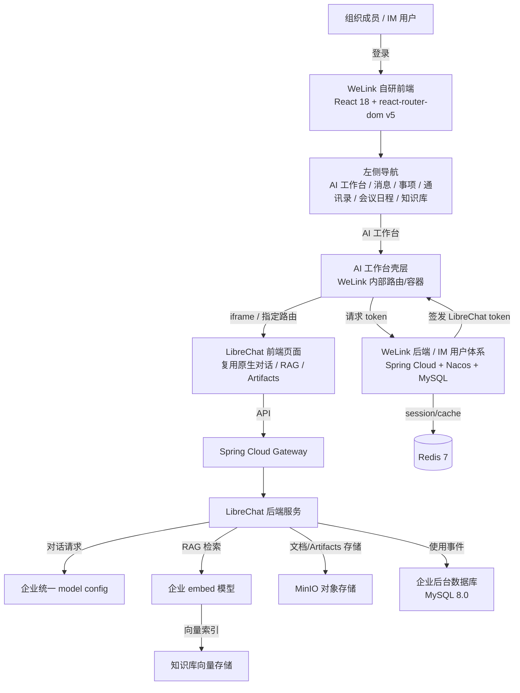
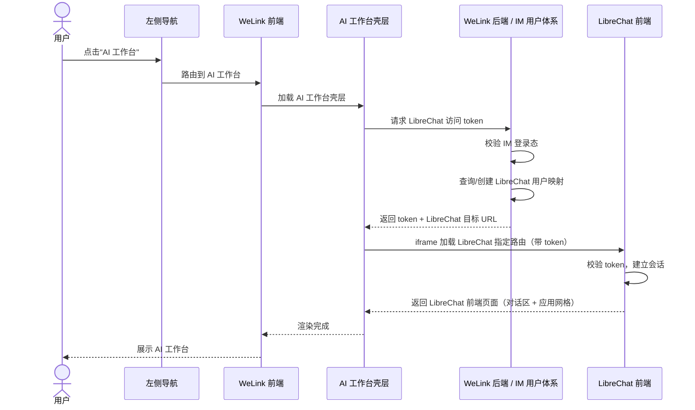
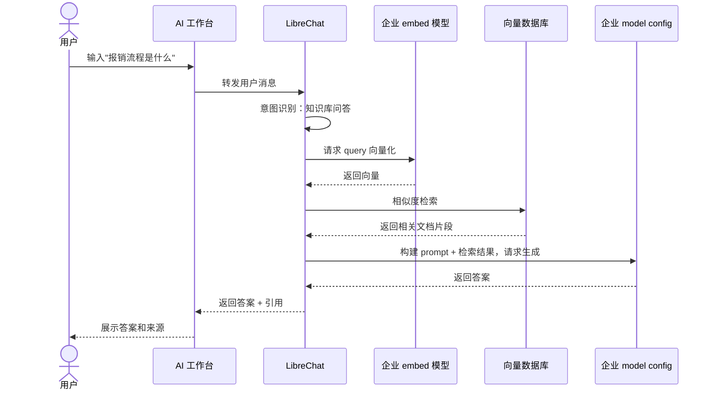
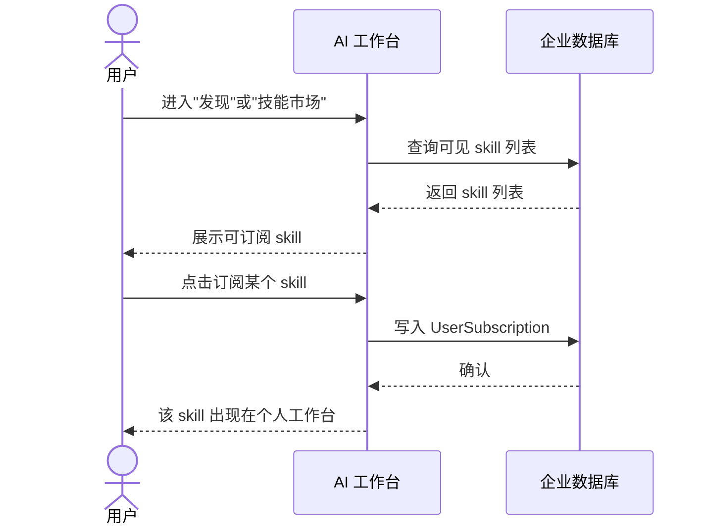
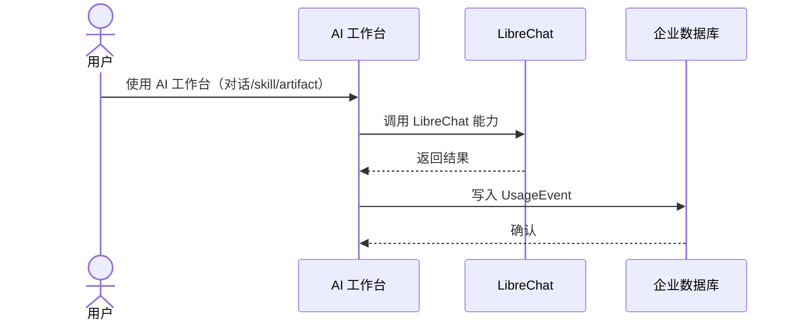
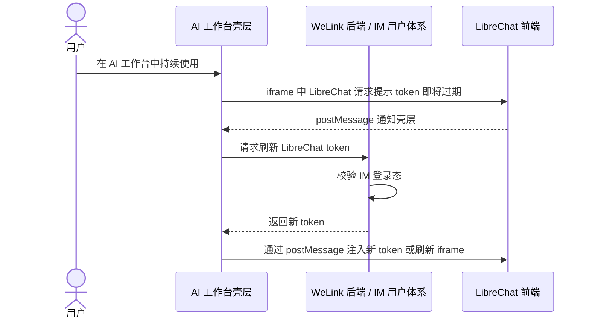

# Flows: 企业 AI 工作台一级落地页

## 1. 系统架构图

```mermaid
graph TB
    User[组织成员 / IM 用户]
    WeLink[WeLink 自研前端<br>React 18 + react-router-dom v5]
    Nav[左侧导航<br>AI 工作台 / 消息 / 事项 / 通讯录 / 会议日程 / 知识库]
    Shell[AI 工作台壳层<br>WeLink 内部路由/容器]
    LibreChatUI[LibreChat 前端页面<br>复用原生对话 / RAG / Artifacts]
    Auth[WeLink 后端 / IM 用户体系<br>Spring Cloud + Nacos + MySQL]
    Gateway[Spring Cloud Gateway]
    LibreChatAPI[LibreChat 后端服务]
    ModelConfig[企业统一 model config]
    EmbedModel[企业 embed 模型]
    KnowledgeStore[知识库向量存储]
    MinIO[MinIO 对象存储]
    EnterpriseDB[企业后台数据库<br>MySQL 8.0]
    Redis[(Redis 7)]

    User -->|登录| WeLink
    WeLink --> Nav
    Nav -->|AI 工作台| Shell
    Shell -->|iframe / 指定路由| LibreChatUI
    Shell -->|请求 token| Auth
    Auth -->|签发 LibreChat token| Shell
    LibreChatUI -->|API| Gateway
    Gateway --> LibreChatAPI
    LibreChatAPI -->|对话请求| ModelConfig
    LibreChatAPI -->|RAG 检索| EmbedModel
    EmbedModel -->|向量索引| KnowledgeStore
    LibreChatAPI -->|文档/Artifacts 存储| MinIO
    LibreChatAPI -->|使用事件| EnterpriseDB
    Auth -->|session/cache| Redis
```

## 2. 用户打开 AI 工作台流程

```mermaid
sequenceDiagram
    actor U as 用户
    participant Nav as 左侧导航
    participant W as WeLink 前端
    participant S as AI 工作台壳层
    participant A as WeLink 后端 / IM 用户体系
    participant L as LibreChat 前端

    U->>Nav: 点击"AI 工作台"
    Nav->>W: 路由到 AI 工作台
    W->>S: 加载 AI 工作台壳层
    S->>A: 请求 LibreChat 访问 token
    A->>A: 校验 IM 登录态
    A->>A: 查询/创建 LibreChat 用户映射
    A-->>S: 返回 token + LibreChat 目标 URL
    S->>L: iframe 加载 LibreChat 指定路由（带 token）
    L->>L: 校验 token，建立会话
    L-->>S: 返回 LibreChat 前端页面（对话区 + 应用网格）
    S-->>W: 渲染完成
    W-->>U: 展示 AI 工作台
```

## 3. 自然语言调用知识库流程

```mermaid
sequenceDiagram
    actor U as 用户
    participant A as AI 工作台
    participant L as LibreChat
    participant E as 企业 embed 模型
    participant V as 向量数据库
    participant M as 企业 model config

    U->>A: 输入"报销流程是什么"
    A->>L: 转发用户消息
    L->>L: 意图识别：知识库问答
    L->>E: 请求 query 向量化
    E-->>L: 返回向量
    L->>V: 相似度检索
    V-->>L: 返回相关文档片段
    L->>M: 构建 prompt + 检索结果，请求生成
    M-->>L: 返回答案
    L-->>A: 返回答案 + 引用
    A-->>U: 展示答案和来源
```

## 4. 员工订阅 skill 流程

```mermaid
sequenceDiagram
    actor U as 用户
    participant A as AI 工作台
    participant DB as 企业数据库

    U->>A: 进入"发现"或"技能市场"
    A->>DB: 查询可见 skill 列表
    DB-->>A: 返回 skill 列表
    A-->>U: 展示可订阅 skill
    U->>A: 点击订阅某个 skill
    A->>DB: 写入 UserSubscription
    DB-->>A: 确认
    A-->>U: 该 skill 出现在个人工作台
```

## 5. 使用数据收集流程

```mermaid
sequenceDiagram
    actor U as 用户
    participant A as AI 工作台
    participant L as LibreChat
    participant DB as 企业数据库

    U->>A: 使用 AI 工作台（对话/skill/artifact）
    A->>L: 调用 LibreChat 能力
    L-->>A: 返回结果
    A->>DB: 写入 UsageEvent
    DB-->>A: 确认
```

## 6. token 刷新流程

```mermaid
sequenceDiagram
    actor U as 用户
    participant S as AI 工作台壳层
    participant A as WeLink 后端 / IM 用户体系
    participant L as LibreChat 前端

    U->>S: 在 AI 工作台中持续使用
    S->>L: iframe 中 LibreChat 请求提示 token 即将过期
    L-->>S: postMessage 通知壳层
    S->>A: 请求刷新 LibreChat token
    A->>A: 校验 IM 登录态
    A-->>S: 返回新 token
    S->>L: 通过 postMessage 注入新 token 或刷新 iframe
```
