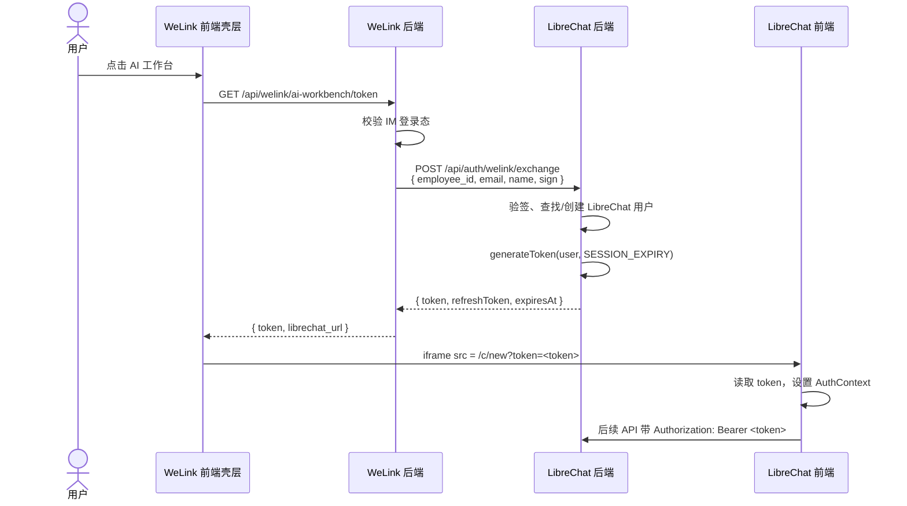

# AI 工作台集成方案（基于 LibreChat 源码）

> 关联文档：
> - [design-review.md](design-review.md)
> - [feasibility.md](feasibility.md)
> - [tech-stack.md](tech-stack.md)
> - [feature-catalog.md](feature-catalog.md)
> - [flows.md](flows.md)
> - [data-model.md](data-model.md)
> - [开源方案研究报告](../../docs/research/ai-workbench-landing-page-oss-options.md)

<!-- status: draft -->

## 1. 设计目标

基于 LibreChat 源码结构与企业现状，给出可直接落地的集成方案：

1. **前端**：复用 LibreChat 原生页面，通过 iframe 嵌入 WeLink 主内容区。
2. **用户体系**：WeLink/IM 登录态映射到 LibreChat 用户，员工无需二次登录。
3. **模型/算力**：复用企业统一 model config，通过 LibreChat `endpoints` 配置接入。
4. **知识库**：复用 LibreChat RAG API，向量化由企业 embed 模型完成。
5. **Canvas**：复用 LibreChat Artifacts（React/HTML/Mermaid/SVG），本期不支持 PPT。
6. **能力分发**：通过 `mcpServers`、`skillSync`、`agents` 配置企业智能体、技能、插件、MCP。
7. **数据收集**：LibreChat 后端异步上报使用事件到企业后台 MySQL。

## 2. LibreChat 关键源码结构

| 模块 | 路径 | 说明 |
|------|------|------|
| 用户模型 | `packages/data-schemas/src/schema/user.ts` | `provider`、`idOnTheSource`、`openidId`、`email`、`role` 等字段，支持外部身份映射 |
| 会话/消息模型 | `packages/data-schemas/src/schema/convo.ts`、`message.ts` | `conversationId`、`user`、`messageId`、`endpoint`、`content` 等字段，可作为使用事件数据源 |
| JWT 签发 | `packages/data-schemas/src/methods/user.ts:101` | `generateToken(user, expiresIn)` 生成访问 token |
| 短 token | `packages/api/src/crypto/jwt.ts:9` | `generateShortLivedToken(userId, '5m')` 用于 RAG API 等内部调用 |
| 路由入口 | `api/server/index.js:263-301` | `/api/auth`、`/api/messages`、`/api/convos`、`/api/agents`、`/api/mcp`、`/api/skills` 等 |
| 前端路由 | `client/src/routes/index.tsx:57` | `/c/:conversationId?` 为对话主界面，`/agents`、`/skills` 为能力分发入口 |
| 鉴权中间件 | `api/server/middleware/requireJwtAuth.js` / `api/strategies/jwtStrategy.js:10` | 默认从 `Authorization: Bearer` 读取 JWT |
| RAG 向量操作 | `api/server/services/Files/VectorDB/crud.js:88` | 调用 `${RAG_API_URL}/embed` 与 `/documents` |
| Agent 加载 | `packages/api/src/agents/load.ts:48` | 根据 `modelSpec` 与 `ephemeralAgent` 组装工具集（MCP、execute_code、file_search 等） |
| Skill 同步 | `packages/api/src/skills/sync/orchestrator.ts` | 按 `librechat.yaml` 的 `skillSync` 配置从 GitHub 拉取 `SKILL.md` |
| MCP 配置 | `packages/data-provider/src/mcp.ts:374` | `MCPServersSchema` 定义 stdio/sse/http 等 MCP 服务器形态 |
| 权限配置 | `packages/api/src/app/permissions.ts` | 控制 `agents`、`mcpServers`、`skills` 的 use/create/share 权限 |

## 3. 嵌入方式

### 3.1 推荐：iframe 嵌入 LibreChat 指定路由

```
WeLink 左侧导航 "AI 工作台"
        │
        ▼
AI 工作台壳层（WeLink 内部路由，React 组件）
        │
        ├── 顶部标题栏（可选：返回、刷新、与工作台其他模块联动）
        │
        ▼
iframe src = https://librechat.example.com/c/new?token=<jwt>
        │
        ▼
LibreChat 前端（对话主界面 / RAG / Artifacts）
```

**原因**：

- 100% 复用 LibreChat UI/UX，符合设计评审中“不重复绘制 UI/UX”的决策。
- 隔离 WeLink 与 LibreChat 路由、状态管理，避免 react-router-dom v5/v6 冲突。
- 升级 LibreChat 时只需替换镜像/版本，壳层改动最小。

**目标路由选择**（`client/src/routes/index.tsx:127-131`）：

| 路由 | 用途 |
|------|------|
| `/c/new` | 新建对话，适合默认 landing |
| `/c/:conversationId` | 继续已有对话 |
| `/agents` | 打开 Agent 市场 |
| `/skills` | 打开 Skill 管理 |

### 3.2 iframe 尺寸与主题

- 壳层占满 WeLink 主内容区宽度；iframe 高度 `100%`。
- LibreChat 原生支持明暗主题；壳层通过 `postMessage` 告知当前主题，LibreChat 前端监听后切换。
- 如企业有品牌色，可在 LibreChat 前端构建时覆盖 CSS 变量（fork 后改 `client/src/style.css`），一期建议保持默认。

### 3.3 备选：React 组件级复用

- **适用**：二期深度融合，需要把 LibreChat 聊天控件直接放进 WeLink 右侧 AI 协同助手。
- **限制**：需要深入 `client/src/components/Chat/`、`packages/data-provider`、React Query 缓存，维护成本高。
- **结论**：本期不做。

## 4. 用户体系打通（SSO）

### 4.1 用户映射

LibreChat `User` 模型关键字段（`packages/data-schemas/src/schema/user.ts:26-168`）：

| 字段 | 用途 |
|------|------|
| `email` | 主键之一，用于查找用户 |
| `provider` | 身份来源，建议设为 `welink` |
| `idOnTheSource` | 外部系统用户 ID，建议存放 WeLink `employee_id` |
| `name` / `username` | 展示名称 |
| `role` | `USER` / `ADMIN`，与企业角色映射 |
| `tenantId` | 多租户隔离，可按企业/部门填充 |
| `skillStates` | 用户订阅的 skill 开关状态 |

**映射规则**：

```
WeLink employee_id ──► idOnTheSource
WeLink email       ──► email
WeLink name        ──► name / username
WeLink department  ──► tenantId（可选）
provider = 'welink'
```

企业后台 `User` 表保存 `librechat_user_id`，实现双向绑定（参见 [data-model.md](data-model.md)）。

### 4.2 Token 注入方案（一期推荐）

#### 4.2.1 整体流程



#### 4.2.2 LibreChat 新增端点 `/api/auth/welink/exchange`

位置：新增 `packages/api/src/auth/welink.ts`，并在 `api/server/routes/auth.js` 挂载（参考 `api/server/index.js:263`）。

职责：

1. 验证 WeLink 后端签名（共享密钥或 RSA 公钥）。
2. 通过 `idOnTheSource` 或 `email` 查找用户（`packages/data-schemas/src/methods/user.ts:135`）。
3. 不存在则调用 `createUser` 创建（`packages/data-schemas/src/methods/user.ts:182`）。
4. 调用 `generateToken(user, sessionExpiry)` 生成访问 token。
5. 调用 `generateRefreshToken` 生成 refresh token 并写入用户 `refreshToken` 数组。
6. 返回 `{ token, refreshToken, expiresAt, user }`。

> 安全：该端点必须仅限内网/API Key 访问；生产环境走 mTLS 或企业网关白名单。

#### 4.2.3 LibreChat 前端小 patch：读取 URL token

LibreChat 前端 token 保存在 `AuthContext`（`client/src/hooks/AuthContext.tsx:50-76`）。

最小改动：在 `AuthContext` 初始化时，若 URL 包含 `?token=`，则：

```ts
const params = new URLSearchParams(window.location.search);
const urlToken = params.get('token');
if (urlToken) {
  setToken(urlToken);
  setTokenHeader(urlToken);
  window.history.replaceState({}, '', window.location.pathname);
}
```

> 该 patch 需维护在企业的 LibreChat fork 中，或作为构建前补丁脚本。

#### 4.2.4 Token 刷新

LibreChat 访问 token 默认 15 分钟（`packages/data-schemas/src/methods/user.ts:8`）。刷新方案：

1. LibreChat 前端检测到 401 或 token 即将过期，向父窗口 `postMessage({ type: 'WELINK_TOKEN_REFRESH' })`。
2. WeLink 壳层收到后调用 WeLink 后端 `/api/welink/ai-workbench/refresh`。
3. WeLink 后端携带 refresh token 调用 LibreChat `/api/auth/refresh`（`api/server/routes/auth.js:52`）。
4. 拿到新 token 后，壳层 `postMessage({ type: 'WELINK_TOKEN_RESPONSE', token })` 给 iframe。
5. LibreChat 前端监听 `message` 事件，更新 `AuthContext` token，并触发 `tokenUpdated` 事件（`client/src/hooks/AuthContext.tsx:255`）。

### 4.3 长期方案：OIDC（推荐二期迁移）

LibreChat 已内置 OpenID Connect（`api/strategies/openidStrategy.js`）。若企业 IAM 支持 OIDC：

- 配置 `OPENID_*` 环境变量。
- 将 WeLink/IAM 作为 IdP。
- LibreChat 用户 `provider='openid'`，`openidId` 存放 `sub`。
- 无需 URL token patch，标准 OAuth cookie 流程即可。

## 5. 模型与算力配置

### 5.1 企业 model config 接入

LibreChat 支持两类方式：

1. **环境变量已知端点**：OpenAI、Anthropic、Azure 等（`.env.example:246-289`）。
2. **自定义 OpenAI 兼容端点**：在 `librechat.yaml` 的 `endpoints.custom` 配置（`librechat.example.yaml:390-399`）。

企业模型网关通常是 OpenAI 兼容 API，推荐方案 2：

```yaml
endpoints:
  custom:
    - name: "Enterprise-LLM"
      apiKey: "${ENTERPRISE_API_KEY}"
      baseURL: "https://model-gateway.welink.example.com/v1"
      models:
        default: ["enterprise-chat", "enterprise-reasoning"]
      fetch: false
```

并通过环境变量 `ENDPOINTS=custom` 关闭其他默认端点，避免员工选择到外部模型。

### 5.2 多模型分发

若企业有多个模型（对话、推理、代码），可在 `librechat.yaml` 配置多个 `custom` endpoint 或单 endpoint 多模型，前端模型下拉框自动展示。

## 6. 知识库 RAG 集成

### 6.1 部署

LibreChat RAG 由独立服务 `rag_api` 提供（`docker-compose.yml:83-93`），向量数据库使用 pgvector。

### 6.2 配置

- 设置 `RAG_API_URL=http://rag_api:8000`。
- RAG API 内部配置企业 embed 模型地址与模型名（在 RAG API 环境变量中）。

### 6.3 调用链路

用户上传文档后：

1. LibreChat `/api/files` 接收文件（`api/server/index.js:289`）。
2. 文件处理完成后调用 `uploadVectors`（`api/server/services/Files/VectorDB/crud.js:67-120`）：
   - 生成短 token：`generateShortLivedToken(req.user.id)`（`packages/api/src/crypto/jwt.ts:9`）。
   - POST `${RAG_API_URL}/embed`，附带文件与 `file_id`。
3. RAG API 调用企业 embed 模型生成向量，写入 pgvector。
4. 对话时 LibreChat Agent 使用 `file_search` 工具或 RAG 检索，从向量库取回片段后拼入 prompt。

### 6.4 企业 embed 模型接口

需确认接口形态：

- 若 RAG API 已支持 OpenAI `/v1/embeddings` 格式，直接配置 baseURL。
- 若为私有协议，需在 RAG API 侧写 adapter（RAG API 为 Python/FastAPI，不在 LibreChat TS 范围）。

## 7. Canvas / Artifacts

### 7.1 能力范围

LibreChat Artifacts 支持（`README.md:89-90`）：

- React、HTML、Mermaid 图表、SVG。
- 在线编辑、下载、导出。
- **不支持 PPT**，本期按设计评审要求降级。

### 7.2 使用方式

- 用户请求生成 artifact 时，模型输出 `<artifact>` 标签，LibreChat 前端自动渲染 Artifact 窗口。
- 无需独立 Canvas 页面，复用 `/c/:conversationId?` 路由。

### 7.3 文件存储

Artifacts 生成的文件可上传到 MinIO：

- 配置 `fileStrategy` 的 `image`、`document` 为 `s3`（`librechat.example.yaml:14-22`）。
- 由于 MinIO 兼容 S3，配置 S3 endpoint 指向 MinIO 即可。

## 8. 智能体、技能、插件、MCP 分发

### 8.1 MCP 服务器

LibreChat 在 `librechat.yaml` 中配置 `mcpServers`（`librechat.example.yaml:361-389`）：

```yaml
mcpServers:
  supervision-api:
    type: sse
    url: http://supervision-mcp.welink.example.com/sse
    timeout: 60000
  hr-system:
    type: stdio
    command: npx
    args:
      - -y
      - "@welink/mcp-hr"
```

**权限控制**（`packages/api/src/app/permissions.ts`）：

- `mcpServers.use: true`：允许员工使用。
- `mcpServers.create: false`：禁止员工自行添加（由企业统一配置）。

**安全**：

- `mcpSettings.allowedDomains` / `allowedAddresses` 限制 MCP 目标（`librechat.example.yaml:336-360`）。
- 企业内部 MCP 服务需带认证，避免 SSRF。

### 8.2 Skills

Skills 是 `SKILL.md` 指令包，支持：

- 部署级 skill：`DEPLOYMENT_SKILLS_DIR=./skill` 或 `skillSync` 从 GitHub 同步。
- 用户级 skill：通过 UI 创建/订阅。

**企业统一 skill 发布**：

```yaml
skillSync:
  github:
    enabled: true
    intervalMinutes: 60
    runOnStartup: true
    sources:
      - id: welink-skills
        owner: welink
        repo: ai-workbench-skills
        ref: main
        paths:
          - skills
        skillDiscoveryDepth: 2
        token: '${GITHUB_SKILLS_TOKEN}'
```

> 对应源码：`packages/api/src/skills/sync/orchestrator.ts:59`、`packages/data-provider/src/config.ts:249`。

### 8.3 Agents

- 持久化 Agent 存储在 MongoDB，通过 `/agents` 市场展示。
- 临时 Agent（Ephemeral Agent）由 `modelSpec` 动态组装（`packages/api/src/agents/load.ts:48-163`），可预置工具：
  - `execute_code`
  - `file_search`
  - `web_search`
  - MCP 工具集

企业可预配置若干 `modelSpec`，每个 spec 绑定一组 MCP/Skills，实现“开箱即用”的办公 agent。

## 9. 个人级使用数据收集

### 9.1 收集范围

基于 [data-model.md](data-model.md) 的 `UsageEvent`：

| event_type | 触发场景 | 关键字段 |
|------------|----------|----------|
| `chat` | 每次用户/AI 消息 | `session_id`, `message_id`, `query_text`, `model`, `endpoint` |
| `knowledge_base` | 上传文档成功 / RAG 命中 | `session_id`, `query_text`, `metadata.retrieved_files` |
| `artifact` | 生成 Artifact | `artifact_type`, `session_id`, `message_id` |
| `search` | Web 搜索 / 文件搜索 | `query_text`, `metadata.search_provider` |

### 9.2 推荐实现：后端事件发布器

在 `packages/api` 新增 `analytics/publisher.ts`：

1. 监听关键路由的响应：
   - `POST /api/messages` → chat 事件
   - `POST /api/convos` → 新会话事件
   - `POST /api/files` → 文档上传事件
   - Agent 调用时 → artifact / tool 事件
2. 异步、非阻塞地 POST 到 WeLink 后端 `POST /api/ai-workbench/events`。
3. WeLink 后端写入 `UsageEvent` 表。

> 注意：避免在请求主链路上同步写企业 DB，防止 LibreChat 响应变慢。

### 9.3 备选：MongoDB 变更流

如果不希望改 LibreChat 路由，可在企业侧订阅 LibreChat MongoDB 的 change stream（`conversations`、`messages` 集合）。但存在耦合与 schema 变更风险，仅建议作为补充。

## 10. 部署与运维

### 10.1 推荐架构

```
WeLink 前端 (React + react-router-dom v5)
        │ iframe
        ▼
LibreChat 前端 (Nginx / Express static)
        │ API
        ▼
Spring Cloud Gateway ──► LibreChat API (Node.js)
        │
        ├── MongoDB（LibreChat 用户/会话/消息）
        ├── MeiliSearch（会话搜索）
        ├── Redis（缓存/refresh token）
        ├── RAG API（pgvector）
        └── MinIO（文档/Artifacts）

WeLink 后端 (Spring Cloud)
        │
        ├── MySQL 8.0（User/UsageEvent/KnowledgeDoc）
        ├── 企业 model gateway
        └── 企业 embed 模型
```

### 10.2 关键环境变量

| 变量 | 说明 |
|------|------|
| `HOST=0.0.0.0`、`PORT=3080` | API 监听 |
| `MONGO_URI` | MongoDB 连接 |
| `MEILI_HOST`、`MEILI_MASTER_KEY` | 搜索服务 |
| `RAG_API_URL` | RAG 服务地址 |
| `JWT_SECRET`、`JWT_REFRESH_SECRET` | Token 签名 |
| `SESSION_EXPIRY` | 访问 token 有效期（默认 15 min） |
| `ENDPOINTS=custom` | 仅启用企业自定义模型端点 |
| `CONFIG_PATH` | `librechat.yaml` 路径 |
| `ALLOW_SOCIAL_LOGIN=false` | 关闭公开社交登录 |
| `PROXY` / `NO_PROXY` | 代理配置 |

### 10.3 域名与跨域

- 建议 LibreChat 部署在企业内网子域：`https://ai-workbench.welink.example.com`。
- 在 LibreChat 后端配置 CORS 允许 WeLink 域名。
- iframe 场景下 token 通过 URL 传递，必须启用 HTTPS。

### 10.4 高可用

- LibreChat API 无状态，可多实例部署，前置网关负载均衡。
- MongoDB、Redis、MeiliSearch、pgvector 按企业标准做副本集/集群。
- RAG API 可独立扩缩容。

## 11. 开发与接入任务清单

| 阶段 | 任务 | 负责人 | 依赖 |
|------|------|--------|------|
| POC | 部署 LibreChat（Docker Compose）+ 接入企业 model gateway | 后端/运维 | 模型接口就绪 |
| POC | 实现 `/api/auth/welink/exchange` 并验证 token 链路 | 后端 | WeLink 用户接口 |
| POC | iframe 嵌入 `/c/new` 并调通主题/尺寸 | 前端 | 壳层路由 |
| 一期 | 用户映射表 + 企业后台 `User` 与 `UsageEvent` 表 | 后端 | 数据库设计 |
| 一期 | RAG API 接入企业 embed 模型 | 后端/RAG | embed 接口规格 |
| 一期 | 配置 `mcpServers` / `skillSync` / `modelSpecs` | 平台/后端 | 业务系统 MCP |
| 一期 | 后端事件发布器 → WeLink 后端 | 后端 | UsageEvent 表 |
| 一期 | Token 刷新 `postMessage` 机制 | 前端 | exchange 端点 |
| 二期 | OIDC 替换 token 注入 | 后端/IAM | IAM 支持 OIDC |
| 二期 | 右侧 AI 协同助手接入 LibreChat 组件 | 前端 | 组件复用评估 |

## 12. 风险与缓解

| 风险 | 影响 | 缓解 |
|------|------|------|
| iframe 跨域 token 传递被安全团队挑战 | 中 | 使用一次性 exchange code 代替直接 token；长期迁移 OIDC |
| LibreChat 版本升级导致 patch 冲突 | 中 | token patch 尽量小且集中；升级前回归验证 |
| 企业 embed 模型接口不兼容 RAG API | 中 | POC 阶段先做向量化端到端验证 |
| MCP 服务器暴露内部接口 | 高 | 严格配置 `allowedDomains`/`allowedAddresses`；MCP 服务自带认证 |
| 个人级数据量大导致企业 DB 压力 | 中 | 事件发布异步 + 批量写入；按用户/时间分区 |

## 13. 验证 checklist

- [ ] WeLink 点击 AI 工作台后 iframe 正常加载 LibreChat `/c/new`。
- [ ] 新用户首次进入自动创建 LibreChat 账号；老用户保持会话历史。
- [ ] 对话请求命中企业 model gateway，响应正常。
- [ ] 上传文档后 RAG API `/embed` 成功，知识库问答可召回。
- [ ] Artifact 生成 React/HTML/Mermaid/SVG，可下载。
- [ ] 管理员配置的 MCP/Skill 在用户端可见并可用。
- [ ] `UsageEvent` 实时写入企业 MySQL，字段完整。
- [ ] Token 过期后自动刷新，用户无感知。
- [ ] 非企业端点不可见/不可用。

## 14. 待 PM/架构确认

1. LibreChat 是否部署为独立子域，还是与 WeLink 同域反向代理？
2. 企业 model gateway 的 OpenAI 兼容接口是否已就绪？
3. 企业 embed 模型接口规格及 RAG API 适配方式。
4. 用户体系采用 token 注入（一期）还是直接 OIDC（若 IAM 支持，可缩短路径）。
5. 数据收集是否需要实时？是否允许异步批量上报？

<!-- status: draft -->
