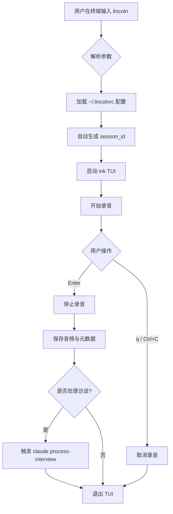
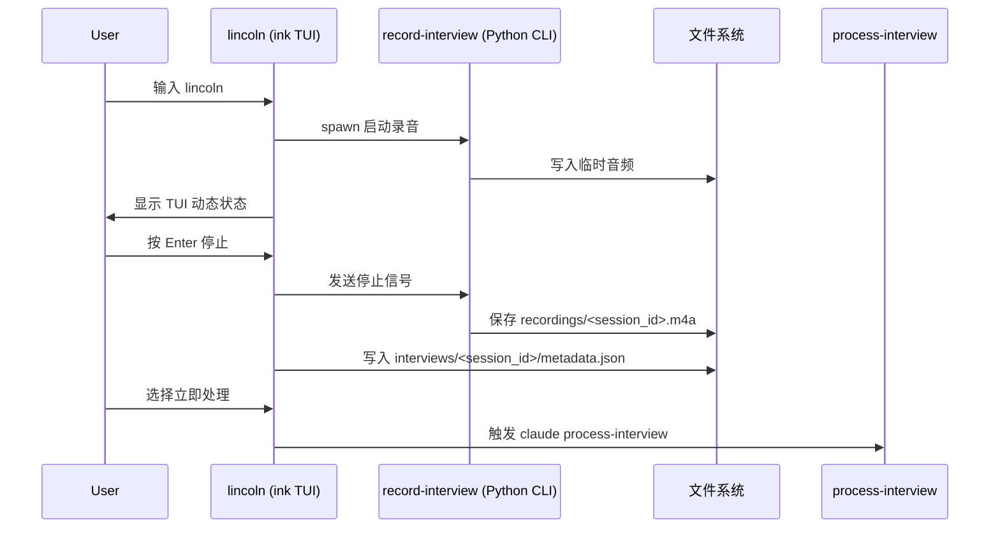
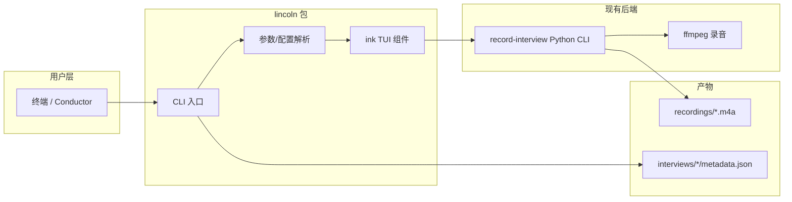
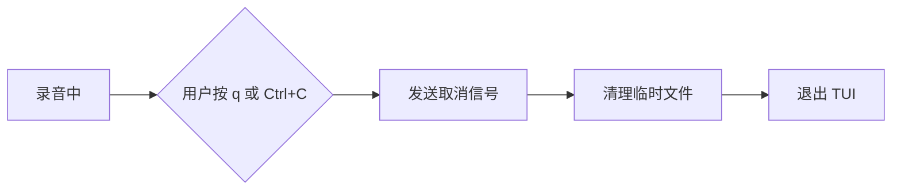

# 流程图：Lincoln TUI 录音工具

**会话 ID**: 2026-06-28-stakeholder-checkout  
**设计 ID**: checkout-redesign

---

## 用户启动录音流程

```mermaid
flowchart TD
    A[用户在终端输入 lincoln] --> B{解析参数}
    B --> C[加载 ~/.lincolnrc 配置]
    C --> D[自动生成 session_id]
    D --> E[启动 ink TUI]
    E --> F[开始录音]
    F --> G{用户操作}
    G -->|Enter| H[停止录音]
    G -->|q / Ctrl+C| I[取消录音]
    H --> J[保存音频与元数据]
    J --> K{是否处理访谈?}
    K -->|是| L[触发 claude process-interview]
    K -->|否| M[退出 TUI]
    I --> M
    L --> M
```

## 系统序列图

```mermaid
sequenceDiagram
    participant User
    participant LincolnTUI as lincoln (ink TUI)
    participant RecordInterview as record-interview (Python CLI)
    participant Filesystem as 文件系统
    participant ProcessInterview as process-interview

    User->>LincolnTUI: 输入 lincoln
    LincolnTUI->>RecordInterview: spawn 启动录音
    RecordInterview->>Filesystem: 写入临时音频
    LincolnTUI->>User: 显示 TUI 动态状态
    User->>LincolnTUI: 按 Enter 停止
    LincolnTUI->>RecordInterview: 发送停止信号
    RecordInterview->>Filesystem: 保存 recordings/<session_id>.m4a
    LincolnTUI->>Filesystem: 写入 interviews/<session_id>/metadata.json
    User->>LincolnTUI: 选择立即处理
    LincolnTUI->>ProcessInterview: 触发 claude process-interview
```

## 架构图

```mermaid
flowchart LR
    subgraph 用户层
        Terminal[终端 / Conductor]
    end

    subgraph lincoln 包
        CLI[CLI 入口]
        TUI[ink TUI 组件]
        Config[参数/配置解析]
    end

    subgraph 现有后端
        PyCLI[record-interview Python CLI]
        FFmpeg[ffmpeg 录音]
    end

    subgraph 产物
        Audio[recordings/*.m4a]
        Meta[interviews/*/metadata.json]
    end

    Terminal --> CLI
    CLI --> Config
    Config --> TUI
    TUI --> PyCLI
    PyCLI --> FFmpeg
    PyCLI --> Audio
    CLI --> Meta
```

## 取消流程

```mermaid
flowchart LR
    A[录音中] --> B{用户按 q 或 Ctrl+C}
    B --> C[发送取消信号]
    C --> D[清理临时文件]
    D --> E[退出 TUI]
```
