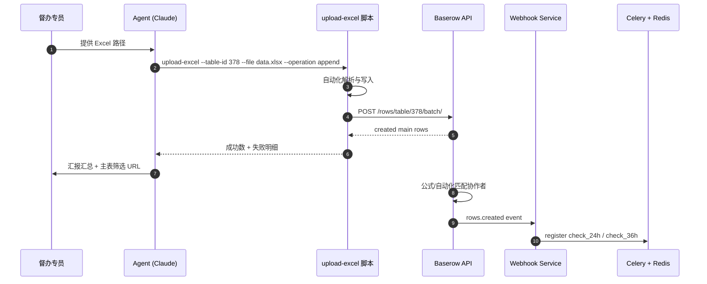
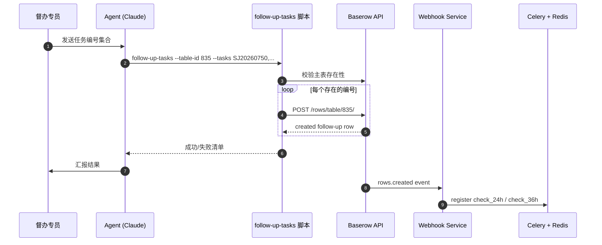
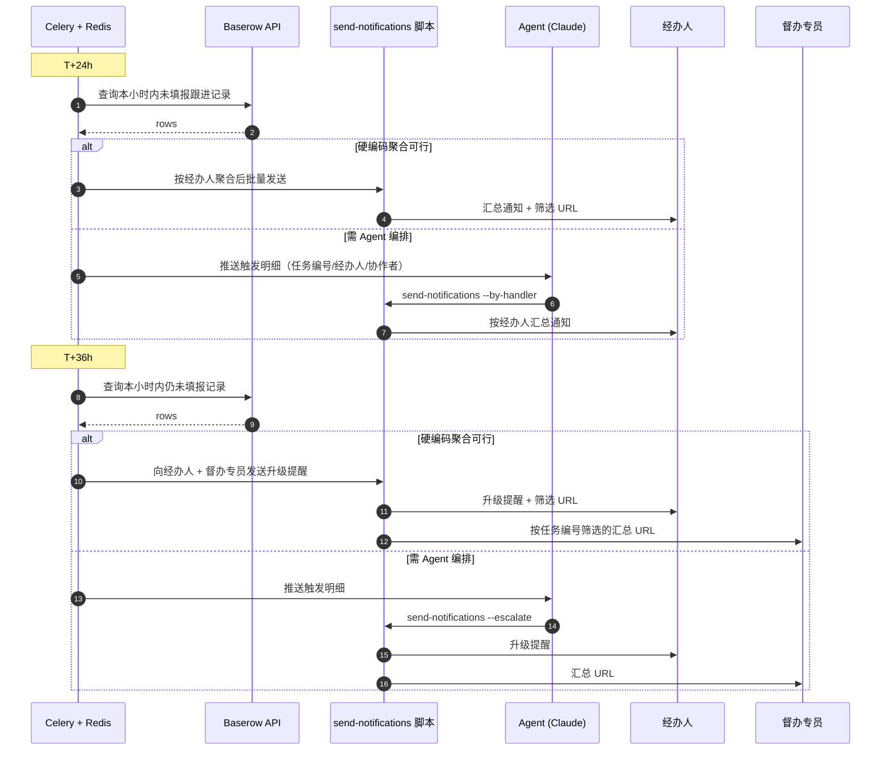
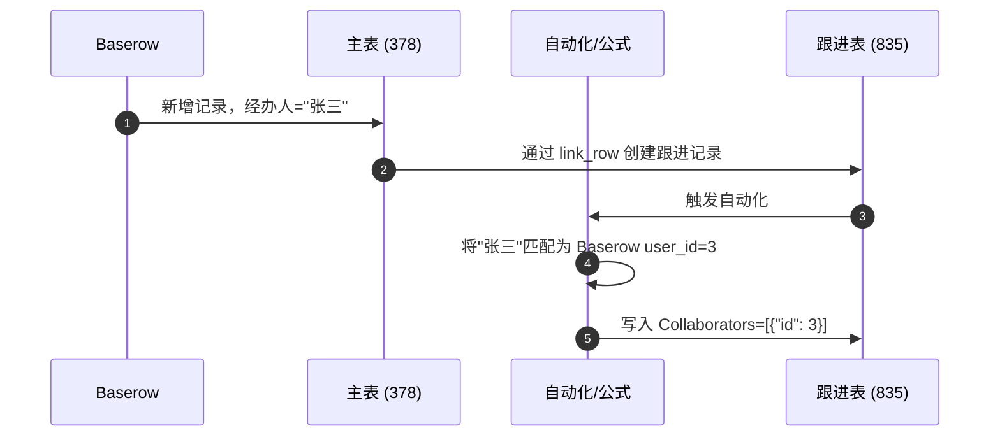

# Flows: Baserow + Mattermost 督办协作系统

## 流程 1：Excel 批量导入

```mermaid
sequenceDiagram
    autonumber
    participant 专员 as 督办专员
    participant Agent as Agent (Claude)
    participant Script as upload-excel 脚本
    participant Baserow as Baserow API
    participant Webhook as Webhook Service
    participant Celery as Celery + Redis

    专员->>Agent: 提供 Excel 路径
    Agent->>Script: upload-excel --table-id 378 --file data.xlsx --operation append
    Script->>Script: 自动化解析与写入
    Script->>Baserow: POST /rows/table/378/batch/
    Baserow-->>Script: created main rows
    Script-->>Agent: 成功数 + 失败明细
    Agent->>专员: 汇报汇总 + 主表筛选 URL
    Baserow->>Baserow: 公式/自动化匹配协作者
    Baserow->>Webhook: rows.created event
    Webhook->>Celery: register check_24h / check_36h
```

## 流程 2：任务编号批量跟进

```mermaid
sequenceDiagram
    autonumber
    participant 专员 as 督办专员
    participant Agent as Agent (Claude)
    participant Script as follow-up-tasks 脚本
    participant Baserow as Baserow API
    participant Webhook as Webhook Service
    participant Celery as Celery + Redis

    专员->>Agent: 发送任务编号集合
    Agent->>Script: follow-up-tasks --table-id 835 --tasks SJ20260750,...
    Script->>Baserow: 校验主表存在性
    loop 每个存在的编号
        Script->>Baserow: POST /rows/table/835/
        Baserow-->>Script: created follow-up row
    end
    Script-->>Agent: 成功/失败清单
    Agent->>专员: 汇报结果
    Baserow->>Webhook: rows.created event
    Webhook->>Celery: register check_24h / check_36h
```

## 流程 3：24h / 36h 批量监控提醒

```mermaid
sequenceDiagram
    autonumber
    participant Celery as Celery + Redis
    participant Baserow as Baserow API
    participant Script as send-notifications 脚本
    participant Agent as Agent (Claude)
    participant 经办人 as 经办人
    participant 专员 as 督办专员

    Note over Celery: T+24h
    Celery->>Baserow: 查询本小时内未填报跟进记录
    Baserow-->>Celery: rows
    alt 硬编码聚合可行
        Celery->>Script: 按经办人聚合后批量发送
        Script->>经办人: 汇总通知 + 筛选 URL
    else 需 Agent 编排
        Celery->>Agent: 推送触发明细（任务编号/经办人/协作者）
        Agent->>Script: send-notifications --by-handler
        Script->>经办人: 按经办人汇总通知
    end

    Note over Celery: T+36h
    Celery->>Baserow: 查询本小时内仍未填报记录
    Baserow-->>Celery: rows
    alt 硬编码聚合可行
        Celery->>Script: 向经办人 + 督办专员发送升级提醒
        Script->>经办人: 升级提醒 + 筛选 URL
        Script->>专员: 按任务编号筛选的汇总 URL
    else 需 Agent 编排
        Celery->>Agent: 推送触发明细
        Agent->>Script: send-notifications --escalate
        Script->>经办人: 升级提醒
        Script->>专员: 汇总 URL
    end
```

## 流程 4：Baserow 内部协作者自动匹配

```mermaid
sequenceDiagram
    autonumber
    participant Baserow as Baserow
    participant Main as 主表 (378)
    participant Auto as 自动化/公式
    participant Follow as 跟进表 (835)

    Baserow->>Main: 新增记录，经办人="张三"
    Main->>Follow: 通过 link_row 创建跟进记录
    Follow->>Auto: 触发自动化
    Auto->>Auto: 将"张三"匹配为 Baserow user_id=3
    Auto->>Follow: 写入 Collaborators=[{"id": 3}]
```
