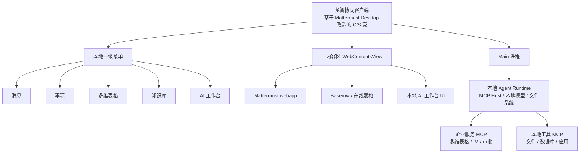

# WeLink（龙智协同）产品技术框架

> **文档定位**：整合当前 WeLink / 龙智协同的全部产品与技术讨论，形成面向决策层、产研团队、架构师的框架性共识文档。
> **核心命题**：在已有 Mattermost IM 基础上，如何以可扩展的架构，依次构建多维表格、AI 工作台、督办协作等业务能力，并形成长期竞争力。
> **版本**：2026-07-10

---

## 1. 战略判断：为什么做 WeLink / 龙智协同

企业协同办公市场正在从 **“沟通工具”** 向 **“智能工作平台”** 演进。飞书 Aily、钉钉悟空、Slack AI 等产品的共同方向是：

- 以 IM 为高频入口；
- 以结构化数据（多维表格、知识库）为业务承载；
- 以 AI Agent 为能力分发层；
- 以企业身份、权限、审计为治理基座。

WeLink / 龙智协同的差异化机会在于：

1. **自主可控**：基于开源构建，数据主权、品牌、升级节奏由企业自己掌握；
2. **本地化体验**：针对中国政企用户的 IM 使用习惯（系统托盘、快捷键、消息免打扰、组织架构）深度改造；
3. **本地 AI 运行时**：在云端 Agent 为主流的市场中，保留本地 Agent 执行能力，作为高合规、高集成场景的护城河；
4. **业务闭环**：以督办协作为首个纵深场景，验证“IM + 多维表格 + AI 工作台”的联动价值。

---

## 2. 产品愿景与核心定位

### 2.1 一句话愿景

> **龙智协同 = 中国企业版的本地优先智能工作平台**：以 IM 为入口，以多维表格和知识库为数据层，以 AI 工作台为能力分发层，以本地客户端为安全可控的执行基座。

### 2.2 三层定位

| 层级 | 定位 | 代表能力 |
|---|---|---|
| **入口层** | 企业员工每天打开的第一个应用 | IM 消息、待办、AI 工作台、应用网格 |
| **数据层** | 企业业务流程的结构化承载 | 多维表格、知识库、文档、审批 |
| **智能层** | 自然语言驱动的工作流与自动化 | Agent、Skill、MCP、本地模型、RPA |

### 2.3 与非竞品的边界

- **不是 Mattermost 换皮**：Mattermost 只是 IM 引擎，上层菜单、品牌、扩展模块全部自研。
- **不是飞书/钉钉的复刻**：不追求功能最全，而是追求“开源可控 + 本地执行 + 业务闭环”。
- **不是 Claude Code / Codex 的企业版**：面向普通员工和业务场景，而非开发者。

---

## 3. 总体架构蓝图

### 3.1 架构核心：C/S 应用壳 + 混合模块

龙智协同客户端基于 **Mattermost Desktop** 开源项目重构，但定位升级为 **企业工作台客户端**：

- **本地 C/S 一级菜单**：自研，符合中国用户习惯；
- **主内容区**：按模块加载不同的 WebContentsView；
- **Main 进程**：承载系统级能力、SSO、通知、本地 Agent runtime；
- **模块可按需选择运行时**：在线模块用 Web 内嵌，本地模块用 Electron 本地视图。



### 3.2 运行时策略：云优先，本地增强

| 能力 | 默认运行时 | 说明 |
|---|---|---|
| IM 消息 | 云端 Mattermost Server | 必须在线，实时协同 |
| 多维表格 | 云端 Baserow | 必须在线，多人实时编辑 |
| 知识库 | 云端 Web 应用 | 在线协同与检索 |
| AI 对话 / RAG | 云端 LibreChat / 企业模型网关 | 通用能力，快速响应 |
| 本地文件处理 | 本地 Agent Runtime | 高合规、离线、本地设备联动 |
| 本地模型 / 本地 MCP | 本地 Agent Runtime | 企业私有模型、本地工具链 |
| 跨应用自动化 | 本地 Agent Runtime | 本地 Excel、ERP 客户端、设计软件 |

**关键原则**：云优先保证通用体验和快速上线；本地增强只用于能证明高价值的特定场景，避免为本地而本地。

---

## 4. 四大核心模块

### 4.1 IM：基于 Mattermost 的本地化改造

- **技术基座**：Mattermost Server + Mattermost Desktop 客户端。
- **改造重点**：
  - 一级菜单从 Mattermost webapp 抽到本地 C/S 壳；
  - 系统托盘、消息通知、快捷键、组织架构、登录体验符合中国习惯；
  - 企业 SSO 与现有 IAM 打通；
  - 保留 Mattermost 的聊天、频道、Bot、Webhook 能力。
- **未来定位**：IM 是高频入口和数据源，但不是唯一入口。

### 4.2 在线协同表格：基于 Baserow

- **选型**：Baserow（MIT 开源，Airtable-like no-code database）。
- **产品形态**：以“多维表格”为一级功能，嵌入龙智协同客户端主内容区。
- **核心能力**：
  - 多 Workspace / Database / Table；
  - 字段类型、表关联、多视图、表单、筛选视图、分享视图 URL；
  - REST API / Webhook / 自动化；
  - 行级/列级权限（需评估开源版或企业版）。
- **集成方式**：iframe 嵌入 Baserow 指定路由，SSO 免登，IM 侧负责入口和通知。
- **首个业务场景**：督办协作的主表 + 跟进表数据承载。

### 4.3 AI 工作台：本地优先的企业 Agent 平台

- **产品形态**：龙智协同客户端内的本地模块（非内嵌远程 Web 页面）。
- **核心能力**：
  - 自然语言对话（基于企业模型网关）；
  - 企业知识库问答；
  - Agent / Skill / MCP 能力分发；
  - Canvas / Artifacts（生成文档、图表、代码）；
  - 本地文件处理、本地模型调用、跨应用自动化。
- **运行时**：
  - UI 层：本地 Electron/React；
  - Agent Runtime：本地 Node/Python/Rust 进程；
  - 企业服务：通过 MCP 调用多维表格、IM、知识库、审批等；
  - 本地工具：通过 MCP 调用文件系统、本地数据库、本地应用。
- **与竞品的差异**：
  - 飞书 Aily 是云端 Agent 平台 + OpenClaw 补充本地能力；
  - 钉钉悟空是独立 AI 原生 App；
  - 龙智协同 AI 工作台是 **“嵌入企业 IM 客户端的本地 Agent 模块”**，统一安装包、统一身份、统一治理。

### 4.4 督办协作：首个业务闭环

- **目标**：验证“IM + 多维表格 + Agent”的联动价值。
- **流程**：
  1. 督办专员通过 Mattermost Bot 上传 Excel 或发送任务编号；
  2. Agent 调用脚本批量写入 Baserow 主表，并创建跟进记录；
  3. Baserow 自动匹配协作者，触发 Webhook；
  4. 延时任务服务注册 T+24h / T+36h 提醒；
  5. 经办人收到 Mattermost 通知，点击 URL 进入 Baserow 填报；
  6. 未填报事项自动升级提醒。
- **价值**：从“人追着数据跑”变成“数据推着人走”。

---

## 5. 关键技术原则

### 5.1 开源优先，可控为本

- IM：Mattermost（开源可控）。
- 多维表格：Baserow / NocoDB / Grist（开源可控，按需选型）。
- AI 工作台：LibreChat / Open WebUI（开源，可自托管）。
- 本地 Agent Runtime：自研或基于开源框架。

### 5.2 模块解耦，统一入口

- 各业务模块独立部署、独立升级；
- 龙智协同客户端作为统一入口，通过本地菜单和 deeplink 串联；
- 模块间通过标准协议（REST / MCP / Webhook）通信，不直接耦合。

### 5.3 身份与权限统一

- 企业 SSO 作为唯一身份源；
- 各模块通过 SSO token 或映射表共享用户身份；
- AI Agent 的权限 ≤ 用户本人权限。

### 5.4 数据主权与审计

- 企业数据默认留在企业自有基础设施；
- 本地执行能力意味着敏感数据可以不出本机；
- 操作日志、Agent 调用记录、数据访问记录统一审计。

### 5.5 云优先，本地增强

- 80% 的通用能力走云端，保证体验和成本；
- 20% 的高价值场景启用本地能力，作为差异化卖点；
- 不为了技术而自嗨，本地能力必须有明确的业务场景支撑。

---

## 6. 与竞品（飞书 Aily / 钉钉悟空 / Slack）的差异化

| 维度 | 飞书 Aily | 钉钉悟空 | Slack | 龙智协同 |
|---|---|---|---|---|
| **核心形态** | 飞书生态内的云端 Agent 平台 | 独立 AI 原生 App | IM + 云端 AI 增强 | IM 客户端内的本地 Agent 工作台 |
| **AI 运行时** | 云端虚拟电脑/沙箱 | 云端为主 + 本地执行 | 云端 | 本地 Runtime + 云端模型 |
| **本地文件/设备** | OpenClaw 插件补充 | 支持 | 不支持 | 原生支持 |
| **与 IM 关系** | 嵌入飞书 | 独立后再接入钉钉 | AI 是 IM 的增强功能 | AI 与 IM 同属一个客户端 |
| **数据主权** | 飞书生态闭环 | 阿里云生态闭环 | Salesforce 生态 | 企业自托管，完全可控 |
| **目标用户** | 飞书企业用户 | 钉钉企业用户 | 研发团队 | 中国政企、需本地可控的组织 |

**核心差异化**：

> 龙智协同不卖“最全的功能”，卖的是 **“开源可控 + 本地执行 + 企业数据主权”** 的组合。对于不能接受数据出域、需要本地集成、希望自主掌控升级节奏的客户，这是飞书和钉钉给不了的。

---

## 7. 实施路线图

### Phase 1：客户端基座改造（2-3 个月）

- 基于 Mattermost Desktop 重构龙智协同客户端；
- 实现本地一级菜单、系统托盘、通知、快捷键、SSO；
- 内嵌 Mattermost webapp 作为消息模块；
- 完成中国本地化 IM 使用习惯改造。

### Phase 2：多维表格上线（2-3 个月）

- 部署 Baserow 自托管实例；
- 完成 SSO、权限、嵌入、通知集成；
- 以督办协作为首个场景，完成主表 + 跟进表上线。

### Phase 3：AI 工作台 POC（2-3 个月）

- 部署 LibreChat / Open WebUI；
- 接入企业模型网关；
- 在客户端内以本地模块或内嵌方式实现 AI 工作台入口；
- 完成对话、知识库、Artifacts 基础能力。

### Phase 4：本地 Agent 增强（3-6 个月）

- 在客户端 Main 进程接入本地 Agent Runtime；
- 实现 MCP Host，连接企业服务 MCP 和本地工具 MCP；
- 验证本地文件处理、本地模型、跨应用自动化等高价值场景。

### Phase 5：生态与治理（持续）

- 企业 skill / Agent 市场；
- 使用数据分析与场景挖掘；
- 审计、合规、权限治理；
- 第三方应用接入。

---

## 8. 风险与治理

| 风险 | 影响 | 缓解措施 |
|---|---|---|
| Mattermost Desktop 升级合并成本高 | 中 | 改造集中在 main/preload 层，避免改动 Mattermost webapp |
| 本地 Agent 安全与权限失控 | 高 | 沙箱、白名单、用户授权、操作审计 |
| 多维表格选型后权限不满足 | 高 | POC 阶段重点验证行级/列级权限和 SSO |
| AI 工作台用户接受度低 | 中 | 以督办等高频场景切入，降低使用门槛 |
| 客户端内存/性能问题 | 中 | 非活跃模块销毁或挂起，优化启动速度 |
| 数据合规争议 | 高 | 本地执行 + 自托管 + 审计日志，明确数据边界 |

---

## 9. 结论

龙智协同的长期架构是清晰的：

> **以 Mattermost Desktop 改造后的 C/S 客户端为统一入口，内嵌 IM、多维表格、AI 工作台等模块；AI 工作台采用本地 Agent Runtime + MCP 调用企业服务的架构；多维表格等协同类能力保持云端；以督办协作验证闭环价值。**

这个架构不是最简单的，但是最符合 WeLink 的长期目标：

1. **自主可控**：开源基座，数据主权；
2. **本地差异化**：在云端 Agent 为主流的市场中，保留本地执行能力；
3. **可扩展**：新模块可以按需选择 Web 内嵌或本地原生；
4. **业务闭环**：从 IM 到表格到 AI，形成“入口—数据—智能”的完整链条。

---

## 10. 架构师评审补充：风险、改进与关键决策

> 本节由架构师评审后补充，用于在对外汇报和研发落地时同步已知风险与改进方向。

### 10.1 总体结论

框架方向成立，架构顶层合理，但存在 **3 个高风险假设**，需要在进入大规模研发前通过 POC 验证：

1. 基于 Mattermost Desktop fork 改造为企业工作台壳的可控性；
2. AI 工作台本地 Agent Runtime 的安全性与可维护性；
3. Baserow 开源核心是否满足行级/列级权限与 SSO 要求。

如果任一假设不成立，方案需要重大调整。

### 10.2 关键架构假设与风险

| 假设 | 风险等级 | 说明 | 应对 |
|---|---|---|---|
| **Mattermost Desktop 深度改造为工作台壳** | 🔴 高 | Mattermost Desktop 不是通用工作台壳，重写导航和状态管理会带来持续合并成本 | 只借其基础设施，业务壳层自研；Mattermost 仅作为内容区模块 |
| **AI 工作台默认使用本地 Agent Runtime** | 🔴 高 | 安全面扩大、环境依赖复杂、更新困难、用户体验碎片化 | 默认云端 Agent，本地 Runtime 作为可选插件；沙箱 + 白名单 + 审计 |
| **Baserow 满足多维表格 P0 权限需求** | 🔴 高 | SSO、行级/列级权限、高级审计为企业版付费功能 | POC 阶段必须验证；同步评估 Grist/NocoDB 作为备选 |
| **MCP 作为模块间集成主干** | 🟡 中 | MCP 尚处早期，安全模型、生命周期、可观测性不完善 | 不把 MCP 当总线；定位为 Agent 工具协议；自建 MCP Gateway |
| **云优先 + 本地增强策略** | 🟡 中 | 执行中容易走样，研发/产品/用户预期不一致 | 制定本地能力启用清单；UI 明确模式标识；所有本地能力必须有云端降级路径 |

### 10.3 架构改进建议

#### 10.3.1 引入统一身份联邦层

不要让 Mattermost、Baserow、LibreChat 各自对接 SSO。建议引入 **Keycloak / Authentik** 作为身份联邦：

```
企业 IAM / AD
     │
     ▼
Keycloak / Authentik（身份联邦）
     │
  ┌──┴──┐
  ▼     ▼
Mattermost   Baserow / LibreChat / 其他模块
```

- 各模块只认一个标准 OIDC/SAML IdP；
- 用户离职/调岗时，在联邦层禁用即可全局失效；
- 降低未来替换模块时的身份迁移成本。

#### 10.3.2 定义模块标准契约

所有业务模块接入 C/S 壳时，遵循统一契约：

| 契约项 | 说明 |
|---|---|
| **生命周期** | `load` / `focus` / `blur` / `unload` / `dispose` |
| **身份注入** | 壳层提供 `token` / `userInfo` / `tenantId` |
| **事件上报** | `window.clientShell.emit(event, payload)` 用于通知、角标、错误 |
| **deeplink** | 支持 `longzhi://module/{name}?params` 被外部唤起 |
| **能力探测** | 模块可查询是否支持本地 Agent、本地模型、离线模式 |

这套契约可以让未来替换 Mattermost、Baserow、LibreChat 时影响最小。

#### 10.3.3 本地 Agent Runtime 采用“进程沙箱”模型

不要把本地 Agent 直接跑在 Electron Main 进程里：

```
Main 进程
    │
    ▼
Agent Supervisor（Node.js）
    │
    ├── pi runtime（受限权限）
    ├── local MCP servers（stdio）
    └── local model proxy（Ollama / vLLM）
```

- Supervisor 负责启动、监控、重启、日志收集；
- pi runtime 以受限用户/受限目录运行；
- 所有本地文件访问通过 Supervisor 中转，并记录审计日志。

#### 10.3.4 建立企业主数据服务

目前数据分散在 Mattermost、Baserow、LibreChat、企业后台 MySQL。建议尽早建立统一主数据服务：

- 统一用户/组织/部门模型；
- 统一权限模型；
- 统一审计事件模型；
- 各模块通过 API/事件订阅同步，而不是各自维护映射表。

### 10.4 分阶段实施与 go/no-go 检查点

| 阶段 | 周期 | 目标 | 必须验证（go/no-go） |
|---|---|---|---|
| **Phase 1：客户端基座** | 6-8 周 | 薄而稳的 C/S 壳，能内嵌 Mattermost，一级菜单可控 | 多 WebContentsView 切换稳定；SSO 联邦跑通；模块契约可用 |
| **Phase 2：多维表格选型** | 4-6 周 | 确定多维表格方案，完成嵌入和 SSO | Baserow/Grist/NocoDB 至少一个满足权限与 SSO；iframe 体验可接受 |
| **Phase 3：督办协作 MVP** | 4-6 周 | 跑通 Excel 导入 → 主表 → 跟进表 → 通知 → 24h/36h 提醒 | 业务方认可闭环价值；经办人填报流程通畅 |
| **Phase 4：AI 工作台（云端优先）** | 6-8 周 | 对话、知识库、Artifacts，走云端 Agent | 与企业模型网关对接；使用数据可写入企业后台 |
| **Phase 5：本地 Agent 增强（可选）** | 8-12 周 | 明确高价值场景后启用本地 Runtime | 一个端到端场景跑通；安全、更新、审计达标；用户反馈正面 |

### 10.5 关键待决策事项

| 决策项 | 当前状态 | 建议 |
|---|---|---|
| 是否采购 Baserow 企业版？ | 未明确 | Phase 2 POC 后决策；若权限不可接受则转 Grist/NocoDB |
| 本地 Agent Runtime 技术栈？ | 待定 | 先用 Node/Python 快速验证，长期关键路径用 Rust |
| 是否强制桌面客户端？ | 倾向强制 | 保留 Web 端最小可用能力，避免完全绑定桌面端 |
| 统一身份联邦方案？ | 未明确 | 建议引入 Keycloak 或 Authentik |
| 企业主数据服务？ | 未规划 | Phase 2 开始设计，避免后期数据孤岛 |

---

## 11. 相关文档索引

- `designs/ai-workbench-landing-page/design-review.md` — AI 工作台设计评审
- `designs/ai-workbench-landing-page/feasibility.md` — AI 工作台可行性
- `designs/ai-workbench-landing-page/integration-plan.md` — AI 工作台集成方案
- `designs/supervision-collab-va/design-review.md` — 督办协作设计评审
- `designs/supervision-collab-va/integration-plan.md` — Baserow 嵌入 IM 方案
- `docs/requirements/online-collaborative-spreadsheet-feature-requirements.md` — 多维表格选型要求
- `docs/research/ai-workbench-landing-page-oss-options.md` — AI 工作台开源方案研究
- `docs/research/collaborative-spreadsheet-oss-options.md` — 协同表格开源方案研究
- `docs/welink-master-framework-architecture-review.md` — 完整版架构师评审报告
