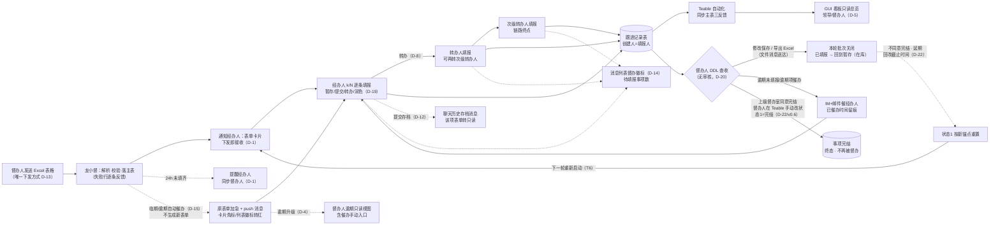

# 角色细分场景与业务闭环：龙小督督办全角色

<!-- status: draft -->

- **日期**: 2026-09-09 v0.8（v0.6 按 PM 2026-09-08 决策回填 D-1~D-19；v0.7 按 PM 决策 D-22 回填双字段；**v0.8 按 PM 修正 D-22**：两字段完全独立——状态1（正常/风险/逾期/完结，纯时间计算）+ 状态2（暂存/推进中/已填报/逾期未填报，去除办结）；完结并入状态1、由督办人在 Teable 手动修改；D-19/D-21 被 D-22 取代，见 `state-machine.md` v0.6；Excel 唯一下发、消息列表督办徽标、催办加急可视化、困难仅填报内容、批示过问移出本期）
- **上游**: `prd.md`、`embed-form-spec.md`、`agent-scenario-script.md`、`supervision-p0.md`（S-1~S-5）
- **定位**: 四类角色（督办人/经办人/转办人/领导）细分场景与闭环。技术已确认可落地，本文保证场景闭环与体验。

## 1. 角色定义与数据落点

| 角色 | 职责 | 主表字段（督办任务 `tblaVFnl1xiS8fLVGYD`） | 交互主通道 |
|------|------|-------------------------------------------|-----------|
| 督办人 | 下发督办任务、跟踪进展、催办、完结标记（Teable 手动修改状态1，上级督办室线下同意后） | 督办人姓名 `fldk2GSOhDo2iAwmFH0` / 督办人账号 `fldh9Ztg81w9x2rquZZ` | 龙小督 IM + 表单视图（supervisor 查收 / 逾期只读视图） |
| 经办人 | 实际跟进任务，提供进展三要素（落实/困难/下一步） | 经办人 `fld5QJsm541oXIaJVDK` / 经办人账号 `fldHPLJangSHWtOnkld` | 龙小督 IM + 填报表单 |
| 转办人 / 次级转办人 | 任务的最终执行者 | 转办人 `fldMkwE6oLgcJsfBUXo`(user) / 次级转办人 `fldFs3fExW588EbZths`(user) | 龙小督 IM + 填报表单 |
| 领导 | 总览全部事项与进度风险，办结审批 | 领导批示 `fldw7V7xueFXDWK89NR` | **GUI 只读总览** + IM 审批消息 |

协作链：**督办人 → 经办人 →（转办人 → 次级转办人）**，最多三级，转办止于次级转办人（D-8）。进展由当前执行人口径填报，领导只读总览 + 办结审批（批示过问本期不做，D-17）。

## 2. PM 决策记录（2026-09-08，D-1~D-19）

| # | 决策 | 结论 |
|---|------|------|
| D-1 | 任务接收 | **下发即接收**，无确认按钮；替代机制为 **24h 填报监督**：任务下发 24h 后检查经办人是否对**所有**经办事项完成五字段填报（落实/困难/下一步/预计完成时间/进度评价），未完成的自动提醒 |
| D-1 | 表单操作 | 表单支持逐条操作与批量操作：左侧事项列表多选（展示填报状态/转办状态）+ 右侧明细逐条填报暂存；当前项有「提交」「转办」按钮；多选后可批量提交、批量转办；批量提交校验必填项，空项报错「{任务编号} {字段名}不能为空」 |
| D-2 | 转办人反馈 | 转办人/次级转办人**同款表单直接填报**（有表单就用表单）；表单内增加**「龙小督润色」按钮**，调用行文风格 Skill 将填报内容转为规范公文，用户确认后回填 |
| D-3 | ~~办结与延期（系统内审批流）~~ | **审批流仍被取代（D-20/D-22）**：不建系统内审批；但按 D-22/v0.6 恢复「完结」为**状态1** 终态——上级督办室**线下**同意后督办人在 Teable **手动修改状态1**；延期 = 督办人手动回改截止时间、状态1 按新锚点重置 |
| D-4 | 催办 | 临期 T-1/T-3 两次；**逾期升级给督办人**（非领导）；督办人收到同款表单的**只读视图 + 「催办」按钮**，点击立刻向经办人发送 IM + 邮箱通知 |
| D-5 | 领导触达 | **只读 GUI**：全部督办事项列表 + 点击下钻明细（跟进记录）+ 统计指标；办结审批通过 IM 审批消息（一键通过/驳回），GUI 保持只读 |
| D-6 | 进度评价 | **督办人、经办人均可修改**，每次修改留痕（谁、何时、改前→改后） |
| D-7 | 通知频控 | 同意：22:00–8:00 非工作时间推送延迟到次日 8:30；经办人每日催办类消息 ≤ 2 条 |
| D-8 | 转办层级 | 最多 **经办人 → 转办人 → 次级转办人** 三级为止 |
| D-9 | GUI 筛选 | 列表经**筛选条件框组合筛选查询**（任意字段，如状态/责任单位/经办人/截止时间区间）；表头点击排序（▲▼） |
| D-10 | ~~状态规范化~~ | **已被 D-19 取代**：状态值集改为状态机 6 值（暂存/推进中/已填报/风险/紧急/逾期），历史数据一次性清洗 |
| D-11 | 督办人 DDL 查收 | 到达督办人设定 DDL 时，向督办人推送**聊内填报情况表单（supervisor 视图：可修改保存+龙小督润色，进度评价改评留痕）**，**替代原「Teable 筛选视图链接」方案** |
| D-12 | 表单持久化与提交存档 | 表单状态**服务端持久化**：session 内任意操作后回到聊天窗口表单仍在，直至批次提交完成；提交后以填报人身份在聊天 session 生成**提交存档消息**（五字段摘要），该项表单转只读 |
| D-13 | 任务下发方式 | 督办人下发任务**唯一方式 = 给龙小督发送 Excel 表格**：龙小督解析校验（编号唯一/经办人匹配）后落主表并通知经办人；口头/纪要下发不做 |
| D-14 | 消息列表督办状态徽标 | IM 消息列表中龙小督会话旁展示**督办状态徽标**（区别于未读红点）：按当前用户**待填报表的事项数**统计（督办人=待查收事项数），点击直达会话表单卡片 |
| D-15 | 自动催办不加表单 | 自动逻辑催经办人**不生成新表单**：原表单升级加急标识（卡片角标/表单内截止标红+加急横幅/消息列表徽标转红）+ 龙小督 push 消息；**无需督办人手动点击催办按钮**（督办人主动催办仍保留手动入口） |
| D-16 | 困难仅填报内容 | 删除「困难升级」场景：「存在困难」仅作为三要素之一的填报内容，不触发额外升级流程 |
| D-17 | 本期不做批示过问 | LD-02 批示过问与督办人「响应领导批示」场景**移出本期范围**；「领导批示」字段保留存储，场景二期再做 |
| D-18 | 交互模式立场（待确认） | 「混合交互」五条防线：表单是消息的富媒体载体而非流程入口；双通道等价、审核不流程 IT 化、状态机归 BFF/agent、Teable 归记录（见 `agent-vs-form-interaction.md`） |
| D-19 | 督办事项状态机 | ~~6 状态生命周期（暂存/推进中/已填报/风险/紧急/逾期）+ 严格串联预警~~ **已被 D-22 取代（v0.6 修正）**：双字段（状态1 4 值 + 状态2 4 值，完全独立）；原取代 D-3 与 D-10 的关系由 D-22 继承（见 `state-machine.md` v0.6） |
| D-21 | 指标口径与关闭触发 | ~~逾期=过完成时限；超期未反馈=过督办反馈 DDL（状态机「紧急」）；风险=完成时限前 7 天~~ **锚点与关闭触发被 D-22 继承**（口径不变：风险=时限前 7 天、超期未反馈→更名「逾期未填报」、逾期=过完成时限、导出 Excel 触发已填报→暂存；挂法改为双字段，见 `metrics-dictionary.md` v0.6/`state-machine.md` v0.6） |
| D-22 | 状态机双字段 + 完结/延期（v0.6 修正） | **状态1**（时间状态，4 值：正常/风险/逾期/完结）+ **状态2**（跟进状态，4 值：暂存/推进中/已填报/逾期未填报），两字段**完全独立**：状态1 仅按当前时间×截止时间计算（与是否填报无关）；**去除「紧急」**（与业务风险定义冲突），其「超期未反馈/通知督办人跟进」职责归「推进中→逾期未填报」（T3）；**完结并入状态1**：上级督办室线下同意后督办人**在 Teable 手动修改**，终态、不再被督办；延期不设状态值=督办人回改截止时间、状态1 重判；通知/监控逻辑不变（见 `state-machine.md` v0.6） |
| D-20 | 聊内不做审核 | 聊内弹窗=数据交互 GUI：无审核/打回/申请办结/汇总页；督办人查收表单直接改数据+提交（保存 Teable）+导出 Excel（文件消息送达）+逾期催办；提交存为填报消息可只读回看；已填报→暂存由本轮批次关闭触发（见 `embed-form-spec.md`/`state-machine.md`） |

## 3. 场景地图（触发 → 触达 → 办理 → 回执 → 数据落点 → 下游可见）

### 3.1 督办人（6 场景）

| 编号 | 场景 | 闭环流程 |
|------|------|----------|
| DB-01 | Excel 下发新任务（唯一方式，D-13） | 督办人给龙小督发送 **Excel 表格** → 龙小督解析校验（编号唯一/经办人匹配，失败行逐条反馈修正、不得丢行）→ 落主表（状态2=暂存）→ 督办人启动督办（T1）后经办人收表单卡片（下发即接收，D-1） |
| DB-02 | 跟踪进展 | 经办人/转办人每次提交 → 龙小督向督办人推回执（事项+进度评价+预计完成时间变化）→ 可一键追问；**进度评价督办人可改评**（留痕，D-6） |
| DB-03 | 催办与逾期升级 | **风险窗（完成时限前 7 天）自动催经办人**（T4）：不生成新表单，原表单加急 + push 消息 + 加急可视化（D-15，每日催办类 ≤2 条）；**过督办 DDL 未填报→逾期未填报（T2）**：持续催经办人 + **通知督办人跟进**（继承原「紧急」通知）；**逾期升级督办人（T5）**：督办人收表单只读视图（含催办手动入口）→ IM+邮箱通知经办人（D-4）→ 催办历史落「已催办时间」 |
| DB-04 | 填报查收与本轮关闭 | DDL 到达后龙小督推 supervisor **查收**表单（已填报+逾期未填报项）→ 督办人**直接修改数据并提交**（保存 Teable，留痕）/ **导出 Excel**（龙小督发文件消息）/ 逾期未填报项**催办**（已填报项禁催办；表单内无办结操作）→ **导出 Excel 后本轮关闭：已填报→暂存**，填报人收「本轮跟进已关闭」通知（T5，D-20/D-21 无审核）；逾期未填报项保持原状态留痕，下轮启动回推进中（T6） |
| DB-05 | DDL 填报情况查收（D-11） | 到达督办人设定 DDL → 龙小督推 supervisor 表单（可修改保存+润色）→ 督办人改评/补正留痕（创建人=督办人）→ 主表自动化同步 |
| DB-06 | 完结与延期（D-22/v0.6） | 到达完成时限后督办人汇总经办人材料报**上级督办室**：同意 → 督办人在 Teable **手动将状态1 改为完结**（终态，该项不再被督办/预警/催办，经办人收完结通知）；不同意或暂缓 → 督办人**回改截止时间**（延期，状态1 按新锚点重置），下一轮重新启动督办（重新设定督办 DDL） |

### 3.2 经办人（6 场景）

| 编号 | 场景 | 闭环流程 |
|------|------|----------|
| JB-01 | 接收填报通知 | 新任务下发/批次到期触发 → 推送「N 项 + 最近 deadline」+ 表单卡片（k/N）；消息列表龙小督会话旁出现**督办状态徽标**（待填报事项数，D-14） |
| JB-02 | 逐条填报 | 右侧明细逐条填五字段（「存在困难」仅为填报内容，D-16）→ 「龙小督润色」按钮规范行文（确认后回填，D-2）→ 暂存或提交；左侧列表多选批量提交（空项报错「{编号} {字段}不能为空」，D-1）；已转办项标记「↷ 已转办」只读留痕；提交项转只读并存为聊天历史提交存档消息（D-12）；中途离开再回表单仍在（D-12） |
| JB-03 | 转办分派 | 当前项点「转办」→ 选转办人 → 写主表「转办人」字段 → 转办人收同款表单；转办人可再转次级转办人（D-8）；转办后原填报责任转移到新执行人 |
| JB-04 | 临期/延期 | 进入风险窗自动催办：原表单加急 + push 消息（D-15，无新表单）→ 补报；需延期由督办人**回改完成时限**（D-22，预警按新时限重置），下轮重新设定督办 DDL |
| JB-05 | 填报与本轮关闭 | 提交五字段 → 已填报（转只读存档 + **存为填报消息**，点击消息可只读回看）→ DDL 后督办人查收（可修改留痕）→ 本轮关闭回暂存收「本轮跟进已关闭」通知（D-20 无审核/打回） |

### 3.3 转办人 / 次级转办人（2 场景）

| 编号 | 场景 | 闭环流程 |
|------|------|----------|
| ZB-01 | 接收转办 | 主表转办人字段写入触发 → 龙小督通知执行要求+deadline → 同款表单直接填报（D-2，记录创建人=实际填报人）；按钮：暂存/提交/转办（转办人）或 暂存/提交（次级转办人，无转办；D-20 无申请办结） |
| ZB-02 | 再转办 | 转办人可将当前项再转次级转办人（链路终点）；不可再向下转 |

### 3.4 领导（3 场景）

| 编号 | 场景 | 闭环流程 |
|------|------|----------|
| LD-01 | GUI 只读总览 | 全部事项列表（**筛选条件框组合筛选**，D-9）+ 指标卡 + 点击行下钻跟进记录时间线；GUI 不开放编辑，保持只读（D-5） |
| LD-02 | ——（领导本期不参与审批） | D-20 起聊内无审核环节；领导侧保持 GUI 只读总览，逾期未填报/风险/逾期事项在 GUI 上直接可见（D-22 双字段口径） |

> **本期不做批示过问（D-17）**：原 LD-02（批示过问）与督办人「响应领导批示」场景移出本期；「领导批示」字段保留存储，二期再做。

## 3.5 消息列表督办状态徽标（D-14，IM 客户端通用）

- **位置**：IM 消息列表（会话列表）龙小督会话行，头像/名称旁；与未读红点**并存但语义独立**（徽标 ≠ 未读数）。
- **计数口径**：当前用户**待填报表的事项数**——经办人/转办人/次级转办人 = 本人未提交批次的进行中事项数；督办人 = 待查收（DDL 到达）+ 逾期未填报事项数；无待办时徽标隐藏。
- **数据源**：BFF 聚合接口（`GET /supervision/badge`，登录态映射身份），客户端轮询/WS 刷新；与表单卡片 `submitted` 回执同源。
- **联动**：催办加急时徽标转红并附「加急」角标（D-15）；点击徽标/会话直达龙小督会话并定位到对应表单卡片。
- 原型演示：壳页面 `?view=chat`（见界面原型 · 事项看板 EAIC 壳内）。

## 4. 闭环总图（含 24h 填报监督）

- 说明：「存在困难」仅为填报内容（D-16），无独立升级分支；批示过问本期不做（D-17）。

## 5. 风险与对策（决策后残余）

| # | 风险 | 对策 |
|---|------|------|
| R-1 | 邮箱催办通道 1.4.1 前未就绪（D-4 要求 IM+邮箱） | 先 IM 即时发，邮件通道就绪后自动补发；BFF 通知层做渠道抽象 |
| R-2 | 历史状态自由文本清洗（D-10/D-22）可能误归并 | 清洗前导出备份，人工确认映射表（如「已完成」→办结；双字段映射见 `state-machine.md` §5） |
| R-3 | 完结依赖上级督办室线下审批，时延不可控（D-22） | 完结为督办人在 Teable 手动修改状态1，不阻塞其他事项；未完结项按状态1 时间口径正常计入风险/逾期 |
| R-4 | 转办后原经办人不再看到进展 | 表单视图按「当前执行人」过滤；转办后经办人保留只读可见 + 汇总口径 |
| R-5 | 润色按钮被误当作自动改写（铁则） | 润色结果必须用户确认后替换，保留原文可撤销（对齐 S-1 铁则） |
| R-6 | 多端同时打开同一表单并发保存 | 服务端批次+用户维度乐观锁（版本号），后保存者收冲突提示并刷新（D-12） |
| R-7 | 提交存档消息被误解为可编辑回执 | 存档消息为只读历史消息；需更正时走「修改保存」（督办人）或新一次填报（执行人），均留痕 |
