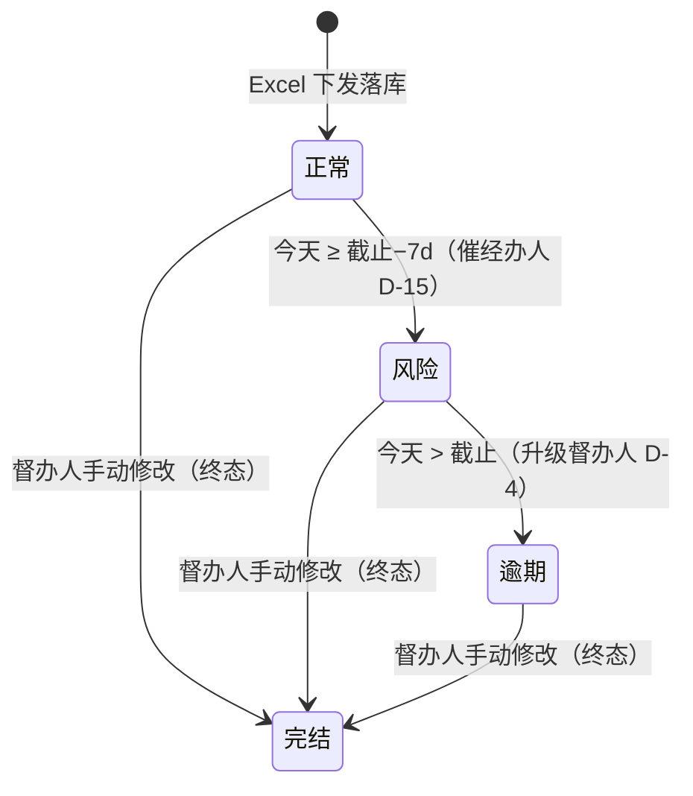
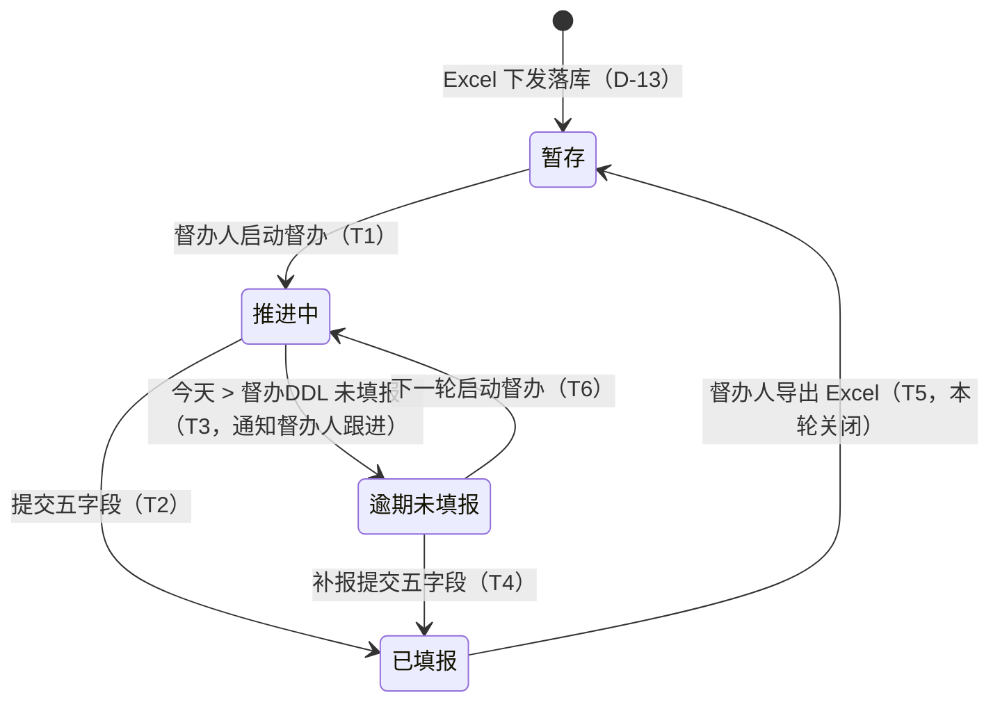

# 督办事项状态机：状态1（正常/风险/逾期/完结）× 状态2（暂存/推进中/已填报/逾期未填报）

<!-- status: draft -->

- **日期**: 2026-09-09 v0.6（**v0.6 按 PM 口径修正 D-22**：①两个字段**完全独立**——状态1 仅由「当前时间 × 截止时间」计算，与状态2、与是否填报无关；②**完结并入状态1**（正常/风险/逾期/**完结** 4 值）：完结由**督办人手动修改**该字段（上级督办室线下同意），完结后锁定、不再参与风险/逾期计算、不再被督办；③**状态2 回到 4 值、去除办结**（暂存/推进中/已填报/逾期未填报）；v0.5「办结挂在跟进字段」「预警需未填报才升级」口径作废）
- **上游**: `prd.md`、`role-scenarios.md`、`embed-form-spec.md`
- **定位**: 全部督办事项的唯一生命周期定义。状态迁移由 **BFF 定时任务 + 龙小督 agent 驱动**（非 Teable 自动化硬编码流程，理由见 `agent-vs-form-interaction.md`）。

## 1. 状态定义（两个独立字段）

### 1.1 状态1（时间状态字段，主表新增，单选 4 值）

| 状态 | 含义 | 进入条件 |
|------|------|----------|
| **正常** | 当前时间未进入截止前 7 天 | Excel 下发落库默认；回改截止时间后按新锚点重算 |
| **风险** | 当前时间进入**截止时间前 7 天**（`今天 ≥ 截止−7d`） | BFF 定时判定（催经办人，D-15） |
| **逾期** | 当前时间**晚于截止时间**（`今天 > 截止`） | BFF 定时判定（逾期升级督办人，D-4） |
| **完结** | 事项办结；**终态** | **督办人手动修改**该字段为完结（上级督办室线下同意，聊内不做审批，D-20）；完结后锁定，不再参与风险/逾期计算、不再被督办 |

- **独立计算（D-22 修正）**：状态1 只看**当前时间与截止时间**，与状态2 取值、与五要素是否填报**完全无关**——已填报的事项到点照样进入风险/逾期（用于提示任务整体临期/超时）；完结除外。
- **完结锁定**：状态1=完结 的记录，BFF 跳过全部监控/催办/预警计算与通知，不出现在待填报徽标、风险/逾期指标中。
- **延期**：不设状态值。不同意完结（或认为不该完结）时，由**督办人手动在 Teable 回改「截止时间」**；BFF 按新锚点（新截止−7d / 新截止）重新计算状态1；完结项不回算。

### 1.2 状态2（跟进状态字段，主表「状态」改造，单选 4 值）

| 状态 | 含义 | 进入条件 |
|------|------|----------|
| **暂存** | 在库事项：已落主表，督办人尚未启动本轮跟进 | Excel 下发落库（D-13）；或上一轮导出关闭后回到在库（T5） |
| **推进中** | 督办人已启动本轮跟进，等待经办人填报五要素 | 督办人启动督办（T1）；或上一轮逾期未填报项重启（T6） |
| **已填报** | 经办人/转办人/次级转办人已提交五字段，等待本轮关闭 | 推进中/逾期未填报提交五字段（T2/T4） |
| **逾期未填报** | 超过**督办人设定的反馈 DDL** 仍未填报（=超期未反馈） | BFF 定时判定 `今天 > 督办DDL`（T3）；可补报回已填报（T4） |

- **提交不受状态1 限制**：风险/逾期（状态1）仍可填报（T2/T4），填报只影响状态2。
- 转办不改变任一字段：转办仅转移「当前填报责任人」；已转办项在转出价视角只读留痕（D-8 不变）。

## 2. 状态图

状态1（独立时间计算；完结为督办人手动修改）：

状态2：

## 3. 迁移表（触发 → 动作 → 通知）

状态2（跟进）：

| # | 迁移 | 触发 | 动作 | 通知 |
|---|------|------|------|------|
| T1 | 暂存→推进中 | 督办人启动督办 | 生成填报批次 + 表单卡片（k/N，预填上次进展） | 经办人 DM：「N 项 + 最近 DDL」+ 表单卡片；消息列表徽标计数（D-14） |
| T2 | 推进中→已填报 | 填报人提交五字段（聊内表单提交=保存 Teable + 存为填报消息，D-20） | 写跟进记录表（创建人=填报人）；该项表单转只读存档（D-12） | 卡片回执「已填报 k/N」；同步督办人 |
| T3 | 推进中→逾期未填报 | BFF 定时：`今天 > 督办DDL` 且未填报 | 表单持续加急（**不生成新表单**，D-15） | push 经办人 + **通知督办人跟进**（原「紧急/超期未反馈」职责） |
| T4 | 逾期未填报→已填报 | 填报人补报提交五字段 | 同 T2 | 同 T2 |
| T5 | 已填报→暂存 | **督办人导出 Excel**（本轮批次关闭信号；BFF 收到 exported 后迁移） | 状态回在库；本轮跟进记录归档；导出文件同步留痕 | 通知填报人「本轮跟进已关闭」；逾期未填报项保持原状态（留痕），由督办人决定下一轮启动（T6） |
| T6 | 逾期未填报→推进中 | 督办人下一轮启动督办（重新设定本轮督办 DDL） | 重新生成填报批次 + 表单卡片 | 同 T1 |

状态1（时间状态）：

| # | 迁移 | 触发 | 动作 | 通知 |
|---|------|------|------|------|
| T7 | 正常→风险 | BFF 定时：`今天 ≥ 截止−7d` 且未完结 | 原表单加急标红 + 加急横幅（**不生成新表单**，D-15） | push 催经办人（频控 D-7） |
| T8 | 风险→逾期 | BFF 定时：`今天 > 截止` 且未完结 | 逾期留痕；表单该项标记逾期 | 逾期升级督办人（只读视图，D-4）；经办人 push |
| — | 任意→完结 | **督办人手动修改**状态1=完结（上级督办室线下同意；聊内不做审批，D-20） | 字段锁定；该项退出全部监控 | 通知经办人「事项已完结」；审计留痕（谁/何时） |

- 督办人查收入口（D-20，无审核；关闭触发不变）：到达督办 DDL 后，龙小督将本批事项以 **supervisor 查收表单**推送督办人——已填报项可直接修改并「提交（保存到 Teable）」、可「导出 Excel」（导出成功后龙小督以**文件消息**发送至会话，同时触发 T5 本轮关闭：已填报项回暂存）；逾期未填报项可「催办」并可由督办人**代录补正**。**完结不在表单内操作**——由督办人在 Teable 手动修改状态1=完结。聊内表单不做审核/打回。

## 4. 数据落点

- 主表两个独立单选：**状态1**（新增，4 值：正常/风险/逾期/完结，BFF 按截止时间定时计算，完结手动）+ **状态2**（原「状态」`fldgIYI60Lz5ztzMANG` 改造，4 值：暂存/推进中/已填报/逾期未填报）；历史数据清洗映射表 PM 确认后执行（见 §5 映射建议）。
- 「督办DDL」字段（本轮反馈截止，逾期未填报由此判定）与「截止时间」字段（状态1 风险/逾期由此判定）需在主表新增/复用；上一轮导出关闭后，下一轮由督办人重新设定督办 DDL；延期 = 督办人回改「截止时间」。
- 完结/延期留痕：督办人手动修改状态1=完结写审计日志（谁/何时/事项）；回改截止时间由 Teable 字段历史自然留痕，跟进时间线可见。
- 督办人查收/修改留痕：督办人在查收表单中的保存写跟进记录表（创建人=督办人）；导出 Excel 动作写审计日志（谁/何时/范围）。
- T3/T7/T8 判定为 BFF 定时任务（对齐 D-15：催办与升级均不生成新表单）。

## 5. 与既有决策的关系（取代与保留）

| 原决策 | 关系 |
|--------|------|
| D-21 状态机 6 值 + 预警链严格串联（推进中→风险→紧急→逾期） | **取代（D-22/v0.6）**：拆为状态1（4 值，纯时间口径）+ 状态2（4 值，跟进口径）两个独立字段；「紧急」去除，其「超期未反馈 / 通知督办人跟进」职责由「推进中→逾期未填报」（T3）继承；风险/逾期锚点不变 |
| D-22 v0.5「办结挂在跟进字段、预警需未填报才升级」 | **修正（v0.6）**：完结并入状态1（督办人手动修改、终态）；状态1 取消「未填报」门槛，仅按当前时间×截止时间计算；状态2 去除办结回到 4 值 |
| D-20 聊内不做审核 | **保留**：完结的审批在上级督办室**线下**完成，聊内/系统内不存在审批流；督办人仅手动改字段 |
| D-3 申请办结 + 两级审批 IT 化 | **仍被取代**：不建系统内审批流；完结 = 线下审批 + 督办人手动修改状态1 |
| D-4 逾期升级督办人 / D-15 自动催办不加表单 | **保留**：风险→催经办人（T7）；逾期未填报→通知督办人跟进（T3）；逾期→升级督办人（T8） |
| D-13 Excel 唯一下发 / D-11 supervisor 表单 / D-12 存档 / D-14 徽标 / D-6 改评 / D-8 转办三级 | **保留**：字段之上的既有能力全部沿用；导出 Excel 仍为本轮关闭触发（T5） |

**历史数据清洗映射建议（待 PM 确认）**：原 6 值 → 新双字段——风险/逾期 → 状态1 同名值；紧急 → 状态2 按「今天 > 督办DDL」判为 推进中 或 逾期未填报；暂存/推进中/已填报 → 状态2 同名值；状态1 全部按截止时间锚点重判（含历史「已完成」类文本 → 完结）。

## 6. 验收

- [ ] 两字段独立：状态1 仅按当前时间×截止时间计算（已填报项到点仍进入风险/逾期；完结项锁定除外），状态2 迁移不受状态1 影响；回归 T1–T8 全链路。
- [ ] 完结：督办人在 Teable 手动将状态1 改为完结后，该项不再出现在风险/逾期指标、待填报徽标、催办/预警任何链路；经办人收到完结通知；修改动作审计留痕。
- [ ] 状态2 闭环：暂存→推进中→已填报（T1/T2）、过督办 DDL 转逾期未填报（T3）可补报（T4）、导出关闭回暂存（T5）、逾期未填报 下轮重启（T6）；状态2 无「办结」值。
- [ ] 锚点准确：`截止−7d` / `督办DDL` / `截止` 三个判定（含跨天、时区）；延期回改截止时间后状态1 按新锚点重算。
- [ ] 暂存→推进中按批启动；督办 DDL 到达后推送 supervisor 查收表单（无审核按钮、无办结按钮）；导出 Excel 后已填报项回暂存、逾期未填报项保持原状态留痕。
- [ ] 风险/逾期未填报/逾期的可视化（看板徽章、表单标红、徽标转红）与新状态一致；「紧急」在状态值、指标、筛选、可视化中全部移除。
