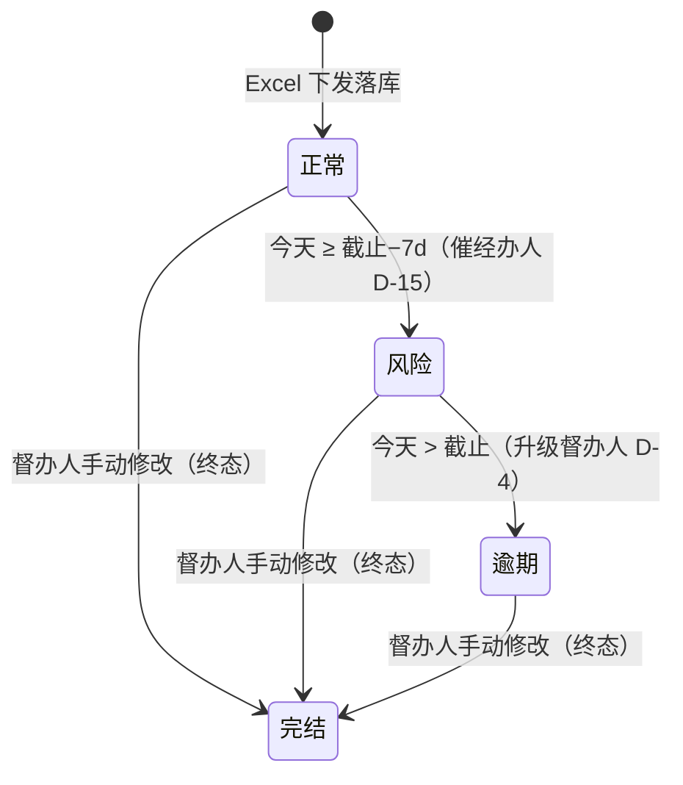
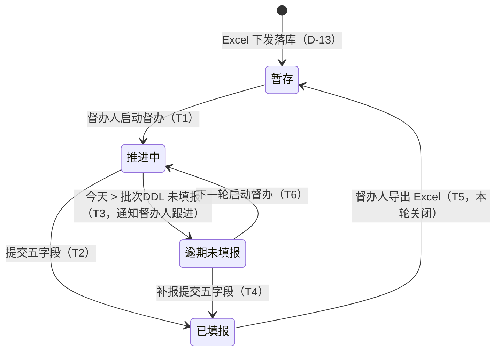

# 督办事项状态机：事项状态（正常/风险/逾期/完结）× 事项跟进状态（暂存/推进中/已填报/逾期未填报）

<!-- status: draft -->

- **日期**: 2026-09-14 v0.11（v0.11 按 PM 2026-09-14 对齐轮（D-31）：§7 增补**台账业务展示名**映射（字段值不变，仅列表/徽标展示用）；催办手动入口移除（督办人台账无催办按钮，自动提醒 D-15 保留））（v0.10 按 PM 2026-09-14 操作映射表（D-30）：新增**越级代提**规则——上级可在下级处理中状态直接填报提交，节点进入「提交者上一级」审核态、通知只发该上一级；已归档（暂存）与更高审核态一律只读；表单只含五要素、无批量操作）（v0.9 按 PM 2026-09-11 决策 D-29 审查修订：v0.9 按 PM 2026-09-11 决策 D-29 审查修订：**DDL 挂督办批次**（推进中事项 DDL=所属批次 DDL，无批次单事项场景保留单事项 DDL）；新增 §7 **节点状态机**（7 值、落跟进记录表、提交即审核、逐级通知不跨级）；T5 导出归档节点同步回「事项暂存中」）（v0.8 按 PM 2026-09-10 决策 D-26/D-27：「事项状态」更名「**事项状态**」、「事项跟进状态」更名「**事项跟进状态**」（单选、每事项各唯一一个值）；填报表单统一命名「**龙小督台账**」）（v0.7 按 PM 2026-09-10 决策 D-23 澄清：**进入风险（截止前 7 天）必须通知经办人**（T7 push 对象明确为经办人）；看板跟进时间线每次填报须展示五要素内容（见 `gui-dashboard-spec.md` v0.9））（**v0.6 按 PM 口径修正 D-22**：①两个字段**完全独立**——事项状态 仅由「当前时间 × 截止时间」计算，与事项跟进状态、与是否填报无关；②**完结并入事项状态**（正常/风险/逾期/**完结** 4 值）：完结由**督办人手动修改**该字段（上级督办室线下同意），完结后锁定、不再参与风险/逾期计算、不再被督办；③**事项跟进状态 回到 4 值、去除办结**（暂存/推进中/已填报/逾期未填报）；v0.5「办结挂在跟进字段」「预警需未填报才升级」口径作废）
- **上游**: `prd.md`、`role-scenarios.md`、`embed-form-spec.md`
- **定位**: 全部督办事项的唯一生命周期定义。状态迁移由 **BFF 定时任务 + 龙小督 agent 驱动**（非 Teable 自动化硬编码流程，理由见 `agent-vs-form-interaction.md`）。

## 1. 状态定义（两个独立字段）

### 1.1 事项状态（时间状态字段，主表新增，单选 4 值）

| 状态 | 含义 | 进入条件 |
|------|------|----------|
| **正常** | 当前时间未进入截止前 7 天 | Excel 下发落库默认；回改截止时间后按新锚点重算 |
| **风险** | 当前时间进入**截止时间前 7 天**（`今天 ≥ 截止−7d`） | BFF 定时判定（催经办人，D-15） |
| **逾期** | 当前时间**晚于截止时间**（`今天 > 截止`） | BFF 定时判定（逾期升级督办人，D-4） |
| **完结** | 事项办结；**终态** | **督办人手动修改**该字段为完结（上级督办室线下同意，聊内不做审批，D-20）；完结后锁定，不再参与风险/逾期计算、不再被督办 |

- **独立计算（D-22 修正）**：事项状态 只看**当前时间与截止时间**，与事项跟进状态 取值、与五要素是否填报**完全无关**——已填报的事项到点照样进入风险/逾期（用于提示任务整体临期/超时）；完结除外。
- **完结锁定**：事项状态=完结 的记录，BFF 跳过全部监控/催办/预警计算与通知，不出现在待填报徽标、风险/逾期指标中。
- **延期**：不设状态值。不同意完结（或认为不该完结）时，由**督办人手动在 Teable 回改「截止时间」**；BFF 按新锚点（新截止−7d / 新截止）重新计算事项状态；完结项不回算。

### 1.2 事项跟进状态（跟进状态字段，主表「状态」改造，单选 4 值）

| 状态 | 含义 | 进入条件 |
|------|------|----------|
| **暂存** | 在库事项：已落主表，督办人尚未启动本轮跟进 | Excel 下发落库（D-13）；或上一轮导出关闭后回到在库（T5） |
| **推进中** | 督办人已启动本轮跟进，等待经办人填报五要素 | 督办人启动督办（T1）；或上一轮逾期未填报项重启（T6） |
| **已填报** | 经办人/转办人/次级转办人已提交五字段，等待本轮关闭 | 推进中/逾期未填报提交五字段（T2/T4） |
| **逾期未填报** | 超过**所属督办批次的批次 DDL** 仍未填报（=超期未反馈；**DDL 双轨 D-29**：推进中事项 DDL=所属批次 DDL，无批次单事项场景保留单事项 DDL） | BFF 定时判定 `今天 > 批次DDL`（T3）；可补报回已填报（T4） |

- **提交不受事项状态 限制**：风险/逾期（事项状态）仍可填报（T2/T4），填报只影响事项跟进状态。
- 转办不改变任一字段：转办仅转移「当前填报责任人」；已转办项在转出价视角只读留痕（D-8 不变）。

## 2. 状态图

事项状态（独立时间计算；完结为督办人手动修改）：

```mermaid
stateDiagram-v2
    [*] --> 正常: Excel 下发落库
    正常 --> 风险: 今天 ≥ 截止−7d（催经办人 D-15）
    风险 --> 逾期: 今天 > 截止（升级督办人 D-4）
    正常 --> 完结: 督办人手动修改（终态）
    风险 --> 完结: 督办人手动修改（终态）
    逾期 --> 完结: 督办人手动修改（终态）
```

事项跟进状态：

```mermaid
stateDiagram-v2
    [*] --> 暂存: Excel 下发落库（D-13）
    暂存 --> 推进中: 督办人启动督办（T1）
    推进中 --> 已填报: 提交五字段（T2）
    推进中 --> 逾期未填报: 今天 > 批次DDL 未填报（T3，通知督办人跟进）
    逾期未填报 --> 已填报: 补报提交五字段（T4）
    已填报 --> 暂存: 督办人导出 Excel（T5，本轮关闭）
    逾期未填报 --> 推进中: 下一轮启动督办（T6）
```

## 3. 迁移表（触发 → 动作 → 通知）

事项跟进状态（跟进）：

| # | 迁移 | 触发 | 动作 | 通知 |
|---|------|------|------|------|
| T1 | 暂存→推进中 | 督办人启动督办 | 生成填报批次 + 表单卡片（k/N，预填上次进展） | 经办人 DM：「N 项 + 批次 DDL（D-29）」+ 表单卡片；消息列表徽标计数（D-14） |
| T2 | 推进中→已填报 | 填报人提交五字段（聊内表单提交=保存 Teable + 存为填报消息，D-20） | 写跟进记录表（创建人=填报人）；该项表单转只读存档（D-12） | 卡片回执「已填报 k/N」；同步督办人 |
| T3 | 推进中→逾期未填报 | BFF 定时：`今天 > 批次DDL` 且未填报 | 表单持续加急（**不生成新表单**，D-15） | push 经办人 + **通知督办人跟进**（原「紧急/超期未反馈」职责） |
| T4 | 逾期未填报→已填报 | 填报人补报提交五字段 | 同 T2 | 同 T2 |
| T5 | 已填报→暂存 | **督办人导出 Excel**（本轮批次关闭信号；BFF 收到 exported 后迁移） | 状态回在库；本轮跟进记录归档；导出文件同步留痕；**节点状态同步回「事项暂存中」（D-29）** | 通知填报人「本轮跟进已关闭」；逾期未填报项保持原状态（留痕），由督办人决定下一轮启动（T6） |
| T6 | 逾期未填报→推进中 | 督办人下一轮启动督办（新 Excel 生成新批次与批次 DDL，D-29） | 重新生成填报批次 + 表单卡片 | 同 T1 |

事项状态（时间状态）：

| # | 迁移 | 触发 | 动作 | 通知 |
|---|------|------|------|------|
| T7 | 正常→风险 | BFF 定时：`今天 ≥ 截止−7d` 且未完结 | 原表单加急标红 + 加急横幅（**不生成新表单**，D-15） | **push 通知经办人**（催办，频控 D-7，D-23） |
| T8 | 风险→逾期 | BFF 定时：`今天 > 截止` 且未完结 | 逾期留痕；表单该项标记逾期 | 逾期升级督办人（只读视图，D-4）；经办人 push |
| — | 任意→完结 | **督办人手动修改**事项状态=完结（上级督办室线下同意；聊内不做审批，D-20） | 字段锁定；该项退出全部监控 | 通知经办人「事项已完结」；审计留痕（谁/何时） |

- 督办人查收入口（D-20，无审核按钮、提交即审核 D-29；关闭触发不变）：到达**批次 DDL** 后，龙小督将本批事项以 **supervisor 查收表单**推送督办人——已填报项可直接修改并「提交（保存到 Teable）」、可「导出 Excel」（导出成功后龙小督以**文件消息**发送至会话，同时触发 T5 本轮关闭：已填报项回暂存）；逾期未填报项可「催办」并可由督办人**代录补正**。**完结不在表单内操作**——由督办人在 Teable 手动修改事项状态=完结。聊内表单不做审核/打回。

## 4. 数据落点

- 主表两个独立单选：**事项状态**（新增，4 值：正常/风险/逾期/完结，BFF 按截止时间定时计算，完结手动）+ **事项跟进状态**（原「状态」`fldgIYI60Lz5ztzMANG` 改造，4 值：暂存/推进中/已填报/逾期未填报）；历史数据清洗映射表 PM 确认后执行（见 §5 映射建议）。
- 「批次 DDL」字段落**督办批次表**（本轮反馈截止，逾期未填报由此判定；DDL 双轨 D-29：推进中事项 DDL=所属批次 DDL，无批次单事项场景保留单事项 DDL）与「截止时间」字段（事项状态 风险/逾期由此判定）需在主表新增/复用；上一轮导出关闭后，下一轮随新 Excel 生成新批次与批次 DDL；延期 = 督办人回改「截止时间」。
- 完结/延期留痕：督办人手动修改事项状态=完结写审计日志（谁/何时/事项）；回改截止时间由 Teable 字段历史自然留痕，跟进时间线可见。
- 督办人查收/修改留痕：督办人在查收表单中的保存写跟进记录表（创建人=督办人）；导出 Excel 动作写审计日志（谁/何时/范围）。
- T3/T7/T8 判定为 BFF 定时任务（对齐 D-15：催办与升级均不生成新表单）。

## 5. 与既有决策的关系（取代与保留）

| 原决策 | 关系 |
|--------|------|
| D-21 状态机 6 值 + 预警链严格串联（推进中→风险→紧急→逾期） | **取代（D-22/v0.6）**：拆为事项状态（4 值，纯时间口径）+ 事项跟进状态（4 值，跟进口径）两个独立字段；「紧急」去除，其「超期未反馈 / 通知督办人跟进」职责由「推进中→逾期未填报」（T3）继承；风险/逾期锚点不变 |
| D-22 v0.5「办结挂在跟进字段、预警需未填报才升级」 | **修正（v0.6）**：完结并入事项状态（督办人手动修改、终态）；事项状态 取消「未填报」门槛，仅按当前时间×截止时间计算；事项跟进状态 去除办结回到 4 值 |
| D-23 风险通知 + 时间线五要素 | **澄清（v0.7）**：①进入风险（截止前 7 天）**必须通知经办人**（T7 push 对象明确）；②GUI 下钻时间线每次填报记录除填报人/填报完成时间外，必须展示**五要素内容**（见 `gui-dashboard-spec.md`） |
| D-20 聊内不做审核 | **保留**：完结的审批在上级督办室**线下**完成，聊内/系统内不存在审批流；督办人仅手动改字段 |
| D-3 申请办结 + 两级审批 IT 化 | **仍被取代**：不建系统内审批流；完结 = 线下审批 + 督办人手动修改事项状态 |
| D-4 逾期升级督办人 / D-15 自动催办不加表单 | **保留**：风险→催经办人（T7）；逾期未填报→通知督办人跟进（T3）；逾期→升级督办人（T8） |
| D-13 Excel 唯一下发 / D-11 supervisor 表单 / D-12 存档 / D-14 徽标 / D-6 改评 / D-8 转办三级 | **保留**：字段之上的既有能力全部沿用；导出 Excel 仍为本轮关闭触发（T5） |

**历史数据清洗映射建议（待 PM 确认）**：原 6 值 → 新双字段——风险/逾期 → 事项状态 同名值；紧急 → 事项跟进状态 按「今天 > 批次DDL」判为 推进中 或 逾期未填报；暂存/推进中/已填报 → 事项跟进状态 同名值；事项状态 全部按截止时间锚点重判（含历史「已完成」类文本 → 完结）。

## 6. 验收

- [ ] 两字段独立：事项状态 仅按当前时间×截止时间计算（已填报项到点仍进入风险/逾期；完结项锁定除外），事项跟进状态 迁移不受事项状态 影响；回归 T1–T8 全链路。
- [ ] 完结：督办人在 Teable 手动将事项状态 改为完结后，该项不再出现在风险/逾期指标、待填报徽标、催办/预警任何链路；经办人收到完结通知；修改动作审计留痕。
- [ ] 事项跟进状态 闭环：暂存→推进中→已填报（T1/T2）、过批次 DDL 转逾期未填报（T3，D-29 双轨）可补报（T4）、导出关闭回暂存（T5）、逾期未填报 下轮重启（T6）；事项跟进状态 无「办结」值。
- [ ] 锚点准确：`截止−7d` / `批次DDL` / `截止` 三个判定（含跨天、时区）；延期回改截止时间后事项状态 按新锚点重算。
- [ ] 节点状态机（§7）：7 值迁移链、提交即审核（无审核按钮）、逐级通知不跨级、导出归档节点回「事项暂存中」（D-29）。
- [ ] 暂存→推进中按批启动；批次 DDL 到达后推送 supervisor 查收表单（无审核按钮、无办结按钮、提交即审核 D-29）；导出 Excel 后已填报项回暂存、逾期未填报项保持原状态留痕。
- [ ] 风险/逾期未填报/逾期的可视化（看板徽章、表单标红、徽标转红）与新状态一致；「紧急」在状态值、指标、筛选、可视化中全部移除。

## 7. 节点状态机（D-29，第三字段）

> 与事项状态、事项跟进状态**完全独立**的第三个字段；节点「事项暂存中」≠ 事项跟进状态「暂存」。

- **字段**：节点状态（单选 **7 值**，落**跟进记录表**，PM 2026-09-11 确认）+ 业务事件节点日志（时间+操作人+事项+前后节点）。
- **7 值**：事项暂存中（初始/归档态）/ 经办人处理中 / 转办人处理中 / 次级转办人处理中 / 转办人审核中 / 经办人审核中 / 督办人审核中。
- **台账业务展示名（D-31，字段值不变）**：事项暂存中=暂存（在库）、经办人处理中=待经办人处理、转办人处理中=待转办人处理、次级转办人处理中=待次级转办人填报、转办人审核中=待转办人提交、经办人审核中=待经办人提交、督办人审核中=待督办人提交；徽标附当前节点归属人（谁头上待办）。
- **迁移链**：督办人下发→经办人处理中→（经办人转办）转办人处理中→（转办人再转）次级转办人处理中→次转提交→转办人审核中→转办人提交→经办人审核中→经办人提交→督办人审核中→**督办人导出 Excel 归档→回事项暂存中**（T5 同步）。
- **提交即审核（PM 2026-09-11）**：系统**不设审核功能按钮**；下一级提交即视为上一级审阅通过并上报，提交记录以**提交人 Token** 写入跟进记录表留存。「审核中」节点=等待上一级查看内容后再提交，审核动作即「查看+提交」。
- **逐级通知（不跨级）**：督办人下发批次→通知对应经办人；转办/再转办→接收方收待办事项通知；次转提交→仅通知转办人、转办人提交→仅通知经办人、经办人提交→仅通知督办人。
- **协作者信息**：节点对应成员（督办人/经办人/转办人/次级转办人）随事件留痕，供台账详情与审计查询。
- **看板口径**：所有角色统一 **批次 > 事项编号 > 事项详情** 三级层级（批次按督办日期近→远）；表单**只含五要素字段**；修改/润色仅在自己看板为暂存状态，必须点**提交**才以提交人 Token 调 API 写入跟进记录表（无批量操作，D-30）。
- **越级代提（D-30，PM 2026-09-14 操作映射表）**：上级可在下级处理中状态直接填报提交（督办人任意未归档态可直提/直审，提交即代表下级链路一并提交）；提交后节点进入**提交者上一级**审核态（经办人代提→督办人审核中、转办人代提→经办人审核中、次转提交→转办人审核中、督办人直提→督办人审核中），通知只发该上一级；已归档（事项暂存中）与更高审核态一律只读。
