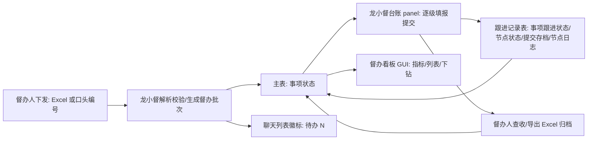

# PRD · 需求板块

> 四大板块：看板 GUI（领导只读）、龙小督台账（聊内填报）、桌面端外壳、龙小督 agent 行为。编号约定：`GUI-xx` 看板、`FORM-xx` 台账表单、`SHELL-xx` 桌面壳、`AGT-xx` 龙小督交互；编号用于研发排期、走查用例与验收对账。逐条功能描述见 `requirements.md`。

## 板块一：督办看板 GUI（领导只读总览）

- **服务对象**：领导/管理层只读总览；督办人全量视图；经办人/转办人/次级转办人仅本人相关（权限过滤）。
- **范围（GUI-01~08）**：5 张指标卡（主表口径：总数/正常/风险/逾期/完结）→ 可组合筛选 + 表头排序事项列表（主表字段列，左右滑动浏览）→ 点击行下钻跟进记录时间线（每次填报展示五要素）；底部分页与指标卡解耦；GUI 零写操作入口。
- **配套产物**：`../04-gui-dashboard/prototype/`（壳内原型）、`../04-gui-dashboard/metrics-dictionary.md`（指标口径）。

## 板块二：龙小督台账嵌入（聊内逐条填报）

- **服务对象**：经办人、转办人、次级转办人（填报）；督办人（查收/修改/导出）。
- **范围（FORM-01~23）**：表单消息卡片（通知/回执载体）→ DM 右侧扩展 panel（默认 480px，可拖拽 320px~覆盖聊天区）→ 批次 > 事项编号 > 事项详情三级看板 → k/N 逐条填报（暂存/提交/转办/润色，按 D-30 映射渲染按钮）→ 提交存档消息可回看 → 服务端草稿持久化 → 督办人批次卡片导出 Excel（导出即归档）。
- **配套产物**：`../02-ledger/prototype/`（17 屏角色场景原型）、`../02-ledger/state-machine.md`（状态机）、`../02-ledger/role-scenarios.md`（角色细分与场景闭环）、`../02-ledger/chat-list-badge.html`（聊天列表徽标）。

## 板块三：桌面端外壳改造

- **范围（SHELL-01~03）**：功能菜单收起为 56px icon bar（hover 显名，状态会话内记忆）；聊天列表可收起（配合 panel 拖宽形成全宽填报，收起不影响未读提醒）；龙小督条目双徽标（未读红点 + 待办事项数量 pill，点击直达会话并打开督办 panel）。
- **配套产物**：`../03-desktop-shell/prototype.html`（四态布局原型图）。

## 板块四：龙小督 agent 行为

- **范围（AGT-01~13）**：任务下发双通道（Excel / 口头编号仅限在库事项，自然语言描述反馈 DDL；解析校验，失败行逐条反馈、不得丢行）；主动通知「N 项 + 最近 deadline」；24h 填报监督；风险/逾期自动提醒与升级——仅通知督办人、可视化只在 GUI 看板，不在台账面板加急（D-44；频控：22:00–8:00 延迟至次日 8:30，每日提醒类 ≤2 条）；DDL 到达推送督办人查收表单；双字段状态机落地（BFF 定时判定）；结果通知与每日汇总数据源；逐级流转通知（不跨级）；全量业务事件节点日志。

## 板块间数据流

