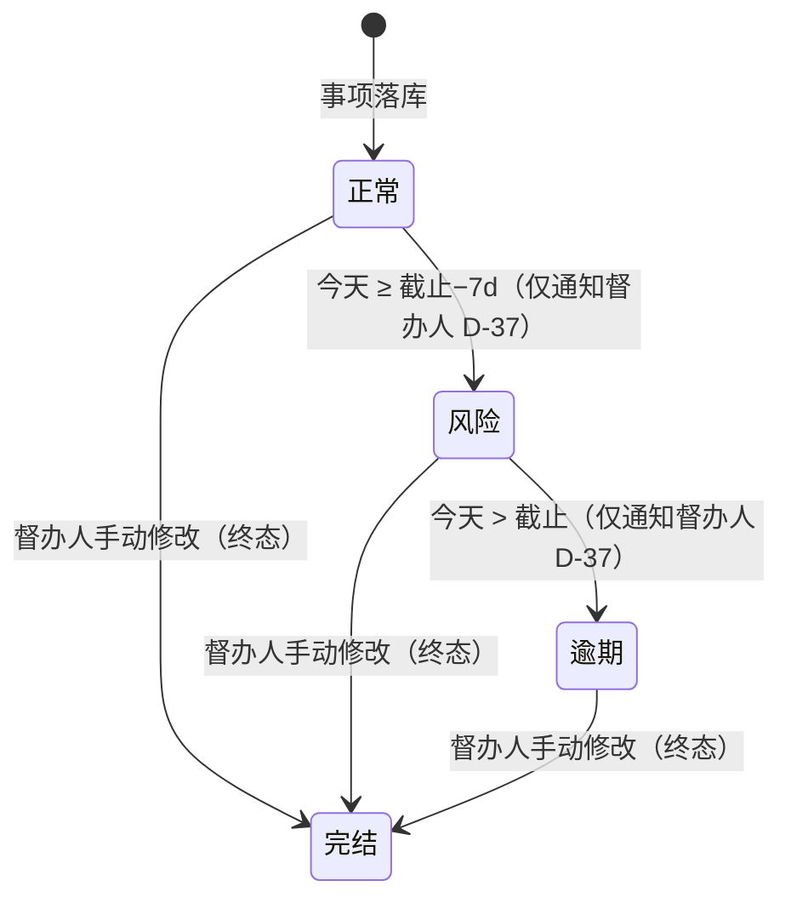
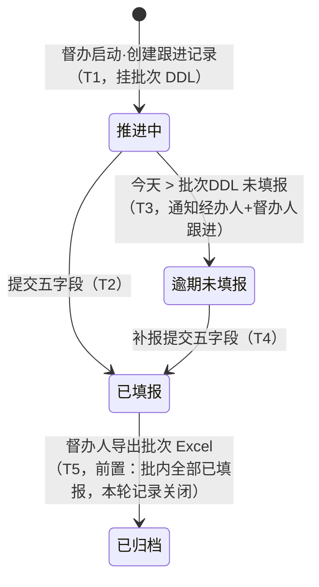

# 督办事项状态机说明（定版 v1.3，含 D-37/D-38/D-42/D-43）

> 全部督办事项与跟进记录的唯一生命周期定义。三个状态字段**相互独立、各自迁移、互不影响**（D-37）：迁移表按字段分开描述，不存在跨字段联动。

## 0. 字段落点总览（D-37/D-38）

| 字段 | 落点 | 与业务对象的关系 |
|------|------|------------------|
| **事项状态**（正常/风险/逾期/完结） | 主表 | 与督办事项 **1-1**：判断整体业务是否存在风险/逾期 |
| **事项跟进状态**（推进中/已填报/逾期未填报/已归档） | **跟进记录表** | 与跟进记录明细 **1-1**：督办人督办一批事项时系统为每个事项创建跟进记录（初始=推进中，挂批次 DDL）；督办人下载批次 Excel 后该批记录转已归档（D-43） |
| **节点状态**（归档/待经办人处理/…/待督办人提交） | **跟进记录表**（独立字段） | 与跟进记录 1-1：记录被创建即指定经办人，导出 Excel 后该批记录转归档（D-38） |
| **提交状态三字段**（经办人是否提交/转办人是否提交/次级转办人是否提交） | **跟进记录表** | 与跟进记录 1-1：对应角色在台账提交（含越级代提）后置真、互不影响；责任链路回显每人提交状态（D-42） |

## 1. 两个独立字段（D-22/D-37）

### 事项状态（时间状态，主表字段，单选 4 值）

| 状态 | 含义 | 进入条件 |
|------|------|----------|
| **正常** | 未进入截止前 7 天 | 事项落库默认；回改截止时间后按新锚点重算 |
| **风险** | 当前时间进入**截止前 7 天**（今天 ≥ 截止−7d） | BFF 定时判定（**仅通知督办人**，D-37） |
| **逾期** | 当前时间**晚于截止时间**（今天 > 截止） | BFF 定时判定（**仅通知督办人**，D-37） |
| **完结** | 终态 | **督办人手动修改**（上级督办室线下同意，D-20）；锁定后不再参与风险/逾期计算、不再被督办 |

- 只看**当前时间×截止时间**，与是否填报**完全无关**——已填报事项到点照样进入风险/逾期。
- **督办人手动调整（D-40）**：① 手动将事项标记为**完结**（终态、锁定，不再被督办）；② **回改「截止时间」**——风险/逾期事项按新锚点（新截止−7d / 新截止）重算，可**恢复为正常**；完结项不回算。

### 事项跟进状态（跟进状态，跟进记录表字段，单选 4 值，D-43）

> 与跟进记录明细 1-1（D-37/D-43）：迁移只发生在跟进记录上——督办人督办一批事项时为每个事项创建跟进记录（初始=推进中，挂批次 DDL）；督办人下载批次 Excel 后该批记录变更为已归档（终态），下一轮督办创建新记录。事项的「当前跟进状态」= 其最新跟进记录的状态。「暂存」已移出值集：表单「暂存」按钮仅为草稿续填动作（D-43）；「在库」为派生业务概念 = 事项无进行中跟进记录（最新跟进记录不存在或已归档），仅用于业务规则表述（如 D-32 口头编号仅限在库事项），不作字段值/指标/筛选值。

| 状态 | 含义 | 进入条件 |
|------|------|----------|
| **推进中** | 已创建本轮待填报跟进记录（挂批次 DDL），等待填报五要素 | 督办人启动督办（T1，创建跟进记录，初始=推进中；上一轮逾期未填报的，**新建记录**而非重启原记录，D-41） |
| **已填报** | 跟进记录五字段已由经办人/转办人/次级转办人提交，等待本轮关闭 | 推进中/逾期未填报提交五字段（T2/T4） |
| **逾期未填报** | 跟进记录超过**所属批次 DDL** 仍未填报（DDL 双轨：推进中记录 DDL=所属批次 DDL，无批次单事项保留单事项 DDL） | BFF 定时判定（T3）；可补报回已填报（T4） |
| **已归档** | 终态：本轮跟进记录已关闭 | 督办人下载批次 Excel（T5，前置：批内全部跟进记录=已填报；该批记录转已归档，节点状态同步归档） |

- **逾期未填报仍可填报提交（D-33）**：逾期类记录照常可填报提交，提交后由逾期未填报改为已填报（T4）；督办人侧无催办按钮，仅直接修改/代录补正。
- **导出前置条件（D-43）**：督办人**仅可导出「批内所有跟进记录均为已填报」的批次**；存在推进中/逾期未填报记录的批次，导出入口置灰不可用，由督办人直接修改/代录补正至全部已填报后方可导出归档。

## 2. 状态图（每字段独立）

事项状态：

事项跟进状态（迁移发生在**跟进记录**上）：

> **逾期未填报不可回推进中（D-41）**：该记录停在逾期未填报（可补报回已填报）；督办人下轮启动督办时系统**新建**跟进记录（推进中，挂新批次 DDL），原记录永久留痕。

## 3. 迁移表（按字段分开，互不迁移）

### 3.1 事项跟进状态（跟进记录生命周期）

| # | 迁移 | 触发 | 动作 | 通知 |
|---|------|------|------|------|
| T1 | 创建记录（初始=推进中） | 督办人督办一批事项 | 为批内每个事项创建本轮跟进记录（挂批次 DDL）+ 表单卡片（k/N，预填上次进展） | 经办人「N 项 + 批次 DDL」+ 表单卡片；消息列表徽标计数 |
| T2 | 推进中→已填报 | 填报人提交五字段 | 写跟进记录表（记录人=填报人）；该项表单转只读存档 | 卡片回执「已填报 k/N」；同步督办人 |
| T3 | 推进中→逾期未填报 | BFF：今天 > 批次DDL 且未填报 | 表单持续加急（不生成新表单，D-15） | push 经办人 + 通知督办人跟进 |
| T4 | 逾期未填报→已填报 | 填报人补报提交 | 同 T2 | 同 T2 |
| T5 | 已填报→已归档 | 督办人下载批次 Excel（**前置：批内所有跟进记录=已填报**，故导出时只存在已填报→已归档；本轮批次关闭信号） | 该批次**全部跟进记录**变更为已归档（终态）；导出留痕；节点状态同步转「归档」 | 通知填报人「本轮跟进已关闭」；留痕由跟进记录本身承担，由督办人决定下轮启动（新建记录，见 T6 注） |
| T6 | ~~逾期未填报→推进中~~ **作废（D-41）** | 逾期未填报的跟进记录**不可回到推进中** | 督办人下轮启动督办时，系统为该事项**新建**跟进记录（推进中，挂新批次 DDL）；原逾期未填报记录永久留痕 | 同 T1（通知发往新记录归属人） |

> **导出前置条件**：仅当批次内所有跟进记录状态=已填报时，督办人方可下载该批次 Excel（T5）；存在推进中/逾期未填报记录的批次导出入口置灰不可用，由督办人直接修改/代录补正（无催办按钮，D-31/D-33）至全部已填报后导出。

### 3.2 事项状态（时间判定，仅通知督办人）

| # | 迁移 | 触发 | 动作 | 通知 |
|---|------|------|------|------|
| T7 | 正常→风险 | BFF：今天 ≥ 截止−7d 且未完结 | GUI 看板事项级标红/徽章（不生成新表单；不在台账加急，D-15/D-44） | **仅通知督办人**（D-37，替代 D-23） |
| T8 | 风险→逾期 | BFF：今天 > 截止 且未完结 | 逾期留痕；GUI 看板事项级标红/徽章 | **仅通知督办人**（逾期升级，只读视图，D-4） |
| — | 任意→完结 | 督办人手动改事项状态=完结 | 字段锁定；退出全部监控 | 通知经办人「事项已完结」；审计留痕 |

> **事项级风险/逾期不进台账（D-44）**：风险/逾期锚定主表「截止时间」，而台账面板按「批次 > 事项 > 事项详情」组织、批次-事项为 **M:N**（一个批次含多个事项；同一事项生命周期内可在多个批次被多次督办收集五要素）——同一条事项级风险/逾期会在多个批次卡片里重复出现，既误导又无法归因到批次，因此**风险/逾期的可视化只落在 GUI 看板（事项级标红/徽章），龙小督台账面板不加急、不标红、不挂横幅**；台账内的加急可视化仅保留批次级「逾期未填报」（锚定批次 DDL，T3）。

## 4. 节点状态机（跟进记录表独立字段，D-38）

与事项状态、事项跟进状态**完全独立**的第三个字段，落在跟进记录表上。

- **字段**：节点状态（单选 **7 值**，跟进记录表独立字段）+ 业务事件节点日志（时间+操作人+前后节点）。
- **7 值**：**归档** / 待经办人处理 / 待转办人处理 / 待次级转办人填报 / 待转办人提交 / 待经办人提交 / 待督办人提交（D-38：原「事项暂存中（暂存）」更名「归档」）。
- **生命周期**：跟进记录创建于督办启动（创建即指定经办人，**初始=待经办人处理**，不存在未激活态）；督办人导出 Excel 后该批次跟进记录**转归档（终态）**；下一轮督办创建新记录。
- **迁移链**：待经办人处理→（转办）待转办人处理→（再转）待次级转办人填报→次转提交→待转办人提交→转办人提交→待经办人提交→经办人提交→待督办人提交→**督办人导出 Excel 归档→归档**（T5 同步）。
- **提交即审核**：系统不设审核按钮；下一级提交即视为上一级审阅通过并上报，提交记录以提交人身份写入跟进记录表。「审核中」= 等待上一级查看后再提交。
- **逐级通知不跨级**：督办人下发批次→通知对应经办人；转办/再转→接收方收待办；次转提交→仅转办人；转办提交→仅经办人；经办提交→仅督办人。
- **越级代提（D-30/D-39）**：上级可在下级任意未归档节点直接填报提交（代提），节点**跨状态直迁**（序列图见 `submission-sequences.md`）：

| 代提提交者 | 事项当前节点（示例） | 直迁目标节点 |
|---|---|---|
| 督办人 | 任意未归档节点 | **归档**（督办人为链路最高级，直提视为全链路审核通过） |
| 经办人 | 待转办人处理 / 待次级转办人填报 / 待转办人提交 | 待督办人提交 |
| 转办人 | 待次级转办人填报 | 待经办人提交 |

- 每次提交（含代提）都以**提交人身份经 API 写入跟进记录**——提交即审核，代表提交人认可所提交内容；代提后下级节点归属人不可再改；已归档与更高审核态一律只读。
- **台账展示**：列表节点展示名即上表 7 值（归档/待经办人处理/…），徽标附当前节点归属人；事项详情责任链路逐环节回显每人提交状态（D-42，见下）。
- **提交状态回显（D-42）**：跟进记录表维护三个独立勾选字段——**经办人是否提交 / 转办人是否提交 / 次级转办人是否提交**；该角色在台账对某批次事项提交（含越级代提）后经 API 写入并置真，与节点状态、事项跟进状态互不影响。台账事项详情的责任链路逐环节回显：该三角色显示「已提交/未提交」，督办人显示「已终审（节点=归档）/待终审」。逾期未填报、导出转归档均不回填未提交角色的字段。

## 5. 数据落点（D-37/D-38）

- 主表新增**事项状态**（单选 4 值，BFF 按截止时间定时计算，完结手动）。
- **跟进记录表**：每条跟进记录两个独立单选字段——**事项跟进状态**（4 值：推进中/已填报/逾期未填报/已归档，D-43）+ **节点状态**（7 值，D-38）+ **提交状态三字段**（经办人/转办人/次级转办人 是否提交，勾选，D-42）；事项当前展示值取其最新跟进记录。「在库」不是字段值：= 事项无进行中跟进记录（最新跟进记录不存在或已归档），仅作派生业务概念使用（D-43）。
- 批次 DDL 落督办批次表（逾期未填报由此判定；DDL 双轨）；「截止时间」为主表字段（风险/逾期由此判定）；延期=督办人回改「截止时间」。**批次-事项 M:N**：一个批次含多个事项；同一事项生命周期内可在多个批次被多次督办（每轮生成一条跟进记录，D-44）。
- 历史数据清洗映射：原 6 值 → 新口径（风险/逾期→事项状态同名；紧急→按「今天>批次DDL」判推进中/逾期未填报；暂存→在库派生概念，不写字段值；事项状态按截止时间锚点重判，含历史「已完成」类文本→完结）。原「主表『状态』改造」口径作废，事项跟进状态落跟进记录表（D-37）。
- 留痕：完结修改写审计日志；督办人查收保存写跟进记录表（记录人=督办人）；导出写审计日志；节点事件写节点日志（含协作者信息）。

## 6. 验收要点

- [ ] 三字段独立：事项状态仅按时间×截止计算；事项跟进状态与节点状态在跟进记录上各自迁移；**不存在跨字段联动/迁移**（D-37）。
- [ ] 字段落点正确：事项状态=主表字段；事项跟进状态、节点状态=跟进记录表字段（D-37/D-38）。
- [ ] 通知对象：风险/逾期**仅通知督办人**（T7/T8）；逾期未填报通知经办人+督办人跟进（T3）。
- [ ] 完结锁定：不再出现在风险/逾期指标、待填报徽标、任何催办链路；经办人收完结通知。
- [ ] 跟进闭环：T1~T5 全路径；**导出前置条件=批内全部跟进记录已填报**（存在推进中/逾期未填报则导出入口不可用）；导出后该批次跟进记录变更为**已归档（终态）**；下轮督办**新建**跟进记录（D-41）。
- [ ] 值集准确：事项跟进状态=推进中/已填报/逾期未填报/已归档（D-43），无「暂存」；「在库」仅作派生业务概念，不作字段值/指标/筛选值。
- [ ] 手动调整（D-40）：督办人完结后锁定退出全部监控；回改截止时间后风险/逾期事项按新锚点重算并可恢复为正常。
- [ ] 锚点准确：截止−7d / 批次DDL / 截止三判定（含跨天、时区）；延期回改后重算。
- [ ] 节点状态机：7 值迁移链、记录创建即待经办人处理、导出归档为终态、提交即审核、逐级通知不跨级。
- [ ] 风险/逾期可视化在 GUI 看板（事项级标红/徽章）与状态一致，**不出现在龙小督台账面板**（D-44）；逾期未填报可视化在台账（角标/查收标红）；「紧急」在状态值、指标、筛选、可视化中全部移除。
