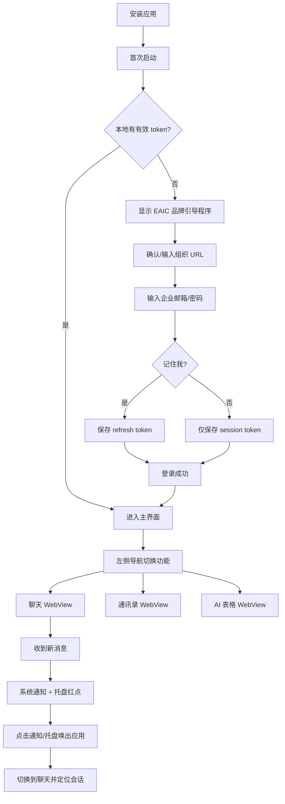
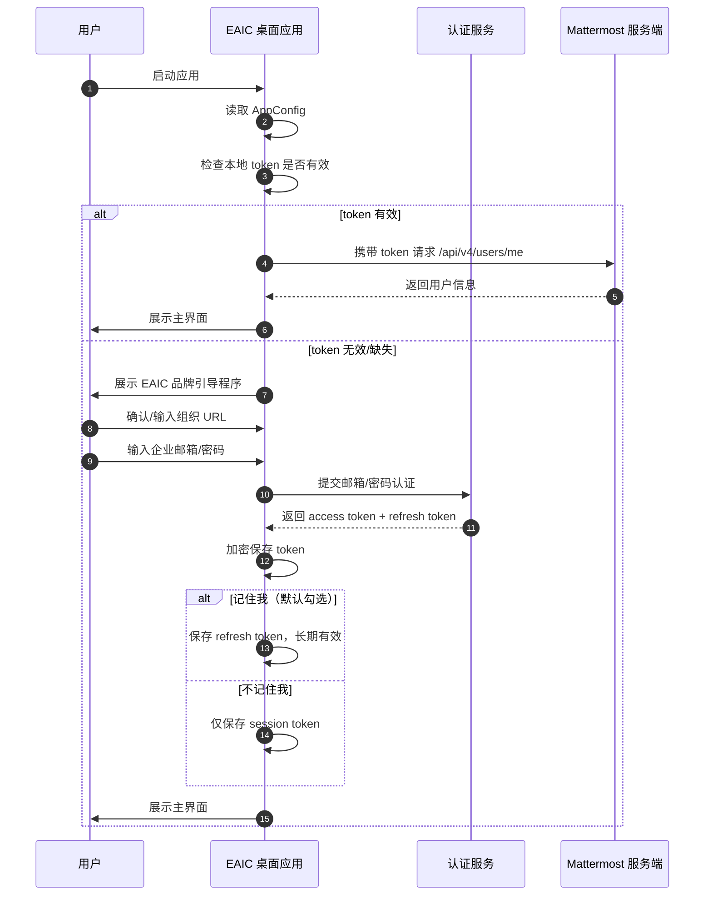
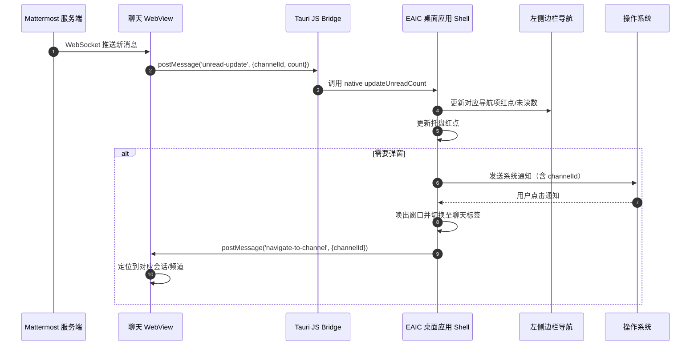
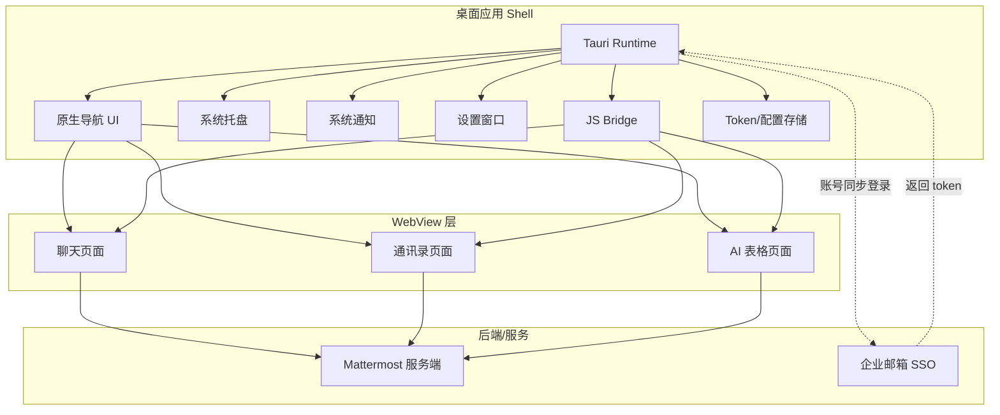

# 流程图：issue-11 企业 IM 桌面应用

## 用户流程

## 业务流：应用启动与登录

## 时序：新消息通知与红点统一

## 架构图

## 模块边界

| 模块 | 职责 | 技术 |
|------|------|------|
| Shell | 窗口管理、生命周期、原生能力调用 | Tauri + Rust |
| Navigation | 一级导航渲染、状态管理 | 前端框架（Vue/React） |
| WebView Container | WebView 创建、销毁、消息桥接 | Tauri WebView API |
| Bridge | JS ↔ Native 通信协议 | Tauri Command + postMessage |
| Settings | 应用设置持久化与 UI | 前端 + Tauri Store/FS |
| Auth | SSO 流程、token 管理、加密存储 | Rust + keyring/DPAPI |
