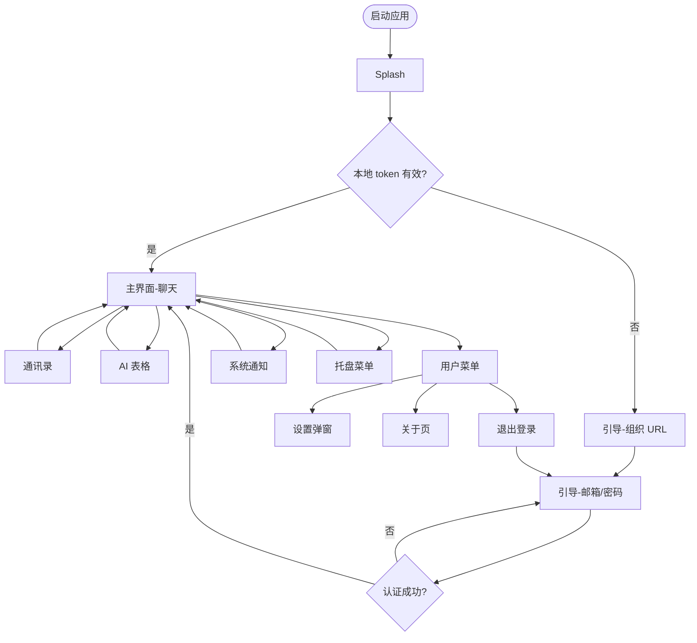
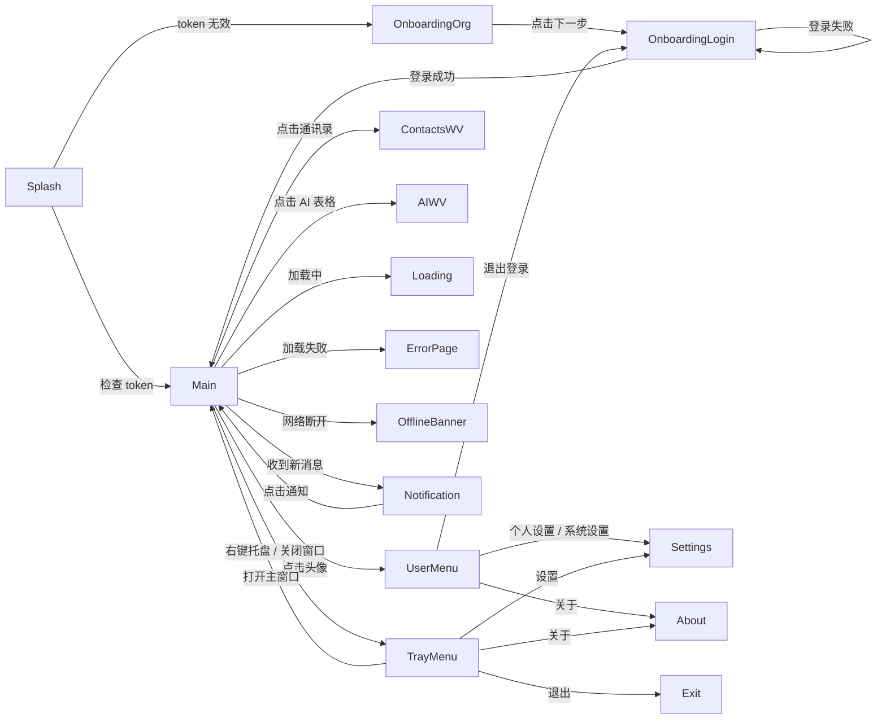

# UI/UX 设计师交接文档：issue-11 企业 IM 桌面应用（EAIC）

<!-- status: approved -->

> **状态**：已 PM 确认，可交付给 UX 设计师开展 GUI 原型设计。  
> **确认时间**：2026-07-21  
> **目标读者**：UX 设计师、前端工程师、产品经理、QA。  
> **关联 PRD**：`issue-11/requirements/2026-07-20-issue-11/prd.md`  
> **关联用户故事**：`issue-11/requirements/2026-07-20-issue-11/user-stories.md`  
> **关联流程/数据模型**：`issue-11/designs/issue-11/flows.md`、`issue-11/designs/issue-11/data-model.md`  
> **交互原型**：`issue-11/designs/issue-11/html-mockups/index.html`

---

## 1. 文档概述

### 1.1 需求背景

企业当前基于 Mattermost B/S 进行二次开发，已在外层增加一级功能目录（通信录、聊天、AI 表格）。但员工仍需通过浏览器访问，流程割裂；Mattermost 品牌暴露、设置不符合中国用户习惯。为此需要一款企业自有品牌的 Windows/macOS 桌面应用 EAIC，将一级功能目录提升为原生 C/S 导航，功能页初期继续通过 WebView 嵌入现有 B/S 二开页面。

### 1.2 设计目标

- **降低使用门槛**：安装包预配置服务器地址，打开应用即进入登录流程。
- **统一消息入口**：系统级通知 + 托盘常驻，提升消息触达率。
- **强化企业品牌**：移除 Mattermost 品牌痕迹，呈现 EAIC 自有形象。
- **本地化体验**：个人/系统设置符合中国企业用户习惯。
- **保护既有投资**：功能页复用现有 B/S 二开页面，保留未来 C/S 化扩展路径。

### 1.3 设计原则

- **简洁克制**：控件密度适中，避免营销化大色块与复杂装饰。
- **品牌一致**：使用企业提供品牌色；在缺乏企业 VI 时，默认采用 **Data UI Design** 规范（主色 `#00AE68`、背景 `#F7F8FA`、字体 PingFang SC）。
- **原生体验**：遵循 Windows/macOS 窗口管理、通知、托盘、自启动等系统习惯。
- **状态可见**：加载、错误、离线、空数据等状态必须明确反馈。
- **边界清晰**：明确原生 C/S 与 WebView B/S 的边界，避免交互职责模糊。

### 1.4 版本记录

| 日期 | 版本 | 说明 | 作者 |
|------|------|------|------|
| 2026-07-21 | v0.1 | 初始框架，待 PM 澄清 | Agent |
| 2026-07-21 | v0.2 | 多轮 PM 澄清后定稿，含页面清单、导航、登录、设置、品牌、异常状态 | Agent / PM |
| 2026-07-22 | v0.3 | 按团队交互文档准出标准补充：文档概述、用户场景与流程、界面流转图、逐页交互说明、交互 Demo 引用；对齐 Data UI Design 设计规范 | Agent |
| 2026-07-23 | v0.4 | 按 PM 反馈加固个人设置账号/用户名只读说明、系统设置与 Mattermost 原生映射、触发通知关键词与桌面通知的关系 | Agent / PM |
| 2026-07-23 | v0.5 | 按 PM 澄清：用户名即全名（实名），与账号（企业邮箱）均为只读；用户使用企业邮箱登录 | Agent / PM |

---

## 2. 产品概述

### 2.1 目标

为企业内部员工提供一款自有品牌的桌面 IM 客户端：

- 启动后无需输入服务器地址，token 有效时自动进入主界面。
- 支持使用已同步到 EAIC 的企业邮箱/密码登录，无需额外注册。
- 提供「记住我」自动登录能力。
- 第三方 SSO/OAuth 登录作为后续迭代能力预留。
- 左侧一级导航（通讯录 / 聊天 / AI 表格）以原生 C/S 方式呈现。
- 聊天、通讯录、AI 表格等功能页初期通过 WebView 嵌入现有 B/S 二开页面。
- 系统通知、托盘常驻、开机自启动等桌面原生体验。
- 隐藏 Mattermost 品牌痕迹，个人/系统设置适配中国用户习惯。

### 2.2 目标用户

- **主要用户**：企业内部员工，使用 Windows 10+ / macOS 12+ 办公。
- **次要用户**：企业 IT/管理员（负责分发与配置）、企业产品负责人（品牌与体验验收）。

### 2.3 平台

- Windows 10+（x64，安装包 `.exe` / `.msi`）
- macOS 12+（x64 + Apple Silicon，安装包 `.dmg` / `.pkg`）

---

## 3. 用户场景与流程

### 3.1 用户场景表

| 场景编号 | 场景名称 | 触发条件 | 用户行为 | 预期结果 | 涉及页面 |
|----------|----------|----------|----------|----------|----------|
| S-01 | 首次安装与登录 | 员工首次下载安装 EAIC | 双击安装包 → 打开应用 → 看到 Splash → 进入引导程序 → 确认组织 URL → 输入企业邮箱/密码 → 点击登录 | 登录成功，进入主界面，默认展示「聊天」WebView | Splash、Onboarding-Org、Onboarding-Login、Main-Chat |
| S-02 | 自动登录 | 本地存在有效 token | 点击应用图标启动 | 展示 Splash 后自动进入主界面 | Splash、Main-Chat |
| S-03 | 日常工作沟通 | 需要处理工作消息 | 点击托盘图标唤出应用 → 在聊天列表选择会话 → 收到新消息 → 点击系统通知 | 消息处理高效，通知可定位到具体会话 | Main-Chat、Notification-Toast、Tray-Menu |
| S-04 | 切换功能模块 | 需要从聊天切换到通讯录/AI 表格 | 点击左侧导航项 | 主区域切换到对应 WebView 页面，导航项显示选中态 | Main-Chat、Main-Contacts、Main-AI-Sheets |
| S-05 | 调整个性化与系统设置 | 需要修改头像、通知、主题、开机自启等 | 点击头像 → 弹出菜单 → 选择「个人设置」/「系统设置」→ 修改并保存/立即生效 | 设置项命名分组符合中国习惯，修改按规则生效 | User-Menu、Settings-Modal |
| S-06 | 离线恢复 | 网络断开 | 网络断开时看到离线提示 → 网络恢复 | 应用自动重连，WebView 自动刷新 | Main-Chat（Offline Banner） |
| S-07 | Token 过期 | access token 过期且刷新失败 | 应用检测到 401 | 显示提示后自动跳转回引导程序重新登录 | Main-Chat → Onboarding-Login |
| S-08 | WebView 加载失败 | 网络异常或服务端问题 | 切换导航后页面加载失败 | 显示错误页，用户可重试或返回 | Main-Chat（Error Page） |

### 3.2 核心用户流程图



---

## 4. 页面清单（Page Inventory）

| 页面/模块 | 类型 | 优先级 | 说明 | 状态 |
|-----------|------|:------:|------|------|
| 启动页 / Splash | 原生 C/S | P0 | 应用启动时展示企业品牌（仅 Logo + 应用名称 EAIC） | 已确认类型，待视觉细化 |
| 引导程序 - 组织 URL | 原生 C/S | P0 | 应用级登录入口第一步：确认/编辑组织地址 | 已确认类型，待视觉细化 |
| 引导程序 - 登录 | 原生 C/S | P0 | 应用级登录入口第二步：输入已同步的企业邮箱/密码 | 已确认类型，待视觉细化 |
| SSO 回调/加载页 | 原生 C/S | P0 | SSO 认证完成后等待 token 交换（本次预留） | 已确认类型，待视觉细化 |
| 主界面框架 | 原生 C/S | P0 | 左侧导航 + WebView 内容区 + 自定义标题栏 | 已确认类型，待视觉细化 |
| 通讯录 | WebView 嵌入 | P0 | 初期复用 B/S 二开通讯录页面 | 已确认类型，待视觉细化 |
| 聊天 | WebView 嵌入 | P0 | 初期复用 B/S 二开聊天页面 | 已确认类型，待视觉细化 |
| AI 表格 | WebView 嵌入 | P0 | 初期复用 B/S 二开 AI 表格页面 | 已确认类型，待视觉细化 |
| 系统通知弹窗 | 原生 OS | P0 | 新消息时由操作系统弹出 | 已确认类型，待视觉细化 |
| 用户头像菜单 | 原生 C/S | P0 | 点击底部头像弹出，含在线状态、设置、关于、退出 | 已确认类型，待视觉细化 |
| 设置弹窗 - 个人设置 | 原生 C/S | P1 | 头像、通知、主题、语言、密码 | 已确认类型，待视觉细化 |
| 设置弹窗 - 系统设置 | 原生 C/S | P1 | 开机自启、最小化到托盘、下载路径、缓存清理 | 已确认类型，待视觉细化 |
| 关于本应用 | 原生 C/S | P0 | 版本号 + 版权 + 企业信息 + 第三方许可 | 已确认类型，待视觉细化 |
| WebView 加载态 | 原生 C/S | P0 | 切换导航或启动时显示加载指示器 | 已确认类型，待视觉细化 |
| WebView 错误页 | 原生 C/S | P0 | 加载失败时显示错误码、重试、返回 | 已确认类型，待视觉细化 |
| 离线提示 Banner | 原生 C/S | P1 | 网络断开时顶部提示，恢复后自动消失 | 已确认类型，待视觉细化 |

---

## 5. 界面流转图

### 5.1 页面与状态节点



### 5.2 主要跳转触发条件

| 起始页面/状态 | 目标页面/状态 | 触发条件 | 备注 |
|---------------|---------------|----------|------|
| Splash | 主界面-聊天 | 本地 token 有效且通过 `/api/v4/users/me` 验证 | 自动跳转 |
| Splash | 引导-组织 URL | 本地无 token 或 token 无效/过期 | 自动跳转 |
| 引导-组织 URL | 引导-登录 | 用户点击「下一步」且 URL 校验通过 | URL 格式/可连接性校验 |
| 引导-登录 | 主界面-聊天 | 用户点击「登录」且认证成功 | 保存 token 后进入 |
| 引导-登录 | 引导-登录（错误态） | 认证失败 | 显示 inline 错误 |
| 主界面-聊天 | 主界面-通讯录 | 用户点击左侧「通讯录」 | WebView 加载通讯录页 |
| 主界面-聊天 | 主界面-AI 表格 | 用户点击左侧「AI 表格」 | WebView 加载 AI 表格页 |
| 主界面 | 用户头像菜单 | 用户点击侧边栏底部头像区域 | 菜单覆盖在头像上方 |
| 用户头像菜单 | 设置弹窗 | 用户选择「个人设置」或「系统设置」 | 弹窗居中显示，原页面不变 |
| 用户头像菜单 | 关于页 | 用户选择「关于 EAIC」 | 在当前 WebView 内容区替换为 About |
| 用户头像菜单 | 引导-登录 | 用户选择「退出登录」 | 清除 token 后跳转 |
| 主界面 | 系统通知 | 收到新消息且满足通知条件 | 操作系统弹窗 |
| 系统通知 | 主界面-聊天 | 用户点击通知 | 唤出窗口并定位会话 |
| 主界面 | 托盘菜单 | 用户右键托盘图标 | 菜单出现在托盘附近 |
| 托盘菜单 | 主界面 | 用户选择「打开主窗口」或单击托盘图标 | 唤出窗口 |
| 主界面 | WebView 加载态 | 切换导航或首次加载 WebView | 显示加载指示器 |
| WebView 加载态 | WebView 错误页 | 加载失败（超时/网络错误/HTTP 错误） | 显示错误码与重试按钮 |
| WebView 错误页 | WebView 加载态 | 用户点击「重试」 | 重新加载原 URL |
| 主界面 | 离线 Banner | 网络断开 | 顶部显示，恢复后自动消失 |

---

## 6. 全局布局与导航

### 6.1 窗口基础规格

| 项 | 当前假设 | 状态 |
|----|----------|------|
| 默认窗口尺寸 | 1280 × 800（最小 1024 × 640） | 已确认（2026-07-21 PM） |
| 是否支持最大化 | 是 | 已确认 |
| 是否支持全屏 | 是 | 已确认（2026-07-21 PM） |
| 是否支持窗口缩放 | 是，但 WebView 内容区按 B/S 页面自身响应式处理 | 已确认（2026-07-21 PM） |
| 侧边栏宽度 | 展开 240px，折叠 72px | 已确认（2026-07-21 PM） |
| 标题栏 | 完全自定义标题栏，包含企业品牌标题和窗口控制按钮 | 已确认（2026-07-21 PM） |
| 窗口圆角 | 8px（与 Data UI Design 控件圆角一致） | 建议 |

### 6.2 一级导航

- **位置**：左侧固定边栏。
- **导航项顺序**：聊天 → 通讯录 → AI 表格（已确认 2026-07-21 PM）。
- **默认选中**：聊天（已确认）。
- **图标与文字**：每个导航项包含图标 + 中文标签；建议从 Data UI Design 图标库选取或企业提供 SVG。
- **折叠行为**：支持折叠为仅图标模式（已确认）。
- **状态**：
  - 默认态
  - 悬停态
  - 选中态（品牌绿背景或文字色）
  - 未读红点态
  - 禁用态（若某模块未开通）

### 6.3 用户信息区

- **位置**：侧边栏底部。
- **展示内容**：当前用户头像、姓名、在线状态（已确认 2026-07-21 PM）。
- **交互**：点击后弹出菜单，包含在线状态切换、「个人设置」「系统设置」「关于」「退出登录」。
- **在线状态**：支持切换（在线 / 离开 / 勿扰 / 离线）（已确认 2026-07-21 PM）。
- **折叠后展示**：仅保留头像 + 在线状态点（已确认 2026-07-21 PM）。

---

## 7. 登录 / SSO 流程

### 7.1 启动与登录状态

```
启动应用
  ├─ 显示 Splash 启动页（企业 Logo + 进度指示）
  ├─ 检查本地 token
       ├─ 有效 → 进入主界面（默认聊天）
       └─ 无效/缺失 → 显示 EAIC 品牌引导程序
            ├─ 步骤一：组织 URL（预配置，可修改）
            ├─ 步骤二：用户名/密码 + 记住我
            └─ 登录成功 → 保存 token → 进入主界面
```

### 7.2 首次启动引导程序（Onboarding Wizard）

PM 已确认：首次安装后打开应用，用户进入引导程序。流程包含组织 URL、已同步的企业邮箱/密码输入。第三方 SSO/OAuth 授权在应用内 WebView 完成（后续迭代）。

#### 步骤一：组织

| 元素 | 说明 | 默认值 | 校验规则 | 异常状态 |
|------|------|--------|----------|----------|
| 页面标题 | 「连接到你的组织」或企业提供文案 | - | - | - |
| 组织首字母/Logo 展示 | 视觉上弱化 URL 输入，以组织首字母或 Logo 为主视觉 | 从 URL 域名提取首字母 | - | URL 无效时显示占位图标 |
| 组织 URL 输入框 | 预配置服务器地址，允许用户修改 | `https://mattermost.example.com`（安装包内置） | 必填；需符合 HTTPS URL 格式；提交前需可连接 | URL 格式错误/无法连接时输入框下方显示 inline 错误 |
| 组织全称 | 输入/确认 URL 后，请求服务器获取组织全称 | 从服务端读取 | - | 读取失败时显示「未知组织」或隐藏 |
| 下一步按钮 | 确认组织后进入身份认证 | - | URL 校验通过前禁用 | 校验中显示按钮 loading 态 |
| 返回/上一步 | 当前步骤无返回 | - | - | - |
| 错误提示 | URL 无效、无法连接服务器 | - | - | 红色文案，位于输入框下方 |

#### 步骤二：身份认证

| 元素 | 说明 | 默认值 | 校验规则 | 异常状态 |
|------|------|--------|----------|----------|
| 企业邮箱输入 | 用户的企业邮箱 | 空（或上次登录邮箱） | 必填；需符合邮箱格式 | 格式错误时输入框变红并提示 |
| 密码输入 | 企业邮箱密码 | 空 | 必填 | 为空时登录按钮禁用 |
| SSO 登录入口 | 当前阶段不展示 | - | - | - |
| 忘记密码链接 | 跳转企业密码重置页或邮箱系统 | - | - | 点击后在外部浏览器打开 |
| 登录按钮 | 提交认证 | - | 邮箱/密码均非空且格式正确时可用 | 点击后显示 loading，认证失败恢复可用并提示错误 |
| 记住我 | 勾选后保存 refresh token | 默认勾选 | - | - |
| 错误提示 | 账号/密码错误、网络断开、组织 URL 失效 | - | - | 输入框下方 inline 红色文案 |

#### 步骤三：登录成功

- 应用获取并保存 token。
- 若用户勾选「记住我」（默认勾选），则保存 refresh token，长期有效直到用户手动退出登录。
- 若未勾选「记住我」，则 token 仅在本次会话有效，关闭应用后清除或仅保留短有效期。
- 进入主界面（默认「聊天」）。

### 7.3 第三方 SSO/OAuth 流程（后续迭代预留）

当前阶段用户使用已同步到 EAIC 的企业邮箱/密码登录。后续如需支持第三方 SSO/OAuth，流程如下：

1. 用户在引导程序中选择 SSO 登录方式。
2. 应用内 WebView 打开 SSO 授权页。
3. 用户完成企业邮箱认证。
4. 应用接收回调授权码 / token。
5. 应用交换 Mattermost token 并加密保存。
6. 进入主界面。

---

## 8. 主界面框架

### 8.1 布局结构

```
┌─────────────────────────────────────────────────────────┐
│  自定义标题栏（窗口控制 + 应用名称 + 最小化/最大化/关闭）   │
├──────────┬──────────────────────────────────────────────┤
│          │                                              │
│  左侧导航 │              WebView 内容区                   │
│          │           （聊天 / 通讯录 / AI 表格）          │
│          │                                              │
│          │                                              │
├──────────┴──────────────────────────────────────────────┤
│  可选：底部状态栏（网络状态、用户信息）                    │
└─────────────────────────────────────────────────────────┘
```

### 8.2 标题栏

- 左侧：应用图标 + 应用名称（无 Mattermost 品牌）。
- 右侧：最小化、最大化/还原、关闭。
- 关闭行为：默认最小化到托盘（可配置为直接退出）。
- 交互：双击标题栏空白区域切换最大化/还原（Windows/macOS 通用习惯）。

### 8.3 WebView 内容区

- WebView 内容区与左侧导航之间需要可见 1px 分割线（已确认 2026-07-21 PM）。
- 切换导航项时，WebView 加载对应 B/S 页面（已确认：每次切换重新加载 2026-07-21 PM）。
- WebView 加载过程中显示加载指示器（居中 spinner + 「正在加载...」文案）。
- WebView 加载失败时显示错误页（带错误代码、重试按钮、返回导航）。

---

## 9. 通讯录 / 聊天 / AI 表格

### 9.1 通讯录

- 初期通过 WebView 加载现有 B/S 通讯录页面。
- 左侧导航「通讯录」可显示未读好友请求或新消息红点（若业务支持）。
- 空态：若 B/S 页面未定义空态，WebView 显示 B/S 自身空态。

### 9.2 聊天

- 默认进入「聊天」导航项。
- WebView 加载现有 B/S 聊天页面。
- 未读消息数通过 JS Bridge 同步到左侧导航红点和托盘红点。
- 点击系统通知时，唤出窗口并切换到「聊天」导航，同时通过 JS Bridge 通知 B/S 页面定位到对应会话/频道。

### 9.3 AI 表格

- WebView 加载现有 B/S AI 表格页面。
- 对所有用户可见（已确认 2026-07-21 PM）。

---

## 10. 通知与托盘

### 10.1 系统通知

| 项 | 当前假设 | 状态 |
|----|----------|------|
| 触发条件 | 收到任何新消息时触发 | 已确认（2026-07-21 PM） |
| 通知标题 | 发送者名称 + 应用名 | 待确认 |
| 通知内容 | 显示发送者 + 消息摘要 | 已确认（2026-07-21 PM） |
| 通知图标 | 企业应用图标 | 待确认 |
| 点击行为 | 唤出窗口，切换到「聊天」导航，并通过 JS Bridge 定位到对应会话/频道 | 已确认（2026-07-21 PM） |
| 免打扰 | 跟随 Mattermost 现有能力支持；作为在线状态之一或独立开关 | 待确认（若 Mattermost 支持则支持） |
| 消息预览开关 | 是否显示消息内容预览 | 待确认，建议默认开启 |

### 10.2 托盘图标

- 应用启动后常驻托盘。
- 托盘图标显示未读红点（数字或红点）。
- 右键托盘菜单：打开主窗口、标记为已读、设置、关于、退出。
- 点击托盘图标：唤出/隐藏主窗口。

### 10.3 启动与关闭行为

- 关闭窗口：默认最小化到托盘。
- 退出应用：通过托盘右键菜单「退出」或设置中关闭「最小化到托盘」后点击关闭按钮。
- 开机自启动：可配置开启/关闭。

---

## 11. 设置

### 11.1 入口

- 点击侧边栏底部用户头像 → 弹出菜单 → 选择「个人设置」或「系统设置」（已确认 2026-07-21 PM）。
- 设置页面以弹窗形式呈现（已确认 2026-07-21 PM）。

### 11.2 个人设置项

> **身份字段约束**：账号（企业邮箱）与姓名（用户名，即人类实名）均来自企业身份体系/组织架构，EAIC 应用层仅做同步展示，**不允许用户自行修改**。用户使用企业邮箱登录。

| 分类 | 设置项 | 默认值 | 生效方式 | 校验/异常 |
|------|--------|--------|----------|-----------|
| **通用** | 头像 | 从 Mattermost 同步 | 上传后需保存 | 支持 jpg/png，大小 ≤ 2MB |
| | 姓名（用户名） | 从 Mattermost/组织架构同步的人类实名 | **只读** | 应用层不可修改；UI 中显示「只读」标签 |
| | 账号（企业邮箱） | 从 Mattermost/企业 AD 同步 | **只读** | 应用层不可修改；UI 中显示「只读」标签 |
| **通知** | 桌面通知 | 开启 | 立即生效 | 若系统权限被拒，显示引导开启 |
| | 通知声音 | 开启 | 立即生效 | - |
| | 邮件通知 | 跟随服务端 | 立即生效 | - |
| | 触发通知的关键词 | 用户名、@all、@channel | 修改后需保存 | 多个关键词用空格分隔；见 §11.5 与桌面通知的关系 |
| **显示** | 主题 | 跟随系统 | 立即生效 | 同步到 WebView |
| | 语言 | zh-CN | 立即生效 | 可能需要刷新 WebView |
| **安全** | 修改密码 | - | 需确认旧密码并保存 | 旧密码校验失败 inline 提示；修改后同步到企业身份体系 |

### 11.3 系统设置项

系统设置在 Mattermost 原生桌面应用设置的基础上，增加企业桌面应用所需的本地行为项。

| 分类 | 设置项 | 默认值 | 生效方式 | 校验/异常 | 与 Mattermost 原生设置的对应关系 |
|------|--------|--------|----------|-----------|----------------------------------|
| **通用** | 开机自启动 | 关闭 | 立即生效 | 需 OS 权限 | 对应 Mattermost 桌面端「Start app on login」 |
| | 关闭窗口时最小化到托盘 | 开启 | 立即生效 | - | 对应 Mattermost 桌面端「Leave app running in notification area when window is closed」 |
| | 下载路径 | 系统下载文件夹 | 选择后立即生效 | 路径无效时提示 | 对应 Mattermost 桌面端「Download Location」 |
| | 语言 | zh-CN | 立即生效 | - | 对应 Mattermost Web 端「Display > Language」；系统设置中提供快捷入口 |
| **高级** | 清理缓存 | - | 点击清理后立即生效 | 清理完成后 toast 提示 | 对应 Mattermost 桌面端「Clear Cache and Reload」 |
| | 硬件加速 | 开启 | 立即生效 | 重启后生效 | 对应 Electron/Chromium 原生开关 |
| | 日志级别 | 信息 | 立即生效 | - | 对应 Mattermost 桌面端「Logging level」 |
| **账号** | 退出登录 | - | 点击后立即生效 | 二次确认弹窗 | 对应 Mattermost 桌面端「Sign Out」 |

### 11.4 生效策略

- **立即生效**：主题、语言、通知开关、声音、开机自启、最小化到托盘、下载路径、硬件加速、日志级别。
- **保存后生效**：头像、触发通知的关键词、修改密码。
- **只读展示**：姓名（用户名）、账号（企业邮箱）。

### 11.5 触发通知的关键词与桌面通知/托盘红点的关系

Mattermost 原生提供「触发通知的关键词（Mention keywords）」设置，用于决定哪些消息会被标记为 **@提及/mention**，从而影响 B/S 页面的未读/mention 计数。

EAIC 的桌面通知与托盘红点逻辑如下：

- **不冲突**：触发通知的关键词是「上游规则」，决定 B/S 端哪些消息产生 mention；EAIC 只负责监听 B/S 通过 JS Bridge 上报的未读/mention 数，并转化为系统通知与托盘红点。
- **协同关系**：
  - 当用户收到一条匹配关键词的消息时，Mattermost 将其计为 mention → B/S 未读数增加 → EAIC 弹出系统通知并更新托盘红点。
  - 若用户关闭「桌面通知」，即使消息匹配关键词，EAIC 也不再弹出系统通知，但 B/S 内部的红点与 mention 标记仍存在。
  - 若用户清空关键词，则只有被 @用户名、@all、@channel 的消息才会触发桌面通知。
- **产品决策**：保留「触发通知的关键词」设置，并在文案中明确其作用于桌面通知与托盘红点的触发条件，避免用户误以为 EAIC 单独维护一套关键词规则。

---

## 12. 品牌与视觉

### 12.1 品牌元素

| 元素 | 当前假设 | 状态 |
|------|----------|------|
| 应用名称 | **EAIC** | 已确认（2026-07-21 PM） |
| 应用图标 | 企业提供，替换 Mattermost 图标 | 待确认 |
| 窗口标题 | 应用名称 | 已确认 |
| 启动图 / Splash | 仅展示企业 Logo + 应用名称 EAIC | 已确认（2026-07-21 PM） |
| 关于页 | 版本号 + 版权信息 + 企业信息 + 第三方许可声明 | 已确认（2026-07-21 PM） |
| 主品牌色 | 企业提供 HEX 色值；缺省采用 Data UI Design `#00AE68` | 待确认 |
| 主题模式 | 浅色 / 深色 / 跟随系统，需要独立深色模式 | 已确认（2026-07-21 PM） |
| 设计规范 | Data UI Design（`/Users/stylesu/Downloads/data-ui design`） | 已确认作为基础规范 |

### 12.2 Data UI Design 基础 Token

在缺乏企业 VI 源文件时，界面设计默认采用以下 token：

| Token | 浅色模式 | 深色模式 | 用途 |
|-------|----------|----------|------|
| `--background` | `#F7F8FA` | `#171918` | 页面背景 |
| `--foreground` | `#171918` | `#F5F7FA` | 主文字 |
| `--primary` | `#00AE68` | `#00AE68` | 主按钮、选中态、焦点环 |
| `--primary-foreground` | `#FFFFFF` | `#FFFFFF` | 主按钮文字 |
| `--secondary` | `#F5F6F7` | `#373D42` | 次级按钮/背景 |
| `--muted` | `#F5F6F7` | `#252A2E` | 侧边栏、输入框背景 |
| `--border` | `#E5E8EB` | `#373D42` | 边框、分割线 |
| `--destructive` | `#F53F3F` | `#F53F3F` | 错误、退出、删除 |
| `--radius` | `8px` | `8px` | 控件圆角 |
| 字体 | `PingFang SC, Noto Sans SC, Microsoft YaHei, ui-sans-serif, sans-serif` | - | 界面字体 |

### 12.3 需要隐藏的 Mattermost 品牌

- 窗口标题中的 Mattermost 字样。
- 应用图标。
- 启动图。
- 关于页面。
- 服务器 URL 输入入口（或弱化为组织确认）。
- Mattermost 相关外链（帮助中心、社区等）。

---

## 13. 页面交互说明

### 13.1 启动页 / Splash

- **触发时机**：应用启动时立即显示。
- **内容**：企业 Logo + 应用名称 EAIC + 可选 slogan。
- **加载态**：底部显示水平进度条或 spinner，提示「正在启动…」。
- **自动跳转**：
  - token 有效且验证通过 → 主界面（默认聊天）。
  - token 无效/缺失 → 引导-组织 URL。
- **手势/键盘**：无交互，不可关闭。
- **边界**：启动异常时显示错误页（如配置文件损坏）。

### 13.2 引导程序 - 组织 URL

- **字段默认值**：从安装包配置文件读取 `server_url`。
- **字段校验**：
  - 必填。
  - 必须以 `https://` 开头。
  - 提交前尝试访问 `/api/v4/system/ping` 确认可连接。
- **按钮状态**：
  - URL 为空或格式错误时，「下一步」禁用。
  - 校验过程中按钮显示 loading。
- **错误状态**：
  - URL 格式错误：输入框边框变红，下方提示「请输入有效的 HTTPS 地址」。
  - 无法连接：提示「无法连接到该组织地址，请检查网络或联系 IT 管理员」。
- **动效**：组织 Logo/首字母在 URL 确认后淡入。

### 13.3 引导程序 - 登录

- **字段默认值**：
  - 企业邮箱：空（或可记住上次登录邮箱）。
  - 密码：空。
  - 记住我：勾选。
- **字段校验**：
  - 邮箱必填，需符合邮箱格式。
  - 密码必填。
- **按钮状态**：
  - 邮箱/密码任一为空或格式错误时，「登录」禁用。
  - 点击后按钮进入 loading 态，文案变为「登录中…」。
  - 认证失败恢复可用状态。
- **错误状态**：
  - 账号/密码错误：密码输入框下方显示「邮箱或密码错误，请检查后重试」。
  - 网络断开：显示「网络连接异常，请检查网络后重试」。
  - 组织 URL 失效：显示「无法连接到组织，请返回上一步检查地址」。
- **动效**：登录成功后全屏淡出到主界面。

### 13.4 主界面框架

- **布局响应**：
  - 窗口宽度 ≥ 1024px 时侧边栏默认展开。
  - 窗口宽度 < 1024px 时侧边栏自动折叠（或允许用户手动折叠）。
- **标题栏交互**：
  - 点击最小化：窗口最小化到任务栏。
  - 点击最大化/还原：切换窗口大小。
  - 点击关闭：默认最小化到托盘。
- **侧边栏折叠**：
  - 触发：点击用户头像菜单中的「折叠侧边栏」或窗口宽度不足。
  - 展开宽度 240px，折叠宽度 72px。
  - 折叠后导航项仅显示图标，tooltip 显示中文标签。
- **分割线**：左侧导航与 WebView 之间 1px 实线，颜色 `--border`。

### 13.5 用户头像菜单

- **触发**：点击侧边栏底部用户头像区域。
- **位置**：菜单在头像上方弹出，不超出窗口边界。
- **菜单项**：
  - 头部：姓名 + 邮箱。
  - 在线状态切换（在线/离开/勿扰/离线）。
  - 分隔线。
  - 个人设置。
  - 系统设置。
  - 关于 EAIC。
  - 分隔线。
  - 退出登录（destructive 色）。
- **状态反馈**：
  - 选中在线状态后，头像右下角状态点即时更新。
  - 鼠标悬停菜单项高亮。
- **关闭方式**：点击菜单外区域、选择菜单项、按 Esc。

### 13.6 设置弹窗

- **弹窗尺寸**：建议宽度 720px，高度 520px，居中显示。
- **结构**：
  - 左侧 180px 分类导航。
  - 右侧内容区。
  - 右上角关闭按钮。
- **分类切换**：点击左侧分类即时切换右侧内容，无保存弹窗。
- **开关控件**：使用 Data UI Design toggle；点击后立即切换视觉状态。
- **输入框**：
  - 获得焦点时显示 `--primary` 色边框。
  - 校验失败时边框变 `--destructive` 色。
- **保存按钮**：
  - 仅对「保存后生效」项显示保存按钮。
  - 点击后显示 loading，保存成功显示 toast「保存成功」，失败显示 inline 错误。
- **退出登录**：点击后弹出二次确认弹窗「确定要退出登录吗？」。

### 13.7 WebView 加载态

- **触发**：切换导航、首次进入主界面、重试加载。
- **表现**：内容区居中显示 spinner + 「正在加载…」。
- **超时处理**：加载超过 10 秒仍未完成，自动显示错误页（可配置）。
- **取消**：用户可点击导航切换到其他页面，当前加载请求取消。

### 13.8 WebView 错误页

- **触发**：URL 不可达、HTTP 错误、超时、证书错误。
- **内容**：
  - 错误图标（红色感叹号）。
  - 错误标题：「页面加载失败」。
  - 错误代码：如 `ERR_CONNECTION_REFUSED`、`ERR_TIMED_OUT`、`404`、`500`。
  - 操作按钮：「重试」「返回」。
- **按钮行为**：
  - 重试：重新加载当前 URL。
  - 返回：回到上一页或默认首页（聊天）。
- **网络恢复**：检测到网络恢复后自动重试一次。

### 13.9 离线提示 Banner

- **触发**：应用检测到网络断开。
- **位置**：WebView 内容区顶部，紧贴标题栏下方。
- **内容**：⚠️ 网络连接已断开，部分功能不可用。恢复后将自动重连。
- **关闭**：不可手动关闭；网络恢复后自动消失。
- **状态联动**：侧边栏用户状态点可同步变为「离线」。

### 13.10 系统通知弹窗

- **触发**：应用在线、未聚焦、用户开启桌面通知、收到新消息。
- **内容**：
  - 左侧：发送者头像。
  - 标题：发送者名称。
  - 子标题：应用名（EAIC）。
  - 正文：消息摘要（最多 2 行）。
- **点击行为**：唤出应用窗口 → 切换到「聊天」导航 → 通过 JS Bridge 定位到对应会话。
- **权限被拒**：若系统通知权限被拒绝，在设置中显示提示条引导用户开启。

### 13.11 托盘菜单

- **触发**：右键托盘图标。
- **菜单项**：
  - 打开主窗口。
  - 标记为已读（显示未读数字 badge）。
  - 设置。
  - 关于。
  - 分隔线。
  - 退出（destructive 色）。
- **单击托盘图标**：唤出/隐藏主窗口。
- **未读 badge**：托盘图标上叠加红色圆点或数字。

### 13.12 关于页

- **入口**：用户头像菜单 → 关于 EAIC。
- **内容**：
  - 应用 Logo。
  - 应用名称 EAIC。
  - 版本号与 Build 号。
  - 企业名称。
  - 版权信息。
  - 第三方开源许可声明（可点击展开）。
  - IT 支持联系方式。
- **交互**：点击许可声明可打开详情弹窗或外部浏览器。

### 13.13 手势与快捷键

- **全局快捷键**：
  - `Ctrl/Cmd + ,`：打开设置。
  - `Ctrl/Cmd + W`：关闭窗口（最小化到托盘）。
  - `Ctrl/Cmd + Q`：退出应用。
  - `Ctrl/Cmd + 1/2/3`：切换导航项（1=聊天，2=通讯录，3=AI 表格）。
- **侧边栏**：鼠标悬停折叠按钮显示 tooltip。
- **WebView 内手势**：由 B/S 页面自身处理，原生层不拦截。

---

## 14. 异常状态

### 14.1 网络异常

- 应用检测到网络断开时，显示离线提示 banner，不强制退出。
- 网络恢复后自动重连 WebSocket 并刷新当前 WebView。

### 14.2 Token 过期

- 检测到 401 或登录态失效时，自动跳转回登录/引导程序页面。
- 跳转前可短暂显示「登录已过期，请重新登录」提示。

### 14.3 WebView 加载失败

- 显示错误页，包含错误代码、重试按钮、返回导航。

### 14.4 单实例限制

- 第二次启动应用时，唤起已有窗口而非新建实例。

### 14.5 通知权限被拒

- 在设置中提示用户开启系统通知权限，并提供「前往系统设置」按钮。

---

## 15. 待澄清问题汇总

### 已确认（可追踪到上文）

- 应用名称：**EAIC**
- 一级导航顺序：聊天 → 通讯录 → AI 表格；默认首页为聊天
- 侧边栏宽度：展开 240px，折叠 72px；支持折叠为仅图标
- 侧边栏底部显示头像/姓名/在线状态；点击弹出菜单
- 在线状态支持切换：在线 / 离开 / 勿扰 / 离线
- 主窗口尺寸：1280 × 800（最小 1024 × 640）；支持全屏、最大化、缩放
- 标题栏：完全自定义（含企业品牌标题和窗口按钮）
- WebView 内容区与左侧导航之间需要分割线
- 切换导航项时 WebView 每次重新加载
- 通知点击后：唤出窗口、切换到「聊天」导航，并定位到对应会话/频道
- 系统通知触发条件：任何新消息；内容显示发送者 + 消息摘要
- 托盘右键菜单：打开主窗口 / 标记为已读 / 设置 / 关于 / 退出
- 首次启动：进入引导程序，确认组织 URL（预配置可改）→ 输入已同步的企业邮箱/密码 → 登录
- 当前阶段仅支持已同步的企业邮箱/密码登录，第三方 SSO/OAuth 入口不展示
- 登录错误：输入框下方 inline 提示
- 设置入口：点击头像弹出菜单 → 选择设置
- 设置弹窗形式：弹窗；内部左右分栏
- 个人/系统设置项清单、生效策略、布局均已确认
- 主题影响范围：原生界面 + WebView 内 B/S 页面；需要独立深色模式
- 语言默认 zh-CN；时区跟随系统；下载路径默认系统下载文件夹
- Token 过期：自动跳转回登录/引导程序
- 品牌规范：企业提供，缺省采用 Data UI Design
- 关于页：版本号 + 版权 + 企业信息 + 第三方许可
- Splash：仅 Logo + 应用名称 EAIC
- AI 表格对所有用户可见

### 待 PM 最终确认

1. 当前 `ui-handoff.md` 是否足够清晰，可交付给 UX 设计师开展 GUI 原型设计？
2. 通知标题与图标是否由企业提供，还是采用默认 EAIC 图标？
3. 是否需要消息预览开关（通知中显示/隐藏消息内容）？

### 待后续提供（非 PM 澄清阻塞项）

- 企业 VI / 设计规范 / 品牌色 / 图标 / Logo 源文件。
- Mattermost 当前设置项的具体字段清单（用于与推荐清单对齐）。
- 离线提示的位置和文案（可交由 UX 设计阶段结合 Mattermost 现状确定）。

---

## 16. 交互 Demo / 原型

- **文件位置**：`issue-11/designs/issue-11/html-mockups/index.html`
- **使用方式**：用浏览器直接打开该 HTML 文件。
- **已覆盖屏幕**：
  - 启动页 Splash
  - 引导程序 - 组织 URL
  - 引导程序 - 登录（含错误态）
  - SSO 回调加载页
  - 主界面 - 聊天 / 通讯录 / AI 表格
  - WebView 加载态 / 错误态 / 离线态
  - 用户头像菜单
  - 设置弹窗（个人/系统全部分类）
  - 系统通知弹窗
  - 托盘菜单
  - 关于页
- **交互说明**：
  - 左侧导航可切换屏幕。
  - 主界面中点击底部用户区可打开用户菜单。
  - 点击「打开设置面板」可查看完整设置分类。
  - 点击「模拟系统通知」查看通知效果。
  - 点击「切换浅色 / 深色模式」查看主题变化。
- **设计规范对齐**：原型已按 Data UI Design 主色 `#00AE68`、字体栈、8px 圆角、4px 间距基准进行更新。

---

## 17. 参考

- PRD：`issue-11/requirements/2026-07-20-issue-11/prd.md`
- 用户故事：`issue-11/requirements/2026-07-20-issue-11/user-stories.md`
- 流程图：`issue-11/designs/issue-11/flows.md`
- 数据模型：`issue-11/designs/issue-11/data-model.md`
- 功能目录：`issue-11/designs/issue-11/feature-catalog.md`
- 场景分析：`issue-11/designs/issue-11/scenarios.md`
- 交互原型：`issue-11/designs/issue-11/html-mockups/index.html`
- 设计规范：`/Users/stylesu/Downloads/data-ui design/README.md`、`SKILL.md`、`colors_and_type.css`
- GitHub Issue #11：https://github.com/sushanglewis/WeLink/issues/11
