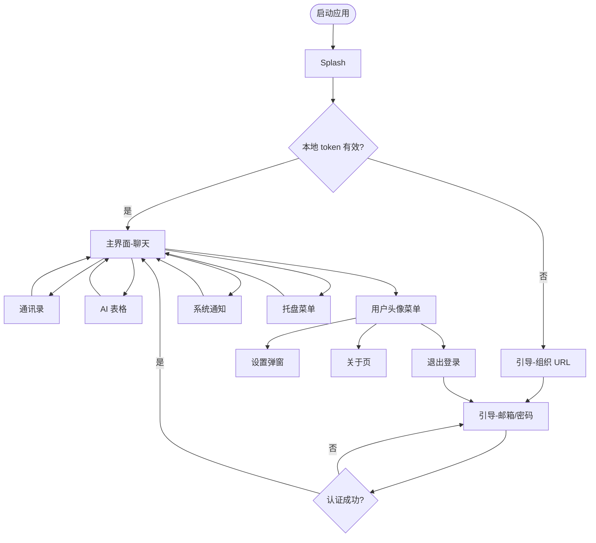

# Page Map: issue-11 EAIC 企业 IM 桌面应用

<!-- version: v1.0 -->

## 1. 页面清单

| 页面/模块 | 类型 | 优先级 | 说明 |
|-----------|------|:------:|------|
| 启动页 / Splash | 原生 C/S | P0 | 应用启动时展示企业品牌（Logo + 应用名称 EAIC） |
| 引导程序 - 组织 URL | 原生 C/S | P0 | 应用级登录入口第一步：确认预配置的组织地址 `lgdg.cc` |
| 引导程序 - 登录 | 原生 C/S | P0 | 输入已同步的企业邮箱/密码，「记住我」默认勾选 |
| 主界面框架 | 原生 C/S | P0 | 左侧导航 + WebView 内容区 + 自定义标题栏 |
| 通讯录 | WebView 嵌入 | P0 | 复用 B/S 二开通讯录页面 |
| 聊天 | WebView 嵌入 | P0 | 复用 B/S 二开聊天页面；默认首页 |
| AI 表格 | WebView 嵌入 | P0 | 复用 B/S 二开 AI 表格页面 |
| 系统通知弹窗 | 原生 OS | P0 | 新消息时由操作系统弹出；默认展示消息预览 |
| 用户头像菜单 | 原生 C/S | P0 | 点击底部头像弹出，含在线状态、设置、关于、退出 |
| 设置弹窗 - 个人设置 | 原生 C/S | P1 | 头像、通知、主题、语言、密码；账号/姓名只读 |
| 设置弹窗 - 系统设置 | 原生 C/S | P1 | 开机自启、最小化到托盘、下载路径、缓存清理 |
| 关于本应用 | 原生 C/S | P0 | 版本号 + 版权 + 企业信息 + 第三方许可 |
| WebView 加载态 | 原生 C/S | P0 | 切换导航或启动时显示加载指示器 |
| WebView 错误页 | 原生 C/S | P0 | 加载失败时显示错误码、重试、返回 |
| 离线提示 Banner | 原生 C/S | P1 | 网络断开时顶部提示，恢复后自动消失 |

## 2. 信息架构

```
EAIC 桌面应用
├── 启动
│   └── Splash
├── 引导程序（无有效 token 时）
│   ├── 组织 URL 确认
│   └── 企业邮箱/密码登录
├── 主界面
│   ├── 自定义标题栏
│   ├── 左侧一级导航
│   │   ├── 聊天（默认）
│   │   ├── 通讯录
│   │   └── AI 表格
│   ├── WebView 内容区
│   │   ├── 加载态
│   │   ├── 错误页
│   │   └── 离线 Banner
│   └── 底部用户区
│       └── 头像菜单
│           ├── 在线状态切换
│           ├── 个人设置
│           ├── 系统设置
│           ├── 关于 EAIC
│           └── 退出登录
├── 系统通知（OS 级别）
└── 托盘菜单
    ├── 打开主窗口
    ├── 标记为已读（遵循 Mattermost 原生实现）
    ├── 设置
    ├── 关于
    └── 退出
```

## 3. 核心页面流转



## 4. 与 PRD 对齐

- 所有页面均来自 PRD §3 功能拆解与 §6 验收标准。
- 导航顺序固定为「聊天 → 通讯录 → AI 表格」，默认选中「聊天」。
- 登录流程仅支持已同步的企业邮箱/密码，无 SSO/OAuth 入口。
- 组织地址统一为 `lgdg.cc`，引导程序中仅做确认。
- 设置项分布与 PRD §5.4 一致：语言设置位于个人设置（Display）。
- 通知触发条件与 PRD §5.3 BR-013 一致：应用在线、未处于前台聚焦、用户已开启桌面通知、收到新消息。
- 消息预览默认开启，可在个人设置中关闭。

## 5. 参考

- PRD：`issue-11/prd.md`（第 6 章「页面与交互详细规格」为逐页字段、交互、异常状态的唯一事实来源）
- 交互原型：`issue-11/designs/html-mockups/index.html`
- 场景分析：`issue-11/designs/scenarios.md`
- 功能目录：`issue-11/designs/feature-catalog.md`
- 流程图：`issue-11/designs/flows.md`
- 数据模型：`issue-11/designs/data-model.md`
- 可行性分析：`issue-11/designs/feasibility.md`
- 设计评审：`issue-11/designs/design-review.md`
