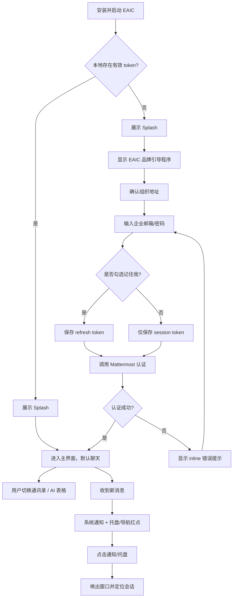
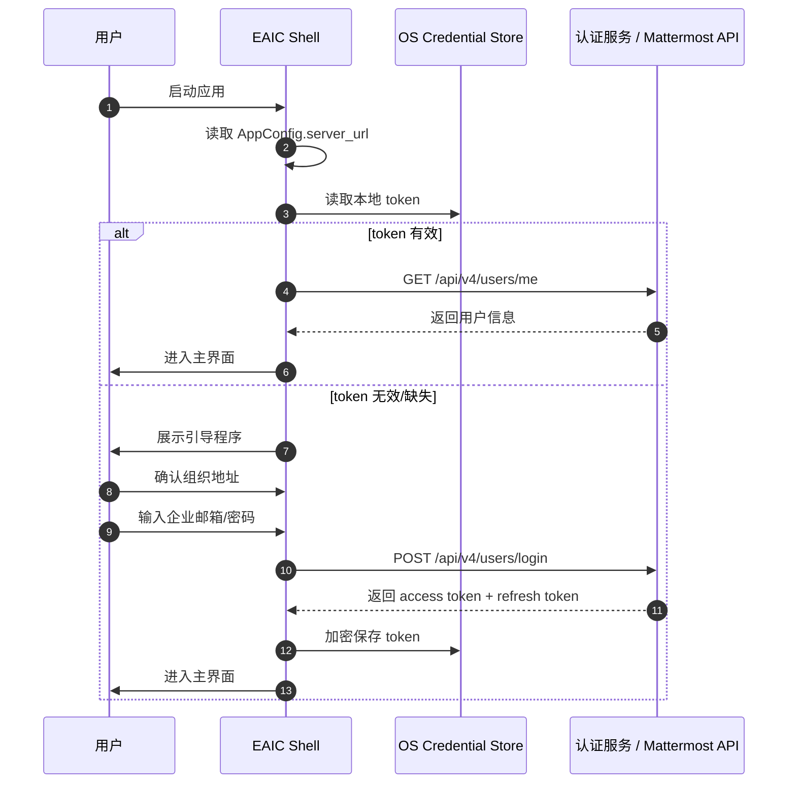
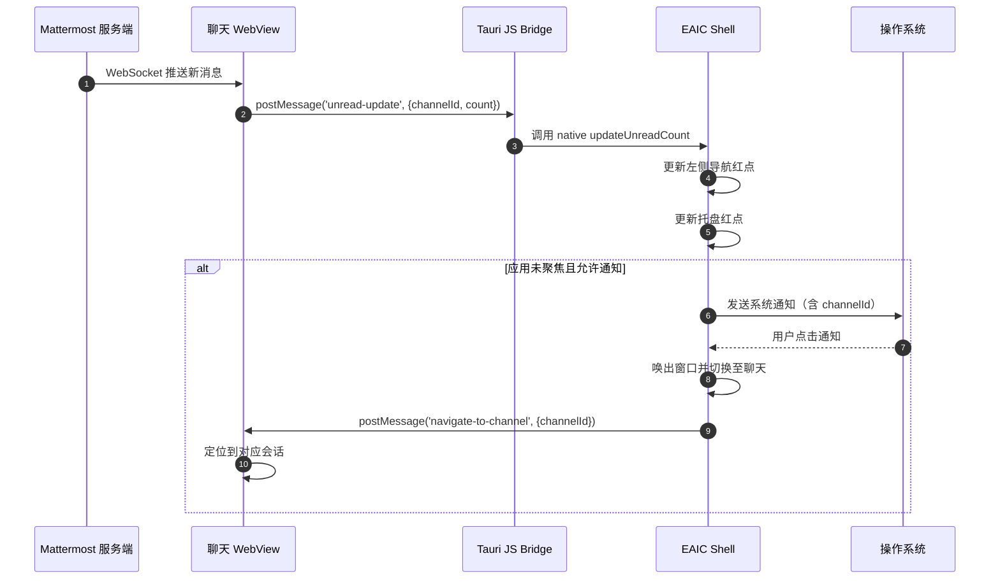

# PRD: issue-11 企业 IM 桌面应用（EAIC）

<!-- status: approved -->
<!-- version: v1.0 -->

> **目标读者**：产品经理、UX 设计师、研发工程师、QA、企业 IT/管理员。  
> **关联文档**：
> - 需求澄清：`issue-11/requirements/requirements.md`
> - 用户故事：`issue-11/requirements/user-stories.md`
> - 设计文档：`issue-11/designs/design-review.md`、`issue-11/designs/page-map.md`
> - 流程/数据模型：`issue-11/designs/flows.md`、`issue-11/designs/data-model.md`
> - 交互原型：`issue-11/designs/html-mockups/index.html`
> - GitHub Issue：#11

---

## 版本记录

| 日期 | 版本 | 说明 | 作者 |
|------|------|------|------|
| 2026-07-20 | v0.1 | 初始 PRD 框架 | Agent |
| 2026-07-21 | v0.2 | PM 确认功能范围与验收清单 | Agent / PM |
| 2026-07-22 | v0.3 | 按团队 PM 准出标准补齐需求背景、用户故事、功能拆解、业务流程图、Given/When/Then 验收标准、业务规则、关联系统/接口；引用 Data UI Design 设计规范 | Agent |
| 2026-07-23 | v0.4 | 同步 PM 决策：个人设置账号/用户名只读、系统设置与 Mattermost 原生对齐、明确「触发通知的关键词」与桌面通知的上下游关系 | Agent / PM |
| 2026-07-23 | v1.0 | 定版：同步 PM 最终决策，移除 SSO、统一通知触发条件、补充消息预览/通知图标/401 处理规则 | Agent / PM |

---

## 1. 需求背景

### 1.1 业务背景

企业当前基于 Mattermost B/S 进行二次开发，已在外层增加一级功能目录（通信录、聊天、AI 表格），使页面结构与飞书、钉钉等协同办公软件保持一致。二开系统已作为企业内部 IM 与协作入口运行，员工通过浏览器访问自托管 Mattermost 地址完成日常沟通、文件传输和 AI 表格协作。

随着使用规模扩大，浏览器访问模式暴露出以下问题：
- 员工每次使用需主动打开浏览器、输入/收藏组织地址、登录，流程割裂。
- 浏览器标签页与大量办公网页混在一起，消息通知容易被忽略。
- 缺少独立的 PC 端应用入口，产品完整度与同类企业 IM 存在差距。
- Mattermost 原生品牌（图标、标题、启动图、关于页、帮助外链）与企业自有品牌形象冲突。
- Mattermost 原生设置项的命名、分组和默认值不符合中国用户习惯。

### 1.2 当前痛点

| 痛点 | 影响 | 涉及角色 |
|------|------|----------|
| 浏览器访问流程长 | 新用户上手门槛高，老员工也依赖书签 | 企业内部员工 |
| 消息通知不独立 | 在线时无法通过系统级通知及时感知新消息 | 企业内部员工 |
| 品牌暴露 | 窗口标题、图标、关于页等显示 Mattermost 标识，削弱企业自有产品形象 | 企业产品负责人 / IT |
| 设置不符合本地习惯 | 个人设置、系统设置分组与命名偏海外产品风格，增加学习成本 | 企业内部员工 |
| 无独立桌面入口 | 缺少可分发、可配置、可常驻托盘的桌面客户端 | 企业 IT/管理员 |

### 1.3 目标与预期收益

为现有 Mattermost B/S 二开系统打造企业自有品牌的 Windows/macOS 桌面应用 **EAIC**，实现：
- **降低使用门槛**：安装包预配置组织地址 `lgdg.cc`，员工打开应用即进入登录流程。
- **统一消息入口**：系统级通知 + 托盘常驻，让员工像使用飞书/钉钉一样处理消息。
- **强化企业品牌**：移除 Mattermost 品牌痕迹，应用名称、图标、启动图、关于页均使用企业自有品牌。
- **本地化体验**：个人设置与系统设置按中国企业用户习惯重新分组、命名和设置默认值。
- **保护既有投资**：功能页面初期继续复用现有 B/S 二开页面，通过 WebView 嵌入；保留未来逐步 C/S 化的扩展路径。

预期收益：
- 员工打开应用到进入聊天的时间从“打开浏览器 + 找地址 + 登录”缩短为“点击图标 + 自动登录”。
- 新消息触达率提升（系统通知替代浏览器通知）。
- 企业对外产品形象统一，便于内部推广与 IT 分发。

### 1.4 范围与边界

**在范围内**：
- Windows 10+ / macOS 12+ 桌面应用（x64 + Apple Silicon）。
- 原生一级导航：通讯录、聊天、AI 表格。
- 应用级统一登录（已同步的企业邮箱/密码 + 记住我）。
- WebView 嵌入现有 B/S 二开页面。
- 系统通知、托盘图标、开机自启动。
- 品牌替换与设置适配。

**不在范围内（后续迭代）**：
- iOS/Android 移动端应用。
- 替换 Mattermost 服务端。
- 一次性完整 IM 协议 C/S 化。
- 语音/视频通话等高级原生能力。
- 
---

## 2. 用户故事

| 编号 | 角色 | 我希望 | 以便 | 关联功能 | 验收标准（关键） |
|------|------|--------|------|----------|------------------|
| US-001 | 企业内部员工 | 安装并打开 EAIC 后无需手动输入组织地址 | 快速进入登录流程，减少使用门槛 | F-001 安装包预配置 | 启动后直接进入 EAIC 品牌引导程序；组织地址以 `lgdg.cc` 预配置并弱化为组织确认 |
| US-002 | 企业内部员工 | 在 EAIC 中直接使用企业邮箱/密码登录 | 无需注册额外账号，复用企业身份体系 | F-002 应用级统一登录、F-003 记住我 | 应用层提供统一登录入口；登录成功并进入主界面；记住我默认勾选且 refresh token 长期有效 |
| US-003 | 企业内部员工 | 桌面应用有原生的通讯录、聊天、AI 表格一级导航 | 获得接近飞书/钉钉的桌面应用体验 | F-004 原生一级导航、F-005 WebView 嵌入聊天 | 登录后展示原生导航；点击导航切换到对应功能区域；聊天通过 WebView 正常加载 |
| US-004 | 企业内部员工 | 收到新消息时桌面应用弹出系统通知 | 不主动查看应用也能及时响应工作消息 | F-006 通知统一、F-007 系统通知 | 在线时收到新消息触发系统通知；点击通知唤出窗口并定位到对应会话 |
| US-005 | 企业内部员工 | 关闭或最小化应用时它常驻系统托盘 | 不占用任务栏空间，同时能快速打开 | F-008 系统托盘、F-009 开机自启动 | 关闭窗口最小化到托盘；点击托盘图标唤出应用；支持开机自启动开关 |
| US-006 | 企业 IT/产品负责人 | 桌面应用的窗口标题、图标、关于页面等不暴露 Mattermost | 呈现企业自有 IM 产品形象 | F-010 品牌定制 | 窗口标题、图标、关于页使用 EAIC 品牌；无 Mattermost 外链 |
| US-007 | 企业内部员工 | 个人设置和系统设置符合中国用户常用习惯 | 无需理解 Mattermost 原生概念即可调整常用选项 | F-011 设置适配 | 个人/系统设置分组、命名、默认值符合国内 IM 习惯 |

---

## 3. 功能拆解

| 功能编号 | 功能名称 | 优先级 | 子功能 / 关键任务 | 依赖 | 验收关联 |
|----------|----------|--------|-------------------|------|----------|
| F-001 | 安装包预配置 | P0 | 1) Windows `.exe` / `.msi` 打包；2) macOS `.dmg` / `.pkg` 打包（x64/Apple Silicon）；3) 安装包内置 `server_url`；4) 安装包混淆/加密配置 | CI/CD、签名证书 | AC-001 |
| F-002 | 应用级统一登录 | P0 | 1) Splash 启动页；2) 组织地址确认页；3) 企业邮箱/密码输入；4) 调用 Mattermost 认证 API；5) token 加密存储 | F-001、Mattermost 认证接口 | AC-002 |
| F-003 | 记住我 | P0 | 1) 默认勾选记住我；2) 保存 refresh token；3) token 刷新策略；4) 手动退出时清除 token | F-002、OS credential store | AC-002、AC-003 |
| F-004 | 原生一级导航 | P0 | 1) 左侧边栏（聊天/通讯录/AI 表格）；2) 选中态与未读红点；3) 侧边栏折叠/展开；4) 底部用户区与状态菜单；5) 全局快捷键遵循 Mattermost 原生设计（如 Cmd/Ctrl+1/2/3 切换导航），仅做必要平台差异适配 | F-002 | AC-004 |
| F-005 | WebView 嵌入聊天 | P0 | 1) WebView 容器；2) 加载 B/S 聊天页；3) 加载态/错误态；4) 与左侧导航分割线；5) 每次切换重新加载 | F-004、B/S 二开页面 | AC-005 |
| F-006 | 通知统一 | P0 | 1) JS Bridge 监听 B/S 未读数；2) 更新左侧导航红点；3) 更新托盘红点 | F-005、F-008、JS Bridge | AC-006 |
| F-007 | 系统通知 | P0 | 1) 新消息系统通知；2) 点击通知唤出窗口；3) 切换到聊天并定位会话 | F-006、OS notification API | AC-007 |
| F-008 | 系统托盘 | P0 | 1) 托盘图标常驻；2) 托盘右键菜单；3) 点击托盘唤出/隐藏窗口；4) 托盘红点 | F-002、OS tray API | AC-008 |
| F-009 | 开机自启动 | P1 | 1) 设置开关；2) Windows/macOS 自启动注册 | F-008、OS auto-start API | AC-009 |
| F-010 | 品牌定制 | P0 | 1) 应用图标替换；2) 窗口标题/任务栏标题；3) Splash 启动图；4) About 页面；5) 隐藏 Mattermost 外链 | 企业 VI 素材 | AC-010 |
| F-011 | 设置适配 | P1 | 1) 个人设置弹窗（通用/通知/显示/安全），其中账号/用户名/全名只读展示；2) 系统设置弹窗（通用/高级/账号），与 Mattermost 原生设置对齐并补充本地行为项；3) 字段默认值与生效策略；4) 明确「触发通知的关键词」与桌面通知/托盘红点的上下游关系 | F-004、F-010 | AC-011 |
| F-012 | 文件下载/打开 | P1 | 1) 拦截 WebView 下载；2) 保存到默认/指定目录；3) 调用系统默认应用打开。交互与快捷键遵循 Mattermost 原生设计，仅做品牌样式统一 | F-005、OS shell API | AC-012 |
| F-013 | 深度链接 | P2 | 1) 注册 `eaic://` 协议；2) 解析并定位到指定聊天。协议与解析逻辑遵循 Mattermost 原生设计，仅做品牌样式统一 | F-005、OS deep-link API | AC-013 |

---

## 4. 业务流程图

### 4.1 主流程：应用启动到进入功能页

### 4.2 登录认证时序

### 4.3 新消息通知与红点同步时序

---

## 5. 业务规则

### 5.1 登录与 Token 规则

- **BR-001 账号体系**：用户使用已同步到 EAIC 的企业邮箱/密码登录，应用层不单独提供注册入口。
- **BR-002 组织地址**：`server_url` 由安装包预配置为 `https://lgdg.cc`，用户可在引导程序中查看/确认；正常企业分发场景下用户无需输入。
- **BR-003 记住我默认状态**：引导程序中「记住我」默认勾选；勾选后应用加密保存 `refresh_token`，长期有效直到用户手动退出登录。
- **BR-004 Token 存储**：`access_token` 与 `refresh_token` 必须加密存储在 OS credential store（Windows DPAPI / macOS Keychain）。
- **BR-005 Token 刷新**：当 `access_token` 过期或即将过期时，应用使用 `refresh_token` 静默刷新；刷新失败则跳转回引导程序。
- **BR-006 登录失败提示**：账号/密码错误、网络断开、组织地址不可达时，在对应输入框下方显示 inline 错误提示，不弹窗阻断。
- **BR-007 单实例**：应用默认单实例运行；第二次启动时唤起已有窗口，不新建实例。

### 5.2 导航与 WebView 规则

- **BR-008 导航顺序与默认项**：一级导航顺序固定为「聊天 → 通讯录 → AI 表格」；登录后默认选中「聊天」。
- **BR-009 切换行为**：点击导航项时，WebView 重新加载对应 B/S 页面；切换期间显示加载指示器。
- **BR-010 WebView 错误处理**：加载失败时显示错误页，包含错误代码、重试按钮、返回上一页/首页入口。
- **BR-011 分割线**：WebView 内容区与左侧导航之间必须显示 1px 可见分割线。
- **BR-012 模块可见性**：AI 表格对所有已登录用户可见；若后续需权限控制，由服务端返回导航项列表控制。

### 5.3 通知与托盘规则

- **BR-013 通知触发条件**：应用在线且收到新消息时触发系统通知；应用处于前台聚焦时是否弹窗由系统通知设置决定。
- **BR-014 通知内容与图标**：通知标题显示发送者名称 + 应用名（如「李四 - EAIC」），内容显示消息摘要；通知图标使用企业应用图标，若企业未提供则使用 EAIC 默认图标。
- **BR-015 通知点击行为**：点击系统通知后，唤出应用窗口、切换到「聊天」导航，并通过 JS Bridge 通知 B/S 页面定位到对应频道/会话。
- **BR-016 红点统一**：左侧导航「聊天」红点与托盘红点均来自 B/S 页面通过 JS Bridge 上报的未读数；两者数字保持一致。
- **BR-017 托盘菜单**：托盘右键菜单固定为「打开主窗口」「标记为已读」「设置」「关于」「退出」。其中「标记为已读」的行为与范围遵循 Mattermost 原生实现。
- **BR-018 关闭行为**：点击窗口关闭按钮默认最小化到托盘；用户可在系统设置中关闭此行为。

### 5.4 设置规则

- **BR-019 设置入口**：点击侧边栏底部用户头像 → 弹出菜单 → 选择「个人设置」或「系统设置」。
- **BR-020 弹窗形式**：设置以弹窗呈现，内部左右分栏（左侧分类、右侧内容）。
- **BR-021 立即生效 vs 保存生效**：
  - 立即生效：主题、语言、通知开关、声音、开机自启、关闭窗口时最小化到托盘、下载路径、硬件加速、日志级别。
  - 保存后生效：头像、触发通知的关键词、修改密码。
- **BR-022 字段只读**：用户名与全名是同一字段，即来自企业身份体系/组织架构的人类实名；账号为企业邮箱。两者均由 Mattermost/企业 AD 同步，EAIC 应用层只读展示，禁止用户修改；UI 中应使用静态文本或禁用态输入框，并标注「只读」。
- **BR-023 语言默认**：`zh-CN`；时区跟随系统。

### 5.5 通知关键词与桌面通知规则

- **BR-024 触发通知的关键词**：保留 Mattermost 原生「触发通知的关键词」设置；该设置决定 B/S 端哪些消息被计为 mention，EAIC 通过 JS Bridge 接收未读/mention 数后触发系统通知与托盘红点更新。关键词规则与桌面通知/托盘红点为上下游协同关系，不存在冲突。
- **BR-025 桌面通知开关**：用户关闭「桌面通知」后，EAIC 不再弹出系统通知，但 B/S 内部 mention 标记与未读数仍按 Mattermost 规则计算。
- **BR-025a 消息预览**：系统通知默认展示消息内容预览；用户可在个人设置中关闭预览，关闭后通知仅显示发送者与应用名。

### 5.6 品牌规则

- **BR-026 品牌隐藏**：窗口标题、应用图标、Splash、About 页、外链中不暴露 Mattermost 品牌。
- **BR-027 企业信息**：About 页展示版本号、版权、企业名称、IT 支持联系方式、第三方开源许可声明。
- **BR-028 主题模式**：支持浅色 / 深色 / 跟随系统；切换主题时同步到 WebView 内 B/S 页面。

### 5.7 异常处理规则

- **BR-029 网络断开**：检测到网络断开后显示离线提示 banner，不强制退出；恢复后自动重连 WebSocket 并刷新当前 WebView。离线期间的新消息通知逻辑遵循 Mattermost 现有实现，本阶段不做额外补发或去重处理。
- **BR-030 Token 过期与失效**：当 `access_token` 过期时，应用使用 `refresh_token` 静默刷新；若服务端返回 401 且刷新失败（如密码已修改、token 被吊销），应用清除本地 token 并返回引导程序重新登录。
- **BR-031 通知权限被拒**：若用户拒绝系统通知权限，在设置中显示提示引导用户前往系统设置开启。
- **BR-032 崩溃恢复**：应用崩溃后提供可选自动重启（默认开启），重启后保留上次登录状态。

---

## 6. 页面与交互详细规格

本章节对 EAIC 桌面应用的所有页面、功能、交互、表单字段及字段要求进行逐页详细说明，作为 PRD 的核心交付内容，确保 UX 设计师、研发工程师、QA 对交付物认知完全一致。

### 6.1 全局规范

#### 6.1.1 窗口与布局

| 项 | 要求 |
|----|------|
| 默认窗口尺寸 | 1280 × 800 px |
| 最小窗口尺寸 | 1024 × 640 px |
| 最大化/全屏 | 支持 |
| 窗口缩放 | 支持；WebView 内容区按 B/S 页面自身响应式处理 |
| 侧边栏展开宽度 | 240 px |
| 侧边栏折叠宽度 | 72 px |
| 标题栏 | 完全自定义，左侧展示应用图标 + 应用名称 EAIC，右侧为最小化/最大化/关闭按钮 |
| 窗口圆角 | 8 px（与 Data UI Design 控件圆角一致） |
| WebView 与导航分割线 | 1 px 实线，颜色 `--border` |

#### 6.1.2 一级导航

| 项 | 要求 |
|----|------|
| 位置 | 左侧固定边栏 |
| 顺序 | 聊天 → 通讯录 → AI 表格 |
| 默认选中 | 聊天 |
| 展示形式 | 图标 + 中文标签；折叠后仅显示图标，tooltip 显示中文标签 |
| 状态 | 默认态、悬停态、选中态、未读红点态、禁用态 |
| 未读红点 | 左侧导航「聊天」显示来自 B/S 的未读/mention 数 |

#### 6.1.3 全局快捷键

| 快捷键 | 行为 | 平台差异 |
|--------|------|----------|
| `Ctrl/Cmd + ,` | 打开设置 | 无 |
| `Ctrl/Cmd + W` | 关闭窗口 | Windows/Linux：最小化到托盘；macOS：关闭窗口但不退出应用 |
| `Ctrl/Cmd + Q` | 退出应用 | macOS 标准；Windows/Linux 等价于托盘菜单「退出」 |
| `Ctrl/Cmd + 1/2/3` | 切换导航项（1=聊天，2=通讯录，3=AI 表格） | 无 |

### 6.2 启动页 / Splash

#### 页面目的

应用启动时展示企业品牌，同时进行本地 token 检查与必要初始化。

#### 页面元素

| 元素 | 要求 |
|------|------|
| 应用 Logo | 居中展示企业应用图标 |
| 应用名称 | 居中展示「EAIC」 |
| Slogan | 可选，企业提供；无企业文案时不展示 |
| 加载指示 | 底部水平进度条或 spinner，文案「正在启动…」 |

#### 交互规则

- 页面不可关闭，无用户交互。
- token 有效且通过 `/api/v4/users/me` 验证 → 进入主界面（默认聊天）。
- token 无效/缺失 → 进入引导程序-组织地址确认页。
- 启动异常（如配置文件损坏）→ 显示错误页。

### 6.3 引导程序 - 组织地址确认

#### 页面目的

确认安装包预配置的组织地址，降低用户输入成本。

#### 表单字段

| 字段 | 类型 | 默认值 | 必填 | 校验规则 | 错误提示 |
|------|------|--------|------|----------|----------|
| 组织 Logo/首字母 | 展示 | 从 URL 域名提取首字母 | - | - | URL 无效时显示占位图标 |
| 组织地址 | 输入框 | `https://lgdg.cc` | 是 | 必须以 `https://` 开头；符合 URL 格式；提交前需可连接（`/api/v4/system/ping`） | URL 格式错误/无法连接时输入框下方显示 inline 红色错误 |
| 组织全称 | 展示 | 从服务端读取 | - | - | 读取失败时显示「未知组织」或隐藏 |
| 下一步按钮 | 按钮 | - | - | URL 校验通过前禁用；校验中显示 loading | - |

#### 交互规则

- 页面标题：「连接到你的组织」或企业提供文案。
- 用户可修改组织地址，但正常企业分发场景下无需修改。
- 点击「下一步」且校验通过后，进入引导程序-登录页。
- 当前步骤无返回/上一步。

### 6.4 引导程序 - 登录

#### 页面目的

使用已同步到 EAIC 的企业邮箱/密码完成认证。

#### 表单字段

| 字段 | 类型 | 默认值 | 必填 | 校验规则 | 错误提示 |
|------|------|--------|------|----------|----------|
| 企业邮箱 | 邮箱输入 | 空（或记住上次登录邮箱） | 是 | 符合邮箱格式 | 格式错误时输入框变红并提示 |
| 密码 | 密码输入 | 空 | 是 | 非空 | 为空时登录按钮禁用 |
| 记住我 | 复选框 | 勾选 | - | - | - |
| 登录按钮 | 按钮 | - | - | 邮箱/密码均非空且格式正确时可用 | 点击后显示 loading，认证失败恢复可用并提示错误 |

#### 页面元素

| 元素 | 要求 |
|------|------|
| 忘记密码链接 | 跳转企业密码重置页或邮箱系统；点击后在外部浏览器打开 |
| 错误提示 | 账号/密码错误、网络断开、组织地址失效时，在对应输入框下方显示 inline 红色文案 |

#### 交互规则

- 点击登录按钮后进入 loading 态，文案变为「登录中…」。
- 认证成功 → 保存 token → 进入主界面（默认聊天）。
- 认证失败 → 恢复按钮可用状态，显示 inline 错误提示，不弹窗阻断。
- 登录成功后全屏淡出到主界面。

### 6.5 主界面框架

#### 页面目的

承载原生导航、WebView 内容区和用户操作入口。

#### 页面元素

| 元素 | 要求 |
|------|------|
| 自定义标题栏 | 左侧应用图标 + 应用名称 EAIC；右侧最小化/最大化/关闭按钮 |
| 左侧导航 | 聊天、通讯录、AI 表格；支持折叠/展开 |
| WebView 内容区 | 加载当前选中导航对应的 B/S 页面 |
| 底部用户区 | 头像、姓名、在线状态点 |
| 分割线 | WebView 与左侧导航之间 1px 实线 |

#### 交互规则

- 默认窗口尺寸 1280×800；窗口宽度 < 1024 px 时侧边栏自动折叠或允许手动折叠。
- 点击关闭按钮默认最小化到托盘；可在系统设置中改为直接退出。
- 双击标题栏空白区域切换最大化/还原。
- 点击底部用户区打开用户头像菜单。

### 6.6 通讯录 / 聊天 / AI 表格

#### 页面目的

通过 WebView 嵌入现有 B/S 二开页面，提供具体 IM 功能。

#### 页面元素

| 元素 | 要求 |
|------|------|
| WebView 容器 | 加载对应 B/S 页面 |
| 加载指示器 | 切换导航或首次加载时居中显示 spinner + 「正在加载…」 |
| 错误页 | 加载失败时显示错误图标、错误码、重试按钮、返回按钮 |
| 离线 Banner | 网络断开时 WebView 内容区顶部显示，恢复后自动消失 |

#### 交互规则

- 点击导航项时 WebView 重新加载对应 B/S 页面。
- 加载超过 10 秒未完成 → 自动显示错误页（可配置）。
- 用户切换导航时取消当前加载请求。
- 聊天 WebView 通过 JS Bridge 上报未读数到左侧导航红点和托盘红点。
- 点击系统通知 → 唤出窗口 → 切换到聊天导航 → 通过 JS Bridge 通知 B/S 定位到对应会话/频道。

### 6.7 用户头像菜单

#### 页面目的

提供用户状态切换、设置、关于、退出等快捷入口。

#### 页面元素

| 元素 | 要求 |
|------|------|
| 头部 | 头像、姓名、邮箱 |
| 在线状态切换 | 在线 / 离开 / 勿扰 / 离线 |
| 分隔线 | - |
| 个人设置 | 菜单项 |
| 系统设置 | 菜单项 |
| 关于 EAIC | 菜单项 |
| 分隔线 | - |
| 退出登录 | 菜单项，destructive 色 |

#### 交互规则

- 点击侧边栏底部头像区域触发。
- 菜单在头像上方弹出，不超出窗口边界。
- 选中在线状态后，头像右下角状态点即时更新。
- 点击菜单外区域、选择菜单项、按 Esc 关闭菜单。

### 6.8 设置弹窗

#### 页面目的

集中管理个人偏好和应用行为设置。

#### 全局结构

| 项 | 要求 |
|----|------|
| 弹窗尺寸 | 宽度 720 px，高度 520 px，居中显示 |
| 布局 | 左侧 180 px 分类导航 + 右侧内容区 + 右上角关闭按钮 |
| 分类切换 | 点击左侧分类即时切换右侧内容，无保存弹窗 |
| 保存按钮 | 仅对「保存后生效」项显示 |

#### 6.8.1 个人设置

##### 通用

| 字段 | 类型 | 默认值 | 生效方式 | 校验/异常 | 只读 |
|------|------|--------|----------|-----------|------|
| 头像 | 图片上传 | 从 Mattermost 同步 | 上传后需保存 | 支持 jpg/png，大小 ≤ 2MB | 否 |
| 姓名（用户名/全名） | 文本 | 从 Mattermost/组织架构同步的人类实名 | - | 应用层不可修改 | **是** |
| 账号（企业邮箱） | 文本 | 从 Mattermost/企业 AD 同步 | - | 应用层不可修改 | **是** |

##### 通知

| 字段 | 类型 | 默认值 | 生效方式 | 校验/异常 |
|------|------|--------|----------|-----------|
| 桌面通知 | 开关 | 开启 | 立即生效 | 若系统权限被拒，显示引导开启 |
| 通知声音 | 开关 | 开启 | 立即生效 | - |
| 邮件通知 | 开关/跟随 | 跟随服务端 | 立即生效 | - |
| 触发通知的关键词 | 文本输入 | 用户名、@all、@channel | 修改后需保存 | 多个关键词用空格分隔 |
| 消息预览 | 开关 | 开启 | 立即生效 | 关闭后系统通知仅显示发送者与应用名 |

##### 显示

| 字段 | 类型 | 默认值 | 生效方式 | 校验/异常 |
|------|------|--------|----------|-----------|
| 主题 | 选择 | 跟随系统 | 立即生效 | 同步到 WebView |
| 语言 | 选择 | zh-CN | 立即生效 | 可能需要刷新 WebView；与 Mattermost Web 端「Display > Language」对应 |

##### 安全

| 字段 | 类型 | 默认值 | 生效方式 | 校验/异常 |
|------|------|--------|----------|-----------|
| 修改密码 | 按钮/表单 | - | 需确认旧密码并保存 | 旧密码校验失败 inline 提示；修改后同步到企业身份体系 |

#### 6.8.2 系统设置

##### 通用

| 字段 | 类型 | 默认值 | 生效方式 | 校验/异常 |
|------|------|--------|----------|-----------|
| 开机自启动 | 开关 | 关闭 | 立即生效 | 需 OS 权限 |
| 关闭窗口时最小化到托盘 | 开关 | 开启 | 立即生效 | - |
| 下载路径 | 路径选择 | 系统下载文件夹 | 选择后立即生效 | 路径无效时提示 |

##### 高级

| 字段 | 类型 | 默认值 | 生效方式 | 校验/异常 |
|------|------|--------|----------|-----------|
| 清理缓存 | 按钮 | - | 点击后立即生效 | 清理完成后 toast 提示 |
| 硬件加速 | 开关 | 开启 | 立即生效 | 重启后生效 |
| 日志级别 | 选择 | 信息 | 立即生效 | - |

##### 账号

| 字段 | 类型 | 默认值 | 生效方式 | 校验/异常 |
|------|------|--------|----------|-----------|
| 退出登录 | 按钮 | - | 点击后立即生效 | 二次确认弹窗「确定要退出登录吗？」 |

#### 生效策略汇总

- **立即生效**：主题、语言、通知开关、声音、开机自启、最小化到托盘、下载路径、硬件加速、日志级别。
- **保存后生效**：头像、触发通知的关键词、修改密码。
- **只读展示**：姓名（用户名/全名）、账号（企业邮箱）。

### 6.9 关于本应用

#### 页面目的

展示应用版本、企业信息、第三方许可声明。

#### 页面元素

| 元素 | 要求 |
|------|------|
| 应用 Logo | 居中展示 |
| 应用名称 | EAIC |
| 版本号与 Build 号 | 展示 |
| 企业名称 | 展示 |
| 版权信息 | 展示 |
| 第三方开源许可声明 | 可点击展开；点击后打开详情弹窗或外部浏览器 |
| IT 支持联系方式 | 展示 |

#### 入口

用户头像菜单 → 关于 EAIC。

### 6.10 系统通知弹窗

#### 触发条件

应用在线、应用未处于前台聚焦、用户已开启桌面通知、收到新消息。

#### 通知内容

| 项 | 要求 |
|----|------|
| 左侧图标 | 发送者头像 |
| 标题 | 发送者名称 + 应用名（如「李四 - EAIC」） |
| 子标题 | 应用名 EAIC |
| 正文 | 消息摘要；默认展示消息内容预览，关闭后仅显示发送者与应用名 |

#### 交互规则

- 点击通知：唤出应用窗口 → 切换到聊天导航 → 通过 JS Bridge 定位到对应会话/频道。
- 若系统通知权限被拒绝，在设置中显示提示条引导用户前往系统设置开启。

### 6.11 托盘菜单

#### 页面元素

| 元素 | 要求 |
|------|------|
| 打开主窗口 | 菜单项 |
| 标记为已读 | 菜单项，显示未读数字 badge；行为遵循 Mattermost 原生实现 |
| 设置 | 菜单项 |
| 关于 | 菜单项 |
| 分隔线 | - |
| 退出 | 菜单项，destructive 色 |

#### 交互规则

- 右键托盘图标触发。
- 单击托盘图标：唤出/隐藏主窗口。
- 托盘图标显示未读红点（数字或红点）。

### 6.12 异常状态

#### 6.12.1 网络异常

- 应用检测到网络断开时，在 WebView 内容区顶部显示离线提示 banner，不强制退出。
- 网络恢复后自动重连 WebSocket 并刷新当前 WebView。
- 离线期间的新消息通知逻辑遵循 Mattermost 现有实现，本阶段不做额外补发或去重处理。

#### 6.12.2 Token 过期与失效

- 当 `access_token` 过期时，应用使用 `refresh_token` 静默刷新。
- 若服务端返回 401 且刷新失败（如密码已修改、token 被吊销），应用清除本地 token 并返回引导程序重新登录。
- 跳转前可短暂显示「登录已过期，请重新登录」提示。

#### 6.12.3 WebView 加载失败

- 显示错误页，包含错误代码、重试按钮、返回导航。
- 错误代码示例：`ERR_CONNECTION_REFUSED`、`ERR_TIMED_OUT`、`404`、`500`。
- 用户点击「重试」重新加载当前 URL；点击「返回」回到上一页或默认首页（聊天）。
- 检测到网络恢复后自动重试一次。

#### 6.12.4 单实例限制

- 应用默认单实例运行。
- 第二次启动应用时，唤起已有窗口而非新建实例。

#### 6.12.5 通知权限被拒

- 在设置中提示用户开启系统通知权限。
- 提供「前往系统设置」按钮。

---

## 7. 验收标准（Given/When/Then）

### AC-001 安装包预配置

- **Given** 用户已完成 EAIC 安装  
- **When** 用户首次启动应用  
- **Then** 应用展示 EAIC 品牌 Splash，并直接进入引导程序；用户无需手动输入组织地址。

### AC-002 应用级统一登录

- **Given** 用户处于引导程序且组织地址校验通过  
- **When** 用户输入已同步的企业邮箱/密码并点击登录  
- **Then** 应用调用 Mattermost 认证接口，登录成功后进入主界面，默认展示「聊天」WebView。

### AC-003 记住我

- **Given** 用户在登录页看到「记住我」选项  
- **When** 用户未取消勾选并登录成功  
- **Then** 应用加密保存 refresh token，关闭应用后再次启动可自动进入主界面。

### AC-004 原生一级导航

- **Given** 用户已成功登录并进入主界面  
- **When** 用户点击左侧「通讯录」或「AI 表格」导航项  
- **Then** 对应导航项显示选中态，主区域 WebView 加载对应 B/S 页面。

### AC-005 WebView 嵌入聊天

- **Given** 用户位于「聊天」导航项  
- **When** WebView 加载现有 B/S 聊天页  
- **Then** 页面可正常收发消息；加载过程中显示加载指示器，失败时显示带重试按钮的错误页。

### AC-006 通知统一

- **Given** 用户在聊天 WebView 中收到新消息  
- **When** B/S 页面上报未读数变化  
- **Then** 左侧导航「聊天」红点与托盘红点同步更新，数字一致。

### AC-007 系统通知

- **Given** 应用处于后台或未被聚焦，且用户已开启桌面通知  
- **When** 收到新消息  
- **Then** 操作系统弹出通知，显示发送者和消息摘要；点击通知唤出应用并定位到对应会话。

### AC-008 系统托盘

- **Given** 应用已启动  
- **When** 用户点击窗口关闭按钮  
- **Then** 应用最小化到托盘；点击托盘图标可唤出应用窗口。

### AC-009 开机自启动

- **Given** 用户在系统设置中开启「开机自启动」  
- **When** 用户重启操作系统并登录  
- **Then** EAIC 自动启动并进入主界面（若 token 有效）。

### AC-010 品牌定制

- **Given** 用户打开 EAIC  
- **When** 查看窗口标题、图标、Splash、About 页  
- **Then** 仅展示 EAIC 企业品牌，无 Mattermost 字样、图标或外链。

### AC-011 设置适配

- **Given** 用户点击头像并打开个人/系统设置  
- **When** 浏览各分类设置项  
- **Then** 分组、命名、默认值符合中国用户习惯；主题/语言/开关即时生效；头像/密码修改后需保存；全名只读展示。

### AC-012 文件下载/打开

- **Given** 用户在聊天 WebView 中点击文件下载  
- **When** 文件下载完成  
- **Then** 文件保存到默认/指定下载目录，并可用系统默认应用打开。

### AC-013 深度链接

- **Given** 用户已安装 EAIC 且已登录  
- **When** 用户点击外部 `eaic://channel/{channelId}` 链接  
- **Then** 应用被唤起，切换到聊天导航并定位到对应频道。

---

## 8. 非功能需求

### 7.1 性能

- 应用冷启动时间 ≤ 3 秒（普通办公电脑，SSD，8GB 内存）。
- WebView 页面切换加载时间 ≤ 2 秒（企业内网正常带宽）。
- 启动时 token 检查与自动登录 ≤ 1 秒。

### 7.2 稳定性

- 支持 7×24 小时驻留，内存增长可控。
- 崩溃后可选自动重启，重启后保留登录态与上次选中导航。
- 网络抖动时不崩溃，恢复后自动重连。

### 7.3 安全性

- `server_url`、`client_id` 等安装包配置需混淆或加密，防止用户随意篡改。
- `access_token` 与 `refresh_token` 加密存储于 OS credential store。
- 不将用户密码持久化存储。
- 所有与服务端通信使用 HTTPS。
- 安装包需代码签名（Windows 证书 / macOS Developer ID + 公证）。

### 7.4 可维护性

- 采用 Tauri v2 + Rust + Web 前端技术栈，便于团队统一维护。

### 7.5 兼容性

- Windows 10+（x64），安装包 `.exe` / `.msi`。
- macOS 12+（x64 + Apple Silicon），安装包 `.dmg` / `.pkg`。
- 支持高分屏（HiDPI）与标准 DPI。

### 7.6 设计规范

- 桌面端 UI 遵循企业设计系统 **Data UI Design**：
  - 主品牌色 `--primary: #00AE68`
  - 浅色背景 `--background: #F7F8FA`，深色背景 `--background: #171918`
  - 字体栈：`PingFang SC, Noto Sans SC, Microsoft YaHei, ui-sans-serif, sans-serif`
  - 控件圆角 8px，卡片 12px，间距基于 4px 单位
  - 优先使用清晰边框与轻微阴影，避免浮夸渐变和玻璃拟态
- WebView 内 B/S 页面由现有二开系统决定，但需通过 JS Bridge 同步主题变量以保持视觉一致。

---

## 9. 关联系统/接口

### 8.1 上游/依赖系统

| 系统/服务 | 作用 | 接口/协议 | 备注 |
|-----------|------|-----------|------|
| Mattermost 服务端 | IM 后端、用户认证、消息推送 | REST API `/api/v4/*`、WebSocket | 现有 B/S 二开系统依赖同一服务端 |
| 企业身份目录（AD/LDAP/SSO） | 账号同步源 | 间接通过 Mattermost 认证 | 当前阶段仅复用已同步的企业邮箱/密码 |
| CI/CD（GitHub Actions 等） | 构建与签名 | GitHub Actions workflows | 需配置 Windows/macOS runner 与签名证书 |
| 企业证书服务 | 代码签名 | Windows 证书、Apple Developer ID | 需提前申请并安全存储私钥 |
| 企业内部下载/分发渠道 | 安装包分发 | HTTPS 内网站点 / MDM | 不依赖公共应用商店 |

### 8.2 操作系统接口

| 接口 | 用途 |
|------|------|
| Windows DPAPI / macOS Keychain | 加密存储 token 与敏感配置 |
| OS Notification API | 发送系统级新消息通知 |
| OS Tray API | 托盘图标、托盘菜单、托盘红点 |
| OS Auto-start API | 开机自启动注册 |
| OS Default Application | 调用系统默认应用打开下载文件 |
| OS Deep-link / URL Scheme | 注册 `eaic://` 协议以支持外部链接唤起 |

### 8.3 应用内部模块

| 模块 | 职责 |
|------|------|
| EAIC Shell（Tauri 主窗口 + Rust 后端） | 窗口管理、导航、托盘、通知、设置、安全存储 |
| JS Bridge | WebView 与原生层的双向通信（未读数、主题、跳转、下载） |
| WebView 容器 | 加载 B/S 通讯录、聊天、AI 表格页面 |
| Settings UI | 个人设置与系统设置弹窗 |
| Installer Config | 安装包内置 `server_url`、品牌素材、签名信息 |

---

## 10. 发布标准 / 里程碑

- **M1 内测版**：Windows/macOS 安装包可安装启动；登录、导航、聊天 WebView、托盘、通知主流程跑通。
- **M2 品牌与设置适配版**：品牌替换完成，设置项按中国用户习惯适配，通过产品负责人验收。
- **M3 企业分发版**：完成代码签名、内部下载渠道、安装包预配置、部署文档，通过 IT 验收。

---

## 11. 风险与缓解

| 风险 | 影响 | 缓解措施 |
|------|------|----------|
| WebView 嵌入 B/S 页面与原生的交互复杂度 | 中 | 定义清晰的 JS Bridge 协议与生命周期管理；提供调试开关 |
| Mattermost Web 页面升级导致嵌入失效 | 中 | 锁定 Mattermost 版本；建立回归测试；关注 DOM 选择器稳定性 |
| 已同步账号体系的认证流程适配 | 中 | 复用 Mattermost 认证 API；明确 token 刷新与过期处理策略 |
| macOS 签名与公证流程耗时 | 中 | 提前准备 Apple Developer 账号与 CI 流程；使用临时分发方案并行测试 |
| 功能范围蔓延风险 | 高 | 明确 MVP 范围，按优先级逐步迁移 |
| 企业 VI/设计规范延迟提供 | 中 | 使用 Data UI Design 作为基础规范；预留品牌色与 Logo 替换入口 |

---

## 12. 参考

- 需求澄清文档：`issue-11/requirements/requirements.md`
- 用户故事：`issue-11/requirements/user-stories.md`
- 设计文档：`issue-11/designs/design-review.md`、`issue-11/designs/page-map.md`
- 流程图：`issue-11/designs/flows.md`
- 数据模型：`issue-11/designs/data-model.md`
- 功能目录：`issue-11/designs/feature-catalog.md`
- 交互原型：`issue-11/designs/html-mockups/index.html`
- 设计规范：`/Users/stylesu/Downloads/data-ui design/README.md`、`SKILL.md`、`colors_and_type.css`
- GitHub Issue #11：https://github.com/sushanglewis/WeLink/issues/11
