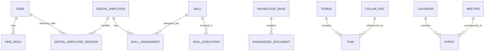

# 数据模型: issue-12

## 核心实体

## 实体定义

### User（用户）

| 字段 | 类型 | 说明 |
|------|------|------|
| user_id | UUID | 用户唯一标识 |
| org_id | UUID | 所属组织 |
| username | string | Mattermost/IM 用户名 |
| role_ids | array<UUID> | 角色集合 |
| permissions | array<string> | 权限标签 |

### DigitalEmployee（数字员工）

| 字段 | 类型 | 说明 |
|------|------|------|
| de_id | UUID | 数字员工唯一标识 |
| org_id | UUID | 所属组织 |
| name | string | 显示名称，如“小 We” |
| bot_account | string | Mattermost BOT 账号 |
| persona | JSON | 角色设定、语气、职责 |
| knowledge_scope | array<string> | 可访问的知识库空间 |

### Skill（技能）

| 字段 | 类型 | 说明 |
|------|------|------|
| skill_id | UUID | 技能唯一标识 |
| name | string | 技能名称 |
| description | string | 技能描述 |
| version | string | 版本号 |
| input_schema | JSON Schema | 输入参数定义 |
| output_schema | JSON Schema | 输出参数定义 |
| runtime | enum | local / remote / mcp |
| permissions | array<string> | 所需权限 |

### SkillAssignment（技能分配）

| 字段 | 类型 | 说明 |
|------|------|------|
| assignment_id | UUID | 分配唯一标识 |
| de_id | UUID | 目标数字员工 |
| skill_id | UUID | 技能 |
| assigned_by | UUID | 分配者 |
| config | JSON | 技能实例配置 |

### KnowledgeBase（知识库空间）

| 字段 | 类型 | 说明 |
|------|------|------|
| kb_id | UUID | 知识库空间唯一标识 |
| org_id | UUID | 所属组织 |
| name | string | 空间名称 |
| permission_policy | JSON | 读写权限规则 |
| embedding_model | string | 使用的向量化模型 |

### KnowledgeDocument（知识文档）

| 字段 | 类型 | 说明 |
|------|------|------|
| doc_id | UUID | 文档唯一标识 |
| kb_id | UUID | 所属知识库空间 |
| title | string | 标题 |
| content | text | 内容 |
| author_id | UUID | 作者 |
| version | int | 版本号 |
| permissions | array<string> | 访问权限 |

### Teable / Task（任务）

| 字段 | 类型 | 说明 |
|------|------|------|
| task_id | UUID | 任务唯一标识 |
| table_id | UUID | 所属 Teable 表 |
| title | string | 任务标题 |
| status | enum | pending / in_progress / done / blocked |
| assignee_id | UUID | 负责人 |
| ai_generated | boolean | 是否由 AI 创建 |
| source_skill_exec | UUID | 来源 skill 执行记录 |

### CollaborationDocument（协作文档）

| 字段 | 类型 | 说明 |
|------|------|------|
| doc_id | UUID | 文档唯一标识 |
| external_doc_id | string | OnlyOffice/Wiki.js 等外部系统文档 ID |
| provider | enum | onlyoffice / wiki / bookstack |
| title | string | 标题 |
| owner_id | UUID | 所有者 |
| status | enum | draft / published / archived |

### Calendar / Event（日历/事件）

| 字段 | 类型 | 说明 |
|------|------|------|
| event_id | UUID | 事件唯一标识 |
| calendar_id | UUID | 所属日历 |
| title | string | 标题 |
| start_time | datetime | 开始时间 |
| end_time | datetime | 结束时间 |
| attendees | array<UUID> | 参与者 |
| source | enum | manual / ai_suggested / meeting |

## 关键关系

1. **用户 ↔ 数字员工**：多对多。一个组织可有多个数字员工分身；一个用户可与多个数字员工交互。
2. **数字员工 ↔ Skill**：通过 SkillAssignment 多对多。一个数字员工可拥有多个 skill；一个 skill 可分配给多个数字员工。
3. **数字员工 ↔ 知识库**：通过 knowledge_scope 一对多。数字员工只能访问用户有权限的知识库内容。
4. **Skill ↔ Teable**：Skill 执行可创建/更新 Teable 任务。
5. **协作文档 ↔ 知识库**：协作文档可沉淀为企业知识库文档。

## 权限模型

- **用户权限**决定**数字员工权限**：数字员工能访问的数据 = 当前交互用户能访问的数据。
- **Skill 权限**在分配时声明，运行时必须小于等于用户权限。
- **知识库权限**按空间/文档/角色控制，向量化检索时先过滤权限再返回结果。

## 与开源系统的映射

| WeLink 实体 | 开源系统对应 |
|-------------|--------------|
| KnowledgeBase / KnowledgeDocument | BookStack / Wiki.js 的书架/页面 |
| Skill | Dify 应用 / Coze 智能体 / 自建 MCP Server |
| CollaborationDocument | OnlyOffice 文档 / BookStack 页面 |
| Calendar / Event | Nextcloud Calendar / Baikal CalDAV |
| Meeting | Jitsi Meet 房间 |
