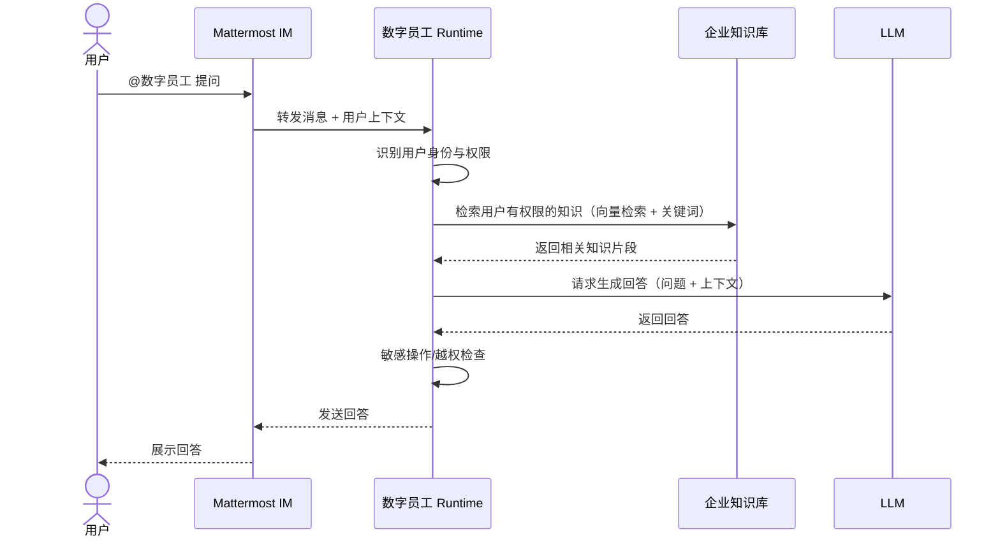
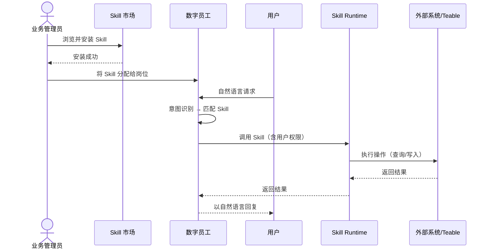
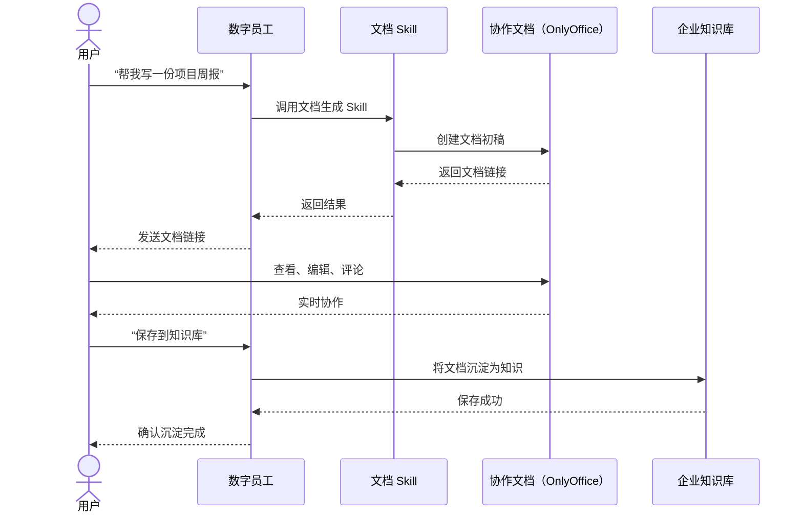
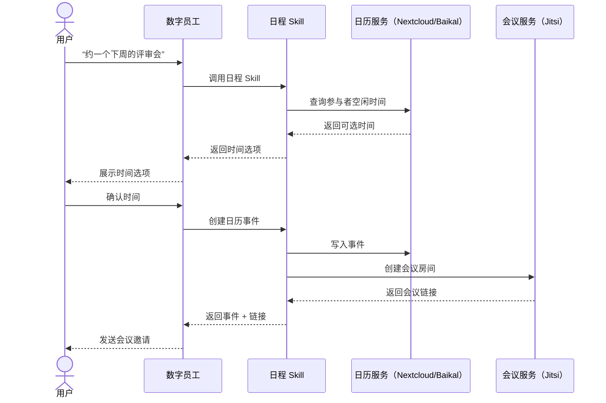
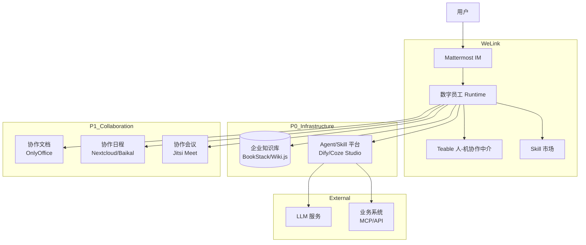

# 流程图: issue-12

## 1. 数字员工回答用户问题（基于知识库）



## 2. 技能分发与调用



## 3. 人-机协作完成文档任务



## 4. 会议预约流程



## 5. 产品架构概览



## 6. 决策流程：是否引入 AI 工作台（长期）

```mermaid
flowchart LR
    A[企业知识库 + 技能分发成熟] --> B{是否有大量<br/>多 Agent 编排需求?}
    B -->|是| C{需求来自<br/>普通用户还是开发者?}
    B -->|否| D[继续方向1]< nouvelle ligne >
    C -->|开发者| E[引入开发者后台<br/>高级模式]
    C -->|普通用户| F[暂不引入<br/>记录并观察]
    E --> G[混合路线<br/>方向3延迟引入]
```
