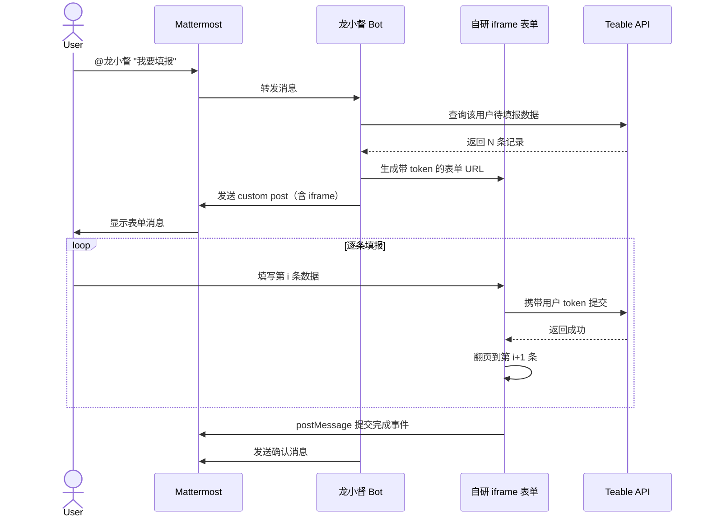
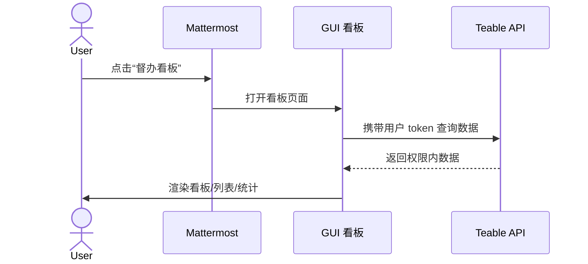
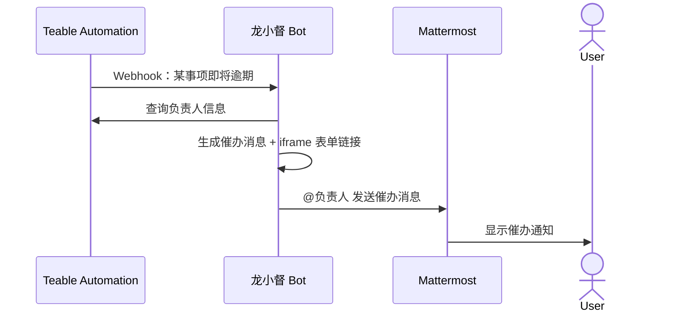
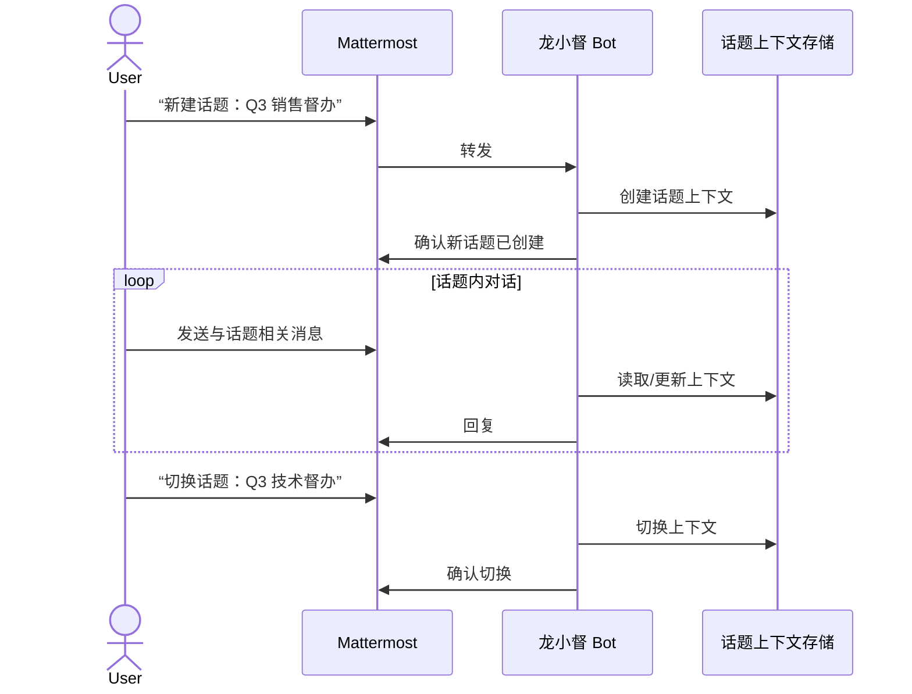
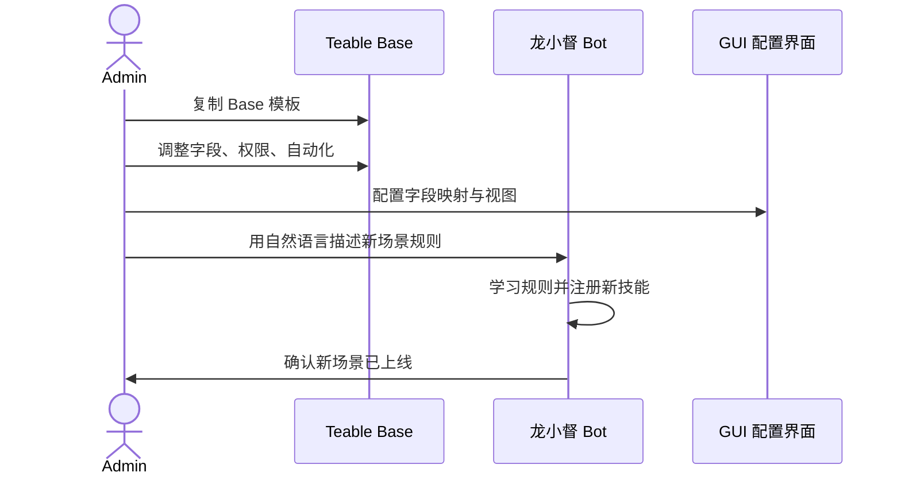

# Issue #17 流程文档

## 流程 1：龙小督推送 iframe 表单（多表单翻页）



## 流程 2：用户打开 GUI 看板



## 流程 3：龙小督主动催办



## 流程 4：话题管理（未来扩展）



## 流程 5：管理员配置新场景



## 关键状态流转

### 督办事项状态机

```
未开始 --(经办人填报)--> 进行中
进行中 --(完成填报)--> 已完成
进行中 --(逾期)--> 逾期
逾期   --(补报/审批)--> 进行中 / 已完成
```

### iframe 表单状态机

```
加载中 --(获取数据成功)--> 编辑中
编辑中 --(单条提交成功)--> 已保存（翻页）
编辑中 --(全部提交完成)--> 已完成
编辑中 --(提交失败)--> 错误提示（可重试）
```

## 异常处理

| 异常 | 处理 |
|------|------|
| Teable API 不可用 | iframe 显示错误提示；龙小督回复“服务暂时不可用，请稍后再试” |
| 用户 token 过期 | iframe 引导用户重新授权；或 Bot 自动发起 OAuth 刷新流程 |
| 权限不足 | iframe 显示“无权操作”；Bot 通知管理员 |
| 数据校验失败 | iframe 高亮错误字段，阻止提交 |
| iframe 加载超时 | 显示“打开完整页面”备选链接 |
