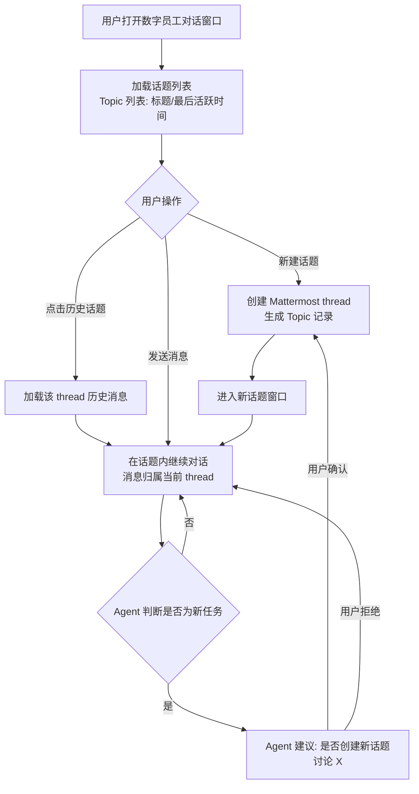
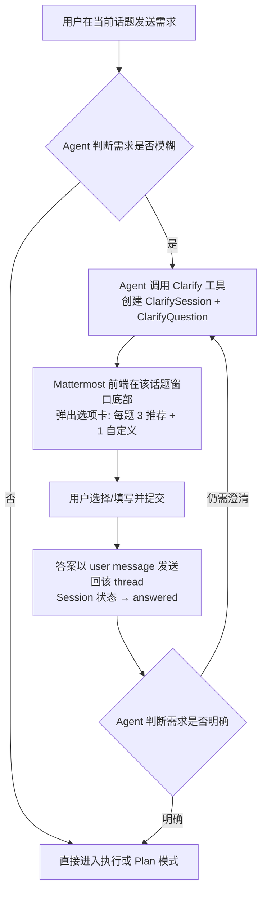
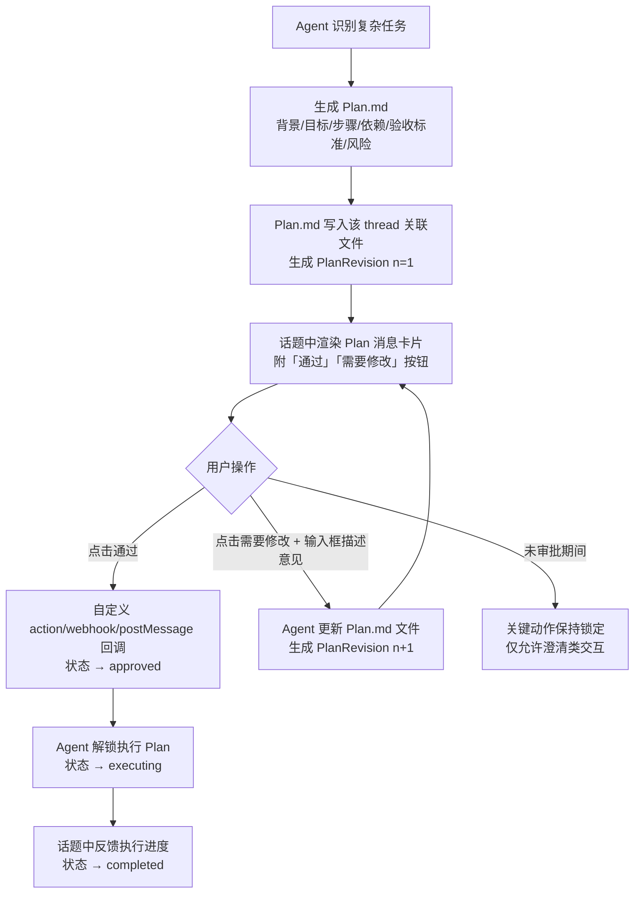
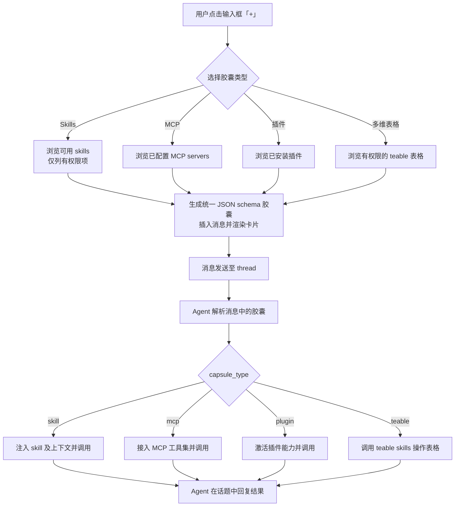
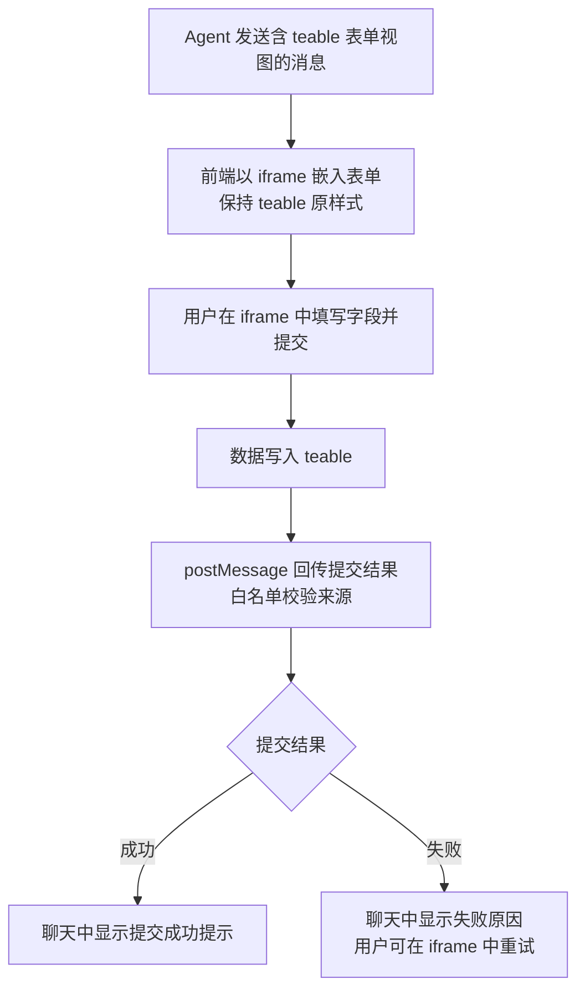
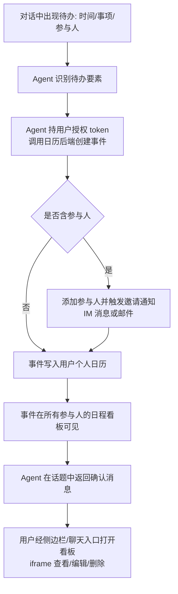
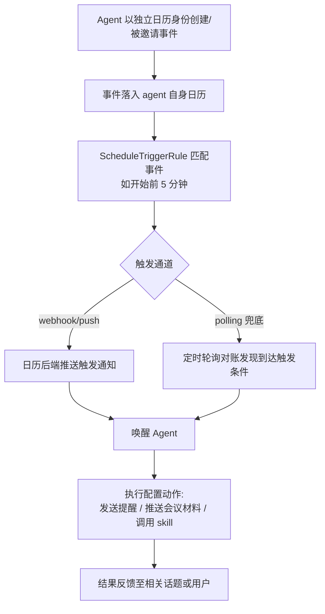
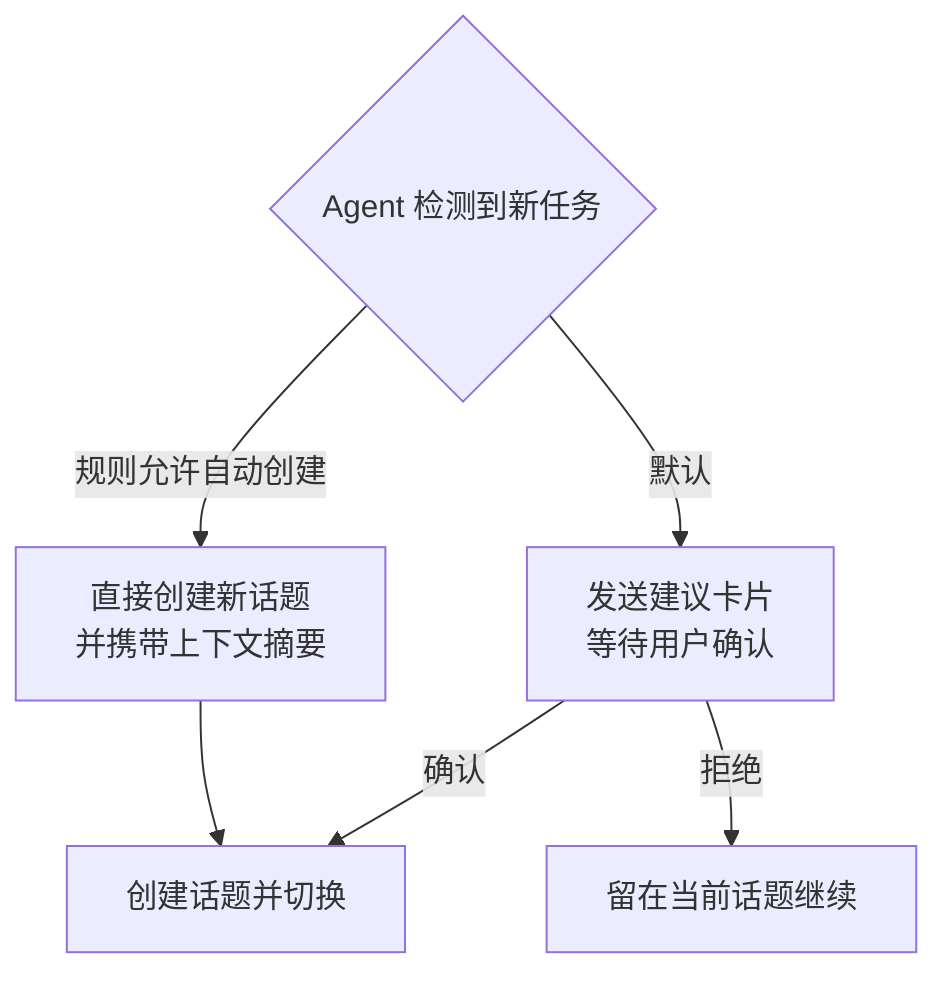
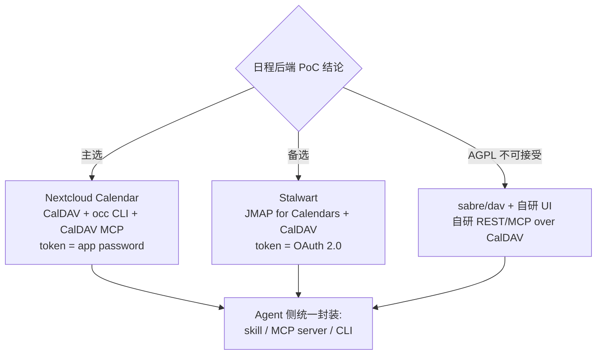
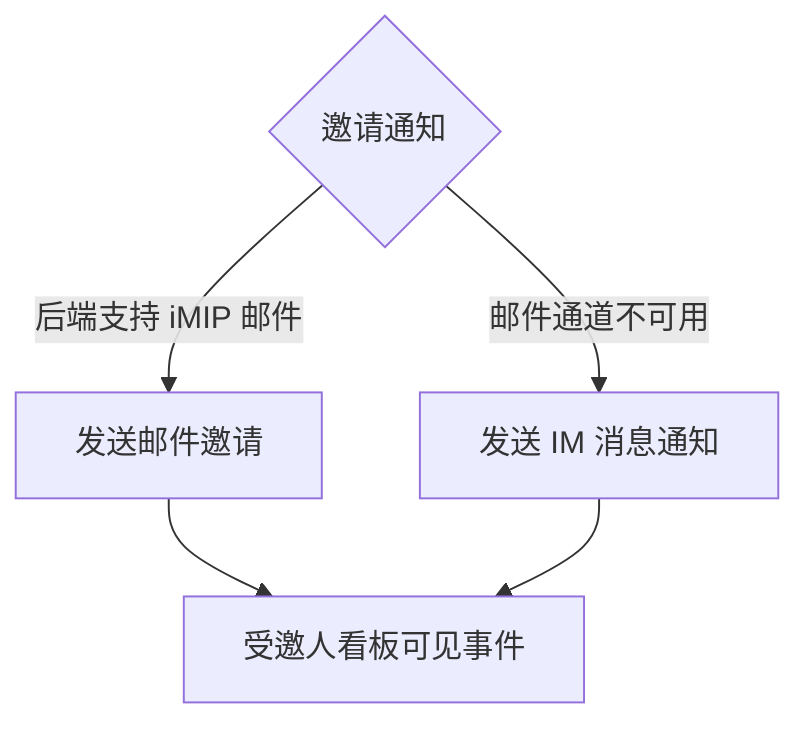

# 流程图: issue-17

## 主流程

### 话题管理主流程（F-T01 ~ F-T05）

### Clarify 流程（F-C01 ~ F-C03）

### Plan 审批流程（F-P01 ~ F-P06）

### 胶囊插入与解析分发流程（F-X01 ~ F-X07）

### Teable 表单 iframe 流程（F-F01 ~ F-F02，复用 issue-6）

### Agent 代管日程流程（F-S01 ~ F-S05）

### 日程事件触发 Agent 流程（F-S07 ~ F-S08）

## 分支流程

### 分支一：Agent 建议创建话题的两种处理

### 分支二：日程 OSS 后端适配分支（PoC 后定案）

### 分支三：日程通知通道降级

## 状态机

### PlanDocument 状态机

- draft → pending_approval（Plan.md 生成并渲染卡片）
- pending_approval → changes_requested（用户点击「需要修改」）
- changes_requested → pending_approval（agent 生成新 revision 并重渲染）
- pending_approval → approved（用户点击「通过」，回调成功）
- approved → executing（agent 解锁开始执行）
- executing → completed（Plan 全部步骤完成）
- draft / pending_approval / changes_requested → cancelled（用户取消任务）

约束：`executing` 的唯一前置状态是 `approved`；`approved` 之后若需变更，生成新 revision 回到 `pending_approval`。

### ClarifySession 状态机

- open（agent 发起 Clarify，选项卡弹出）
- open → answered（用户提交答案，以 user message 回传）
- answered → open（agent 发起新一轮澄清，round+1）
- open → expired（超时未提交，可重新打开）
- open → cancelled（agent 判断无需继续澄清或用户中止）

### ScheduleEvent 状态机

- confirmed（创建成功，默认状态）
- confirmed → tentative（时间或参与人待定调整）
- tentative → confirmed（确认后）
- confirmed / tentative → cancelled（用户或 agent 删除事件）
