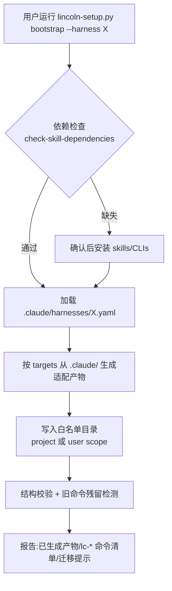
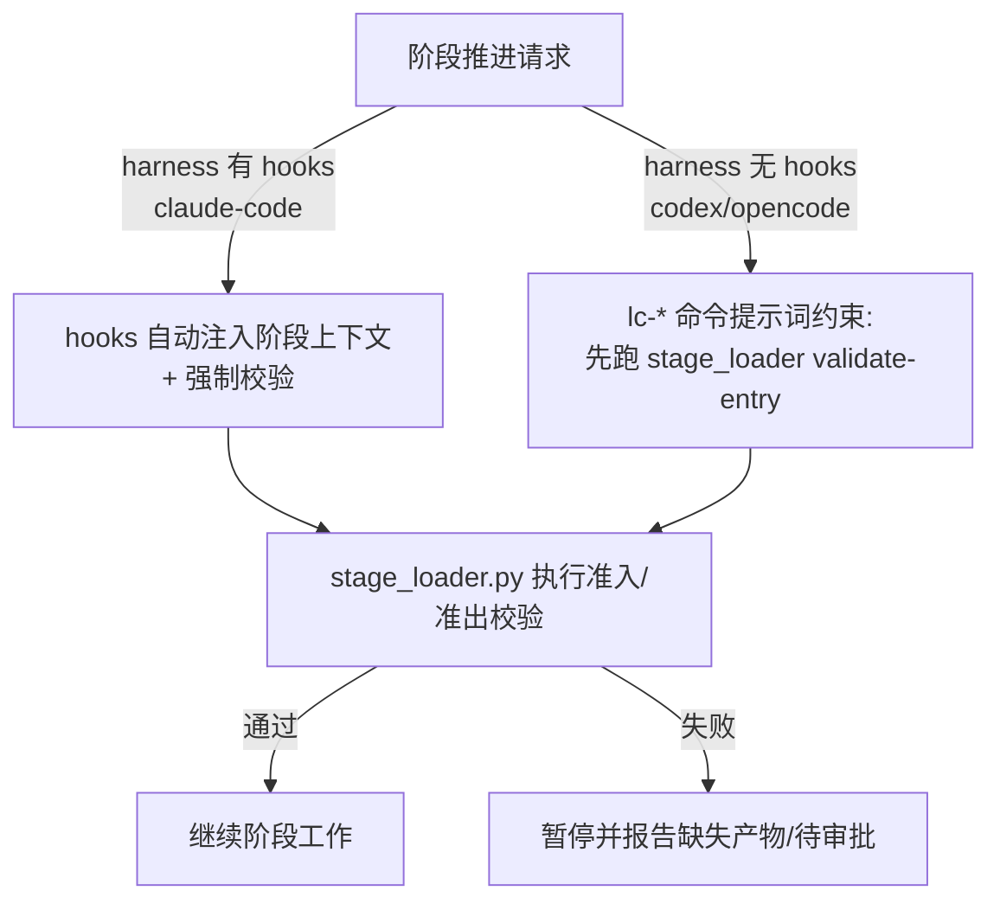
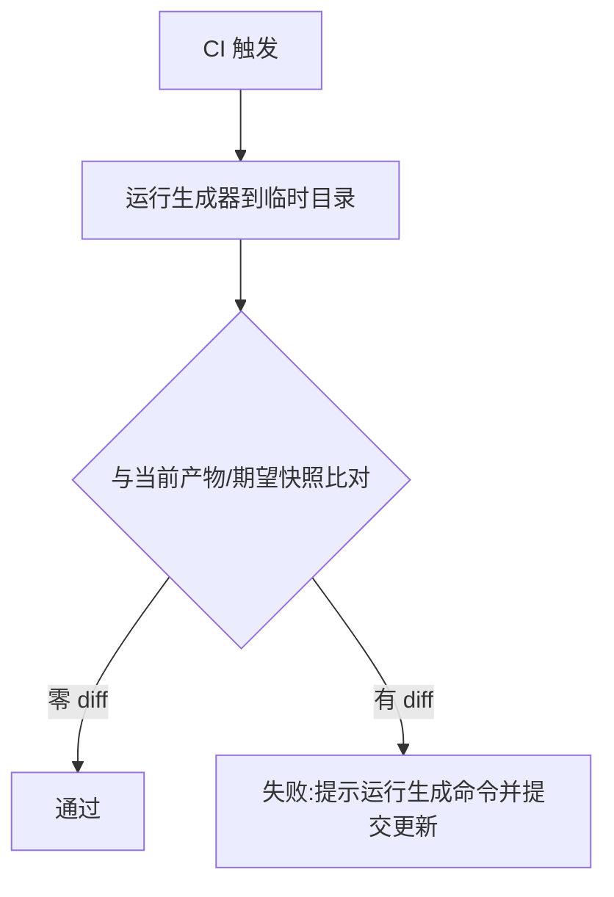

# 流程图: issue-47

## 主流程:安装与适配生成

## 分支流程

### 分支一:弱能力 harness 的门控执行

### 分支二:CI 漂移校验

## 状态机

- 未安装 → 已适配(事件:bootstrap --harness 完成)
- 已适配 → 漂移(事件:`.claude/` 变更未重新生成)
- 漂移 → 已适配(事件:重新运行生成器)
- 任意状态 → 安装失败(事件:校验/写入失败;原子回滚,不留半成品)
