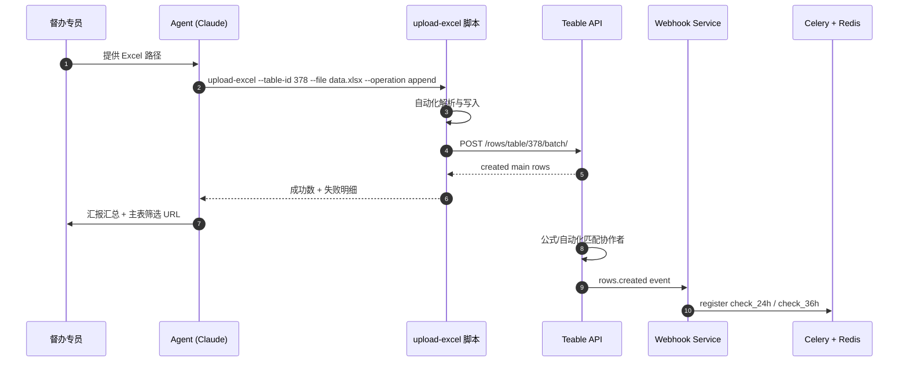
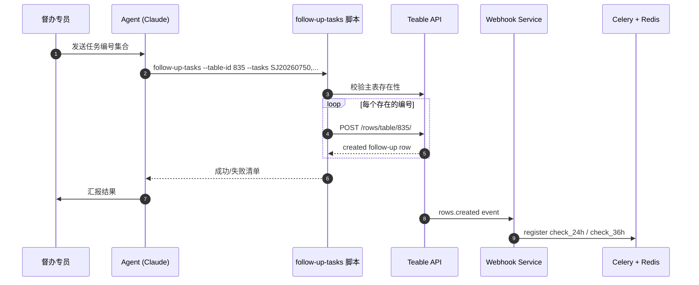
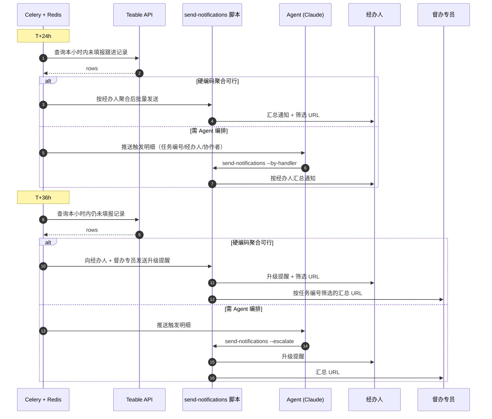
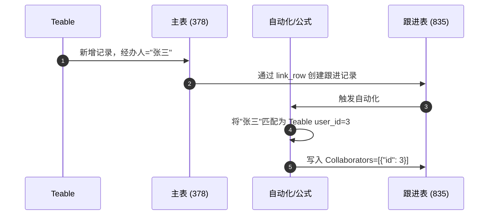

# Flows: Teable + Mattermost 督办协作系统

> **⚠️ 选型更新(2026-07-15)**:本文档基于 Baserow 的具体实例编写(含 `database 84`、`table_id: 378/835`、`field_3521~7966` 等),**选型已更新为 [Teable](https://github.com/teableio/teable)**。文档中的流程时序、Webhook 触发、Agent 编排模式仍可参考,但 API 路径、字段 ID、事件名需按 Teable 实际能力重新映射。Baserow 仅保留作为功能完备性参照基线(见 SRS §1.3)。

## 流程 1：Excel 批量导入

## 流程 2：任务编号批量跟进

## 流程 3：24h / 36h 批量监控提醒

## 流程 4：Teable 内部协作者自动匹配

